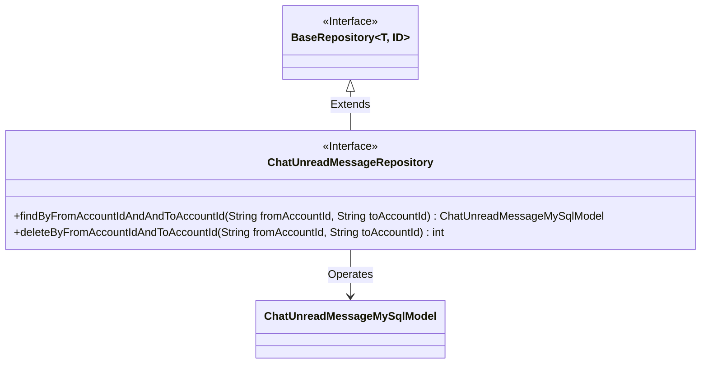
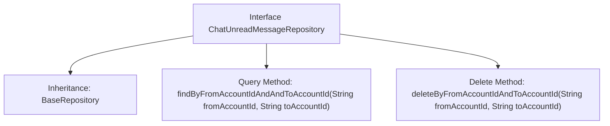

# Basic Information

|      |      |
|------|------|
| Name | ChatUnreadMessageRepository |
| Language | .java |
| Code Path | WeFe/board/board-service/src/main/java/com/welab/wefe/board/service/database/repository/ChatUnreadMessageRepository.java |
| Package Name | com.welab.wefe.board.service.database.repository |
| Dependencies | ['com.welab.wefe.board.service.database.entity.chat.ChatUnreadMessageMySqlModel', 'com.welab.wefe.board.service.database.repository.base.BaseRepository', 'org.springframework.stereotype.Repository'] |
| Brief Description | The ChatUnreadMessageRepository interface extends BaseRepository, providing methods to query unread messages and delete records by sender and recipient accounts. |

# Description

This is a Spring Data repository interface named ChatUnreadMessageRepository, which extends BaseRepository and operates on data of type ChatUnreadMessageMySqlModel with a primary key type of String. The interface defines two methods: findByFromAccountIdAndAndToAccountId for querying unread message records based on sender and recipient account IDs, and deleteByFromAccountIdAndToAccountId for deleting unread message records based on sender and recipient account IDs and returning the deletion count. The interface is marked as a Spring-managed persistence layer component via the @Repository annotation.

# Class Summary

| Name   | Type  | Description |
|-------|------|-------------|
| ChatUnreadMessageRepository | interface | The ChatUnreadMessageRepository interface extends BaseRepository, providing methods to query unread messages and delete records by sender and recipient accounts. |

## Class ChatUnreadMessageRepository

|      |      |
|------|------|
| Access Modifier | @Repository;public |
| Type | interface |
| Name | ChatUnreadMessageRepository |
| Description | The ChatUnreadMessageRepository interface extends BaseRepository, providing methods to query unread messages and delete records by sender and recipient accounts. |

### UML Class Diagram

This code illustrates a Spring Data JPA repository interface `ChatUnreadMessageRepository`, which extends the generic `BaseRepository` interface and is specifically designed to operate on the `ChatUnreadMessageMySqlModel` entity class. The interface defines two core methods: querying unread messages by sender and recipient account IDs, and deleting unread message records between specified accounts. The class diagram clearly depicts the interface inheritance relationship and entity operation dependencies.

### Internal Method Call Graph

This flowchart illustrates the structure of a Spring Data JPA repository interface, which primarily includes inheriting a base repository and defining two derived query methods. The interface is marked as a persistence layer component with the `@Repository` annotation. The inherited `BaseRepository` provides basic CRUD operations, while the custom methods `findBy...` and `deleteBy...` respectively implement the functionality of querying unread messages by account IDs and deleting records, automatically generating SQL following JPA method naming conventions.

### Field List

| Name  | Type  | Description |
|-------|-------|------|

### Method List

| Name  | Type  | Description |
|-------|-------|------|
| deleteByFromAccountIdAndToAccountId | int | Delete records with specified source and destination account IDs. |
| findByFromAccountIdAndAndToAccountId | ChatUnreadMessageMySqlModel | MySQL model method to query unread messages based on fromAccountId and toAccountId. |

