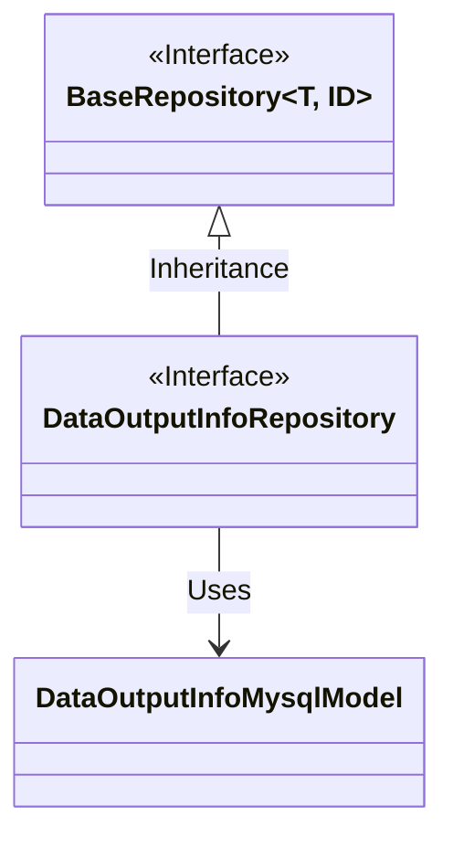
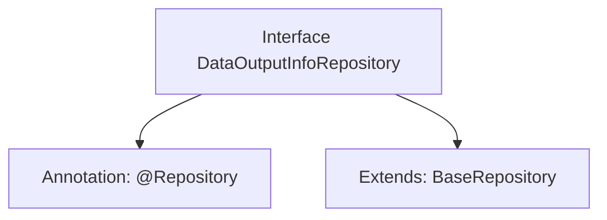

# Basic Information

|      |      |
|------|------|
| Name | DataOutputInfoRepository |
| Language | .java |
| Code Path | WeFe/board/board-service/src/main/java/com/welab/wefe/board/service/database/repository/DataOutputInfoRepository.java |
| Package Name | com.welab.wefe.board.service.database.repository |
| Dependencies | ['com.welab.wefe.board.service.database.entity.DataOutputInfoMysqlModel', 'com.welab.wefe.board.service.database.repository.base.BaseRepository', 'org.springframework.stereotype.Repository'] |
| Brief Description | Data Output Information Repository Interface, inherits from the base repository class, operates on the data output information MySQL model, with the primary key type as string. |

# Description

The content describes a Java interface named DataOutputInfoRepository, annotated with @Repository to mark it as a Spring data repository component. This interface extends the generic BaseRepository interface, specifying the entity type as DataOutputInfoMysqlModel and the primary key type as String. This indicates it is a data access layer interface for operating on DataOutputInfoMysqlModel entity data, equipped with basic CRUD operation capabilities.

# Class Summary

| Name   | Type  | Description |
|-------|------|-------------|
| DataOutputInfoRepository | interface | This is a Spring Data JPA repository interface that extends the base repository, used for operating on the DataOutputInfoMysqlModel entity class with a primary key type of String. |

## Class DataOutputInfoRepository

|      |      |
|------|------|
| Access Modifier | @Repository;public |
| Type | interface |
| Name | DataOutputInfoRepository |
| Description | This is a Spring Data JPA repository interface that extends the base repository, used for operating on the DataOutputInfoMysqlModel entity class with a primary key type of String. |

### UML Class Diagram

This class diagram illustrates that the DataOutputInfoRepository interface inherits from the generic BaseRepository interface, with generic parameters specified as DataOutputInfoMysqlModel and String. DataOutputInfoRepository is a Spring data access layer interface annotated with @Repository. By extending BaseRepository, it acquires basic CRUD operations capabilities, specifically designed to handle DataOutputInfoMysqlModel type data entities with String as the primary key type. This design follows the standard pattern of Spring Data JPA specifications.

### Internal Method Call Graph

This code defines a Spring Data JPA repository interface DataOutputInfoRepository, marked as a persistence layer component via the @Repository annotation, and inherits the BaseRepository interface to acquire basic CRUD operations. The interface's generics specify the entity type as DataOutputInfoMysqlModel with a primary key type of String. The framework will automatically generate a proxy implementation class to handle database interactions.

### Field List

| Name  | Type  | Description |
|-------|-------|------|

### Method List

| Name  | Type  | Description |
|-------|-------|------|

