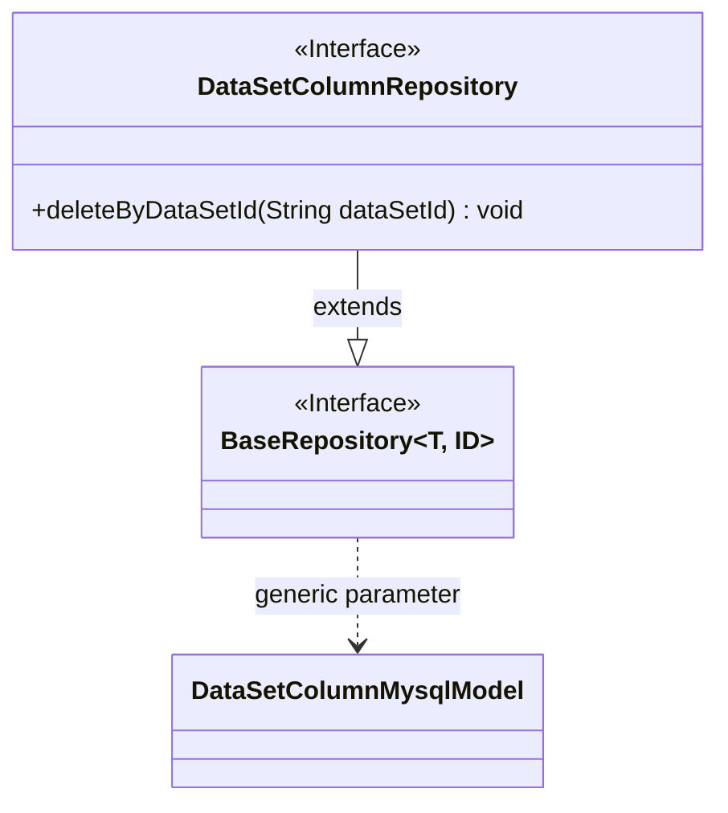
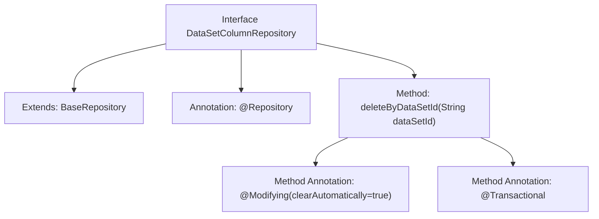

# Basic Information

|      |      |
|------|------|
| Name | DataSetColumnRepository |
| Language | .java |
| Code Path | WeFe/board/board-service/src/main/java/com/welab/wefe/board/service/database/repository/DataSetColumnRepository.java |
| Package Name | com.welab.wefe.board.service.database.repository |
| Dependencies | ['com.welab.wefe.board.service.database.entity.data_set.DataSetColumnMysqlModel', 'com.welab.wefe.board.service.database.repository.base.BaseRepository', 'org.springframework.data.jpa.repository.Modifying', 'org.springframework.stereotype.Repository', 'org.springframework.transaction.annotation.Transactional'] |
| Brief Description | This is a Spring Data JPA repository interface designed for operating dataset series models. It extends the base repository and defines a delete method that removes records based on dataset ID, supporting transactions and automatic cache clearance. |

# Description

This is a Spring Data JPA repository interface definition, extending the base repository interface `BaseRepository`, with generic parameters specifying the entity type as `DataSetColumnMysqlModel` and the primary key type as `String`. The interface includes a custom delete method `deleteByDataSetId`, which removes records by dataset ID. The method is annotated with `@Modifying` and configured with `clearAutomatically=true` to automatically clear the persistence context, while the `@Transactional` annotation ensures transactional execution.

# Class Summary

| Name   | Type  | Description |
|-------|------|-------------|
| DataSetColumnRepository | interface | Dataset column repository interface, inherits from the base repository, provides methods to delete columns by dataset ID, and supports automatic cleanup and transaction processing. |

## Class DataSetColumnRepository

|      |      |
|------|------|
| Access Modifier | @Repository;public |
| Type | interface |
| Name | DataSetColumnRepository |
| Description | Dataset column repository interface, inherits from the base repository, provides methods to delete columns by dataset ID, and supports automatic cleanup and transaction processing. |

### UML Class Diagram

This class diagram illustrates the structure of a Spring Data JPA repository interface. The DataSetColumnRepository interface extends the generic BaseRepository interface, specifying DataSetColumnMysqlModel as the entity type and String as the ID type. The interface defines a delete method deleteByDataSetId, annotated with @Modifying and @Transactional, indicating it is a modifying operation requiring transaction support. BaseRepository serves as a generic repository interface, providing basic CRUD operations through generic parameters T and ID.

### Internal Method Call Graph

This code demonstrates a Spring Data JPA Repository interface that extends BaseRepository and is annotated with @Repository. The core method deleteByDataSetId uses @Modifying and @Transactional annotations, indicating it modifies the database and requires transaction support. The flowchart clearly presents the inheritance relationship of the interface, the hierarchy of class-level and method-level annotations, reflecting the typical design pattern of JPA repositories.

### Field List

| Name  | Type  | Description |
|-------|-------|------|

### Method List

| Name  | Type  | Description |
|-------|-------|------|
| deleteByDataSetId | void | Delete records with the specified dataset ID, automatically clear the cache, and support transactions. |

