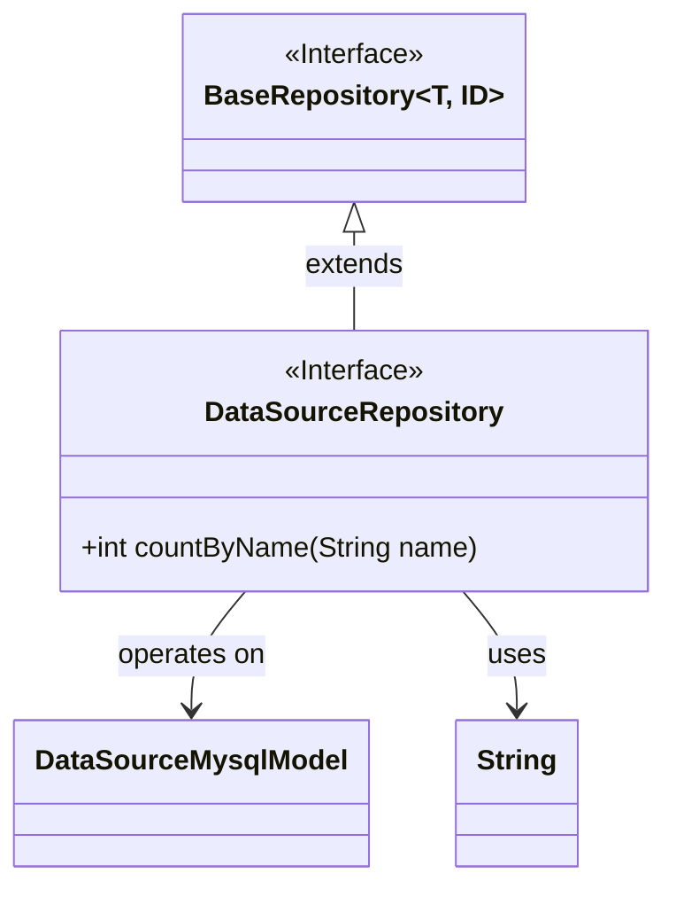
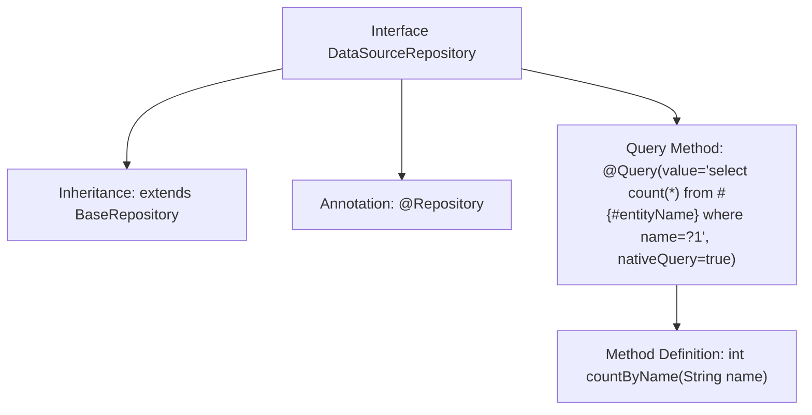

# Basic Information

|      |      |
|------|------|
| Name | DataSourceRepository |
| Language | .java |
| Code Path | WeFe/board/board-service/src/main/java/com/welab/wefe/board/service/database/repository/DataSourceRepository.java |
| Package Name | com.welab.wefe.board.service.database.repository |
| Dependencies | ['com.welab.wefe.board.service.database.entity.DataSourceMysqlModel', 'com.welab.wefe.board.service.database.repository.base.BaseRepository', 'org.springframework.data.jpa.repository.Query', 'org.springframework.stereotype.Repository'] |
| Brief Description | This is a Spring Data JPA repository interface that extends the base repository and defines a native SQL query method for counting data sources by name. |

# Description

This is a Spring Data JPA repository interface named DataSourceRepository, which extends the BaseRepository base class with generic parameters specifying the entity type as DataSourceMysqlModel and the primary key type as String. The interface defines a countByName method that uses the @Query annotation to execute a native SQL query, counting the total number of records in the table where the name field matches the parameter. The query references the entity name via #{#entityName} and uses the positional parameter ?1 to receive the method parameter name.

# Class Summary

| Name   | Type  | Description |
|-------|------|-------------|
| DataSourceRepository | interface | The data source repository interface extends the base repository, providing native SQL query methods for counting by name. |

## Class DataSourceRepository

|      |      |
|------|------|
| Access Modifier | @Repository;public |
| Type | interface |
| Name | DataSourceRepository |
| Description | The data source repository interface extends the base repository, providing native SQL query methods for counting by name. |

### UML Class Diagram

Class Diagram Description:
The diagram illustrates a Spring Data JPA repository interface structure. The DataSourceRepository interface extends the generic BaseRepository<DataSourceMysqlModel, String>, indicating it's a repository interface for the DataSourceMysqlModel entity class with String as the primary key type. The interface defines a countByName() method that uses the @Query annotation to specify a native SQL query. BaseRepository serves as the parent interface providing basic CRUD operations, DataSourceMysqlModel represents the entity class, and String denotes the primary key type identifier.

### Internal Method Call Graph

This flowchart illustrates the structure and functionality of the DataSourceRepository interface. The interface is marked as a Spring Data repository through the @Repository annotation and inherits from the generic BaseRepository class, specifying DataSourceMysqlModel as the entity type and String as the ID type. Its core functionality is a native SQL query method countByName defined via the @Query annotation, which takes a name parameter and returns the count of matching records. The flowchart clearly demonstrates the hierarchical relationship from interface definition to concrete query method, reflecting a typical implementation of Spring Data JPA's repository pattern.

### Field List

| Name  | Type  | Description |
|-------|-------|------|

### Method List

| Name  | Type  | Description |
|-------|-------|------|
| countByName | int | Query Method: Count the total number of records with a specified name using native SQL queries. |

