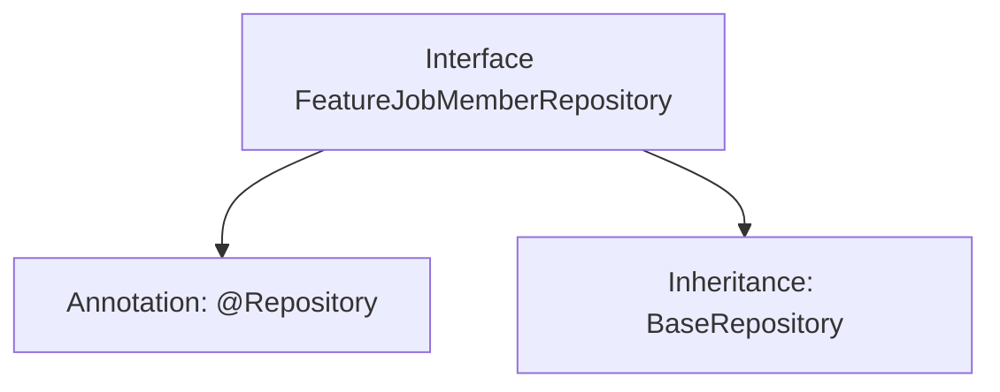

# Basic Information

|      |      |
|------|------|
| Name | FeatureJobMemberRepository |
| Language | .java |
| Code Path | WeFe/board/board-service/src/main/java/com/welab/wefe/board/service/database/repository/FeatureJobMemberRepository.java |
| Package Name | com.welab.wefe.board.service.database.repository |
| Dependencies | ['com.welab.wefe.board.service.database.entity.job.JobMemberMySqlModel', 'com.welab.wefe.board.service.database.repository.base.BaseRepository', 'org.springframework.stereotype.Repository'] |
| Brief Description | This is a Spring repository interface that extends the base repository class, designed to manage JobMemberMySqlModel type data with a primary key of String type. |

# Description

This is a Spring Data repository interface named FeatureJobMemberRepository, identified by the @Repository annotation. It extends the BaseRepository base class, specifying the entity type as JobMemberMySqlModel and the primary key type as String. This interface is primarily used for operating on the database table corresponding to the JobMemberMySqlModel entity, inheriting common CRUD operation methods provided by the base class.

# Class Summary

| Name   | Type  | Description |
|-------|------|-------------|
| FeatureJobMemberRepository | interface | This is a Spring Data repository interface that extends the base repository class, designed for operating on data of type JobMemberMySqlModel with a primary key of String type. |


## Class FeatureJobMemberRepository

|      |      |
|------|------|
| Access Modifier | @Repository;public |
| Type | interface |
| Name | FeatureJobMemberRepository |
| Description | This is a Spring Data repository interface that extends the base repository class, designed for operating on data of type JobMemberMySqlModel with a primary key of String type. |


### UML Class Diagram

```mermaid
classDiagram
    class BaseRepository~T, ID~ {
        <<Interface>>
    }
    
    class FeatureJobMemberRepository {
        <<Interface>>
    }
    
    BaseRepository <|-- FeatureJobMemberRepository : Extends
    // FeatureJobMemberRepository inherits from generic interface BaseRepository
    // Generic parameter T is specified as JobMemberMySqlModel, ID as String
```

This class diagram illustrates the inheritance relationship where FeatureJobMemberRepository interface extends the BaseRepository generic interface. BaseRepository is an interface with two generic parameters (T and ID), while FeatureJobMemberRepository specializes it by specifying JobMemberMySqlModel as the entity type and String as the ID type. The diagram clearly demonstrates a common repository interface inheritance pattern in Spring Data JPA, where child interfaces inherit all CRUD operation methods from the parent interface while using generic parameters to define concrete entity types and primary key types.


### Internal Method Call Graph



This flowchart illustrates the structural relationships of the FeatureJobMemberRepository interface. The interface is marked with the @Repository annotation, indicating it is a Spring Data Access Layer component. It also inherits from the BaseRepository generic interface, specifying the entity type as JobMemberMySqlModel and the primary key type as String. This design adheres to Spring Data JPA specifications, automatically acquiring CRUD operation capabilities by inheriting the base repository interface without requiring manual implementation of basic data access methods.

### Field List

| Name  | Type  | Description |
|-------|-------|------|

### Method List

| Name  | Type  | Description |
|-------|-------|------|


