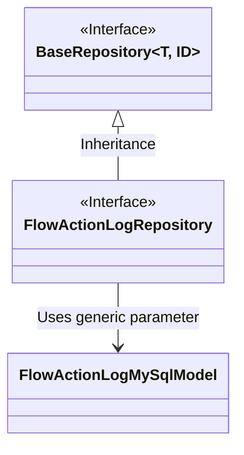
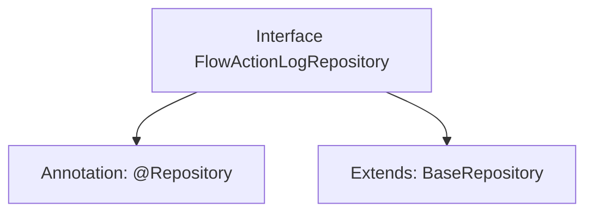

# Basic Information

|      |      |
|------|------|
| Name | FlowActionLogRepository |
| Language | .java |
| Code Path | WeFe/board/board-service/src/main/java/com/welab/wefe/board/service/database/repository/FlowActionLogRepository.java |
| Package Name | com.welab.wefe.board.service.database.repository |
| Dependencies | ['com.welab.wefe.board.service.database.entity.flow.FlowActionLogMySqlModel', 'com.welab.wefe.board.service.database.repository.base.BaseRepository', 'org.springframework.stereotype.Repository'] |
| Brief Description | This is a Spring repository interface that extends the base repository class, designed for operating on FlowActionLogMySqlModel type data with a primary key of String type. |

# Description

This code snippet defines a Spring Data repository interface named `FlowActionLogRepository`, identified by the `@Repository` annotation. The interface extends the generic base class `BaseRepository`, specifying the entity type as `FlowActionLogMySqlModel` and the primary key type as `String`. This indicates that the repository is used for manipulating process action log data in a MySQL database, inheriting CRUD operation methods from the base repository.

# Class Summary

| Name   | Type  | Description |
|-------|------|-------------|
| FlowActionLogRepository | interface | This is a Spring repository interface that extends the base repository class, designed for operating on data of type FlowActionLogMySqlModel with a primary key of String type. |

## Class FlowActionLogRepository

|      |      |
|------|------|
| Access Modifier | @Repository;public |
| Type | interface |
| Name | FlowActionLogRepository |
| Description | This is a Spring repository interface that extends the base repository class, designed for operating on data of type FlowActionLogMySqlModel with a primary key of String type. |

### UML Class Diagram

This class diagram illustrates the relationship where the FlowActionLogRepository interface inherits from the generic BaseRepository interface. BaseRepository is a generic interface accepting two type parameters T and ID, while FlowActionLogRepository specializes to use FlowActionLogMySqlModel as the entity type and String as the ID type. This represents a typical data access layer design pattern where a base repository interface provides generic CRUD operations, and concrete repository interfaces operate on specific domain models through type specialization.

### Internal Method Call Graph

This code defines a Spring Data JPA repository interface `FlowActionLogRepository`, marked as a persistence layer component with the `@Repository` annotation, and extends the `BaseRepository` interface. The generic parameters specify the entity type as `FlowActionLogMySqlModel` and the primary key type as `String`. The flowchart illustrates the annotation and inheritance relationships of the interface, clearly demonstrating the standard definition approach of a JPA repository.

### Field List

| Name  | Type  | Description |
|-------|-------|------|

### Method List

| Name  | Type  | Description |
|-------|-------|------|

