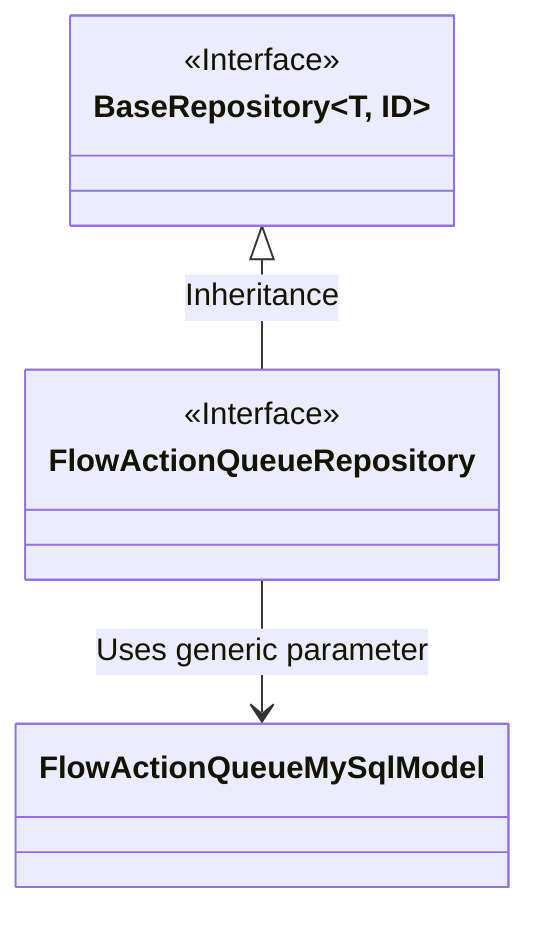
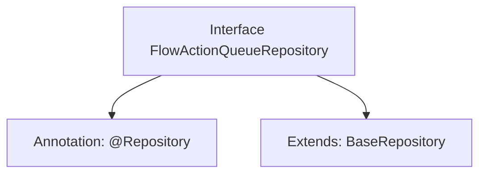

# Basic Information

|      |      |
|------|------|
| Name | FlowActionQueueRepository |
| Language | .java |
| Code Path | WeFe/board/board-service/src/main/java/com/welab/wefe/board/service/database/repository/FlowActionQueueRepository.java |
| Package Name | com.welab.wefe.board.service.database.repository |
| Dependencies | ['com.welab.wefe.board.service.database.entity.flow.FlowActionQueueMySqlModel', 'com.welab.wefe.board.service.database.repository.base.BaseRepository', 'org.springframework.stereotype.Repository'] |
| Brief Description | This is a Spring framework repository interface that extends the base repository class, designed for operating on FlowActionQueueMySqlModel type data with String as the primary key. |

# Description

This code snippet defines a Spring Data repository interface named `FlowActionQueueRepository`, identified by the `@Repository` annotation. The interface extends the generic base class `BaseRepository`, specifying the entity type as `FlowActionQueueMySqlModel` and the primary key type as `String`. This indicates that the repository is used to manipulate process action queue-related data in a MySQL database, providing basic CRUD operation capabilities.

# Class Summary

| Name   | Type  | Description |
|-------|------|-------------|
| FlowActionQueueRepository | interface | This is a Spring framework repository interface, extending the base repository class, used for manipulating data of type FlowActionQueueMySqlModel with a primary key of String type. |

## Class FlowActionQueueRepository

|      |      |
|------|------|
| Access Modifier | @Repository;public |
| Type | interface |
| Name | FlowActionQueueRepository |
| Description | This is a Spring framework repository interface, extending the base repository class, used for manipulating data of type FlowActionQueueMySqlModel with a primary key of String type. |

### UML Class Diagram

This class diagram illustrates the relationship where the FlowActionQueueRepository interface inherits from the generic BaseRepository interface. BaseRepository is a generic interface that accepts two type parameters, T and ID; FlowActionQueueRepository specifies the concrete type parameters FlowActionQueueMySqlModel and String. The diagram clearly demonstrates the interface inheritance relationship and the instantiation of generic parameters, with FlowActionQueueMySqlModel being utilized as an entity model class by the generic interface.

### Internal Method Call Graph

This flowchart illustrates the structural relationships of the FlowActionQueueRepository interface. The interface is marked with the @Repository annotation, indicating it is a Spring data access component. It also extends the generic BaseRepository interface, specifying the entity type as FlowActionQueueMySqlModel and the primary key type as String. This design pattern represents a typical Data Access Layer (DAO) implementation, inheriting basic CRUD operation capabilities from the base repository interface while maintaining interface simplicity.

### Field List

| Name  | Type  | Description |
|-------|-------|------|

### Method List

| Name  | Type  | Description |
|-------|-------|------|

