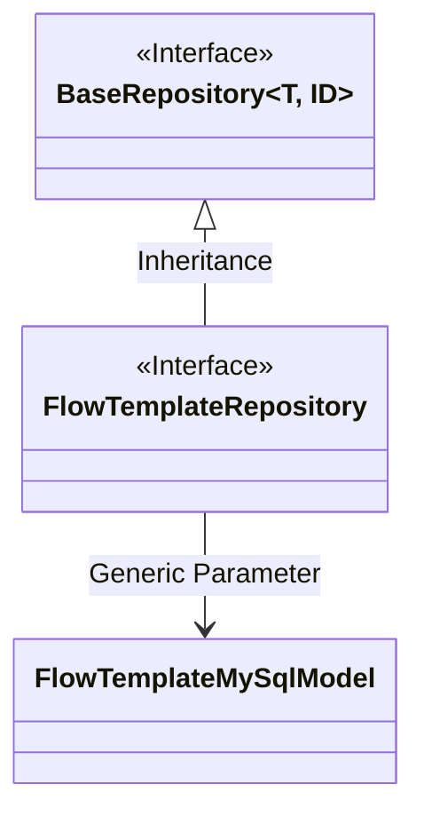
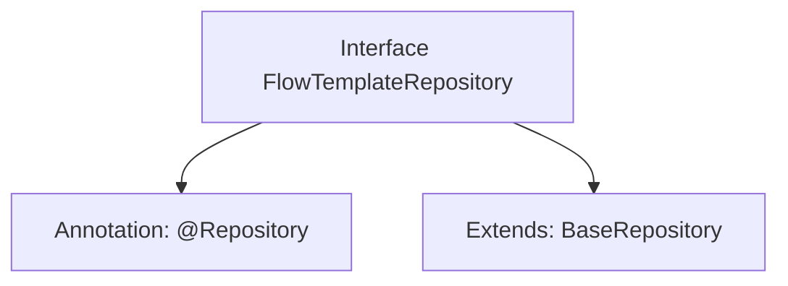

# Basic Information

|      |      |
|------|------|
| Name | FlowTemplateRepository |
| Language | .java |
| Code Path | WeFe/board/board-service/src/main/java/com/welab/wefe/board/service/database/repository/FlowTemplateRepository.java |
| Package Name | com.welab.wefe.board.service.database.repository |
| Dependencies | ['com.welab.wefe.board.service.database.entity.flow.FlowTemplateMySqlModel', 'com.welab.wefe.board.service.database.repository.base.BaseRepository', 'org.springframework.stereotype.Repository'] |
| Brief Description | This is a Spring repository interface that extends the base repository class, used for operating on FlowTemplateMySqlModel data with a primary key type of String. |

# Description

The content defines a Spring Data repository interface named FlowTemplateRepository, identified by the @Repository annotation. This interface extends the generic base class BaseRepository, specifying the entity type as FlowTemplateMySqlModel and the primary key type as String. This indicates it is a persistence layer component for operating on FlowTemplateMySqlModel entity data, following Spring Data's repository pattern design.

# Class Summary

| Name   | Type  | Description |
|-------|------|-------------|
| FlowTemplateRepository | interface | This is a Spring FlowTemplateRepository interface, which extends BaseRepository, used for manipulating data of type FlowTemplateMySqlModel with a primary key of String type. |

## Class FlowTemplateRepository

|      |      |
|------|------|
| Access Modifier | @Repository;public |
| Type | interface |
| Name | FlowTemplateRepository |
| Description | This is a Spring FlowTemplateRepository interface, which extends BaseRepository, used for manipulating data of type FlowTemplateMySqlModel with a primary key of String type. |

### UML Class Diagram

This class diagram illustrates the relationship where the FlowTemplateRepository interface inherits from the generic BaseRepository interface. BaseRepository is an interface with two generic parameters (T and ID), where T is concretized as the FlowTemplateMySqlModel entity class and the ID type is String. As a data access layer interface, FlowTemplateRepository inherits basic CRUD operation capabilities from BaseRepository while specifying the entity type as FlowTemplateMySqlModel and the primary key type as String. This design follows the repository pattern of Spring Data JPA, achieving abstraction in the data access layer.

### Internal Method Call Graph

This flowchart describes the definition of a Spring Data JPA Repository interface. FlowTemplateRepository is marked as a persistence layer component via the @Repository annotation, while extending the BaseRepository interface with the entity type specified as FlowTemplateMySqlModel and the primary key type as String. This interface inherits all basic CRUD operation methods from BaseRepository and can be used directly without explicit declaration. This design adheres to Spring Data specifications, implementing standard database table operation interfaces.

### Field List

| Name  | Type  | Description |
|-------|-------|------|

### Method List

| Name  | Type  | Description |
|-------|-------|------|

