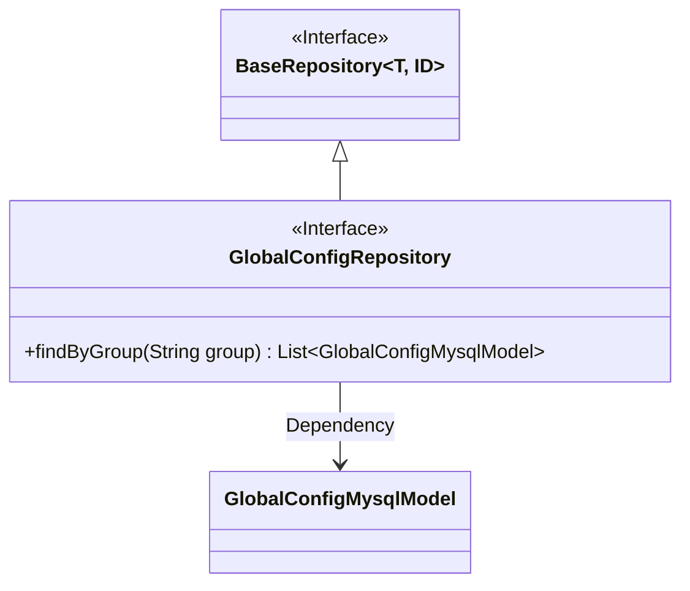
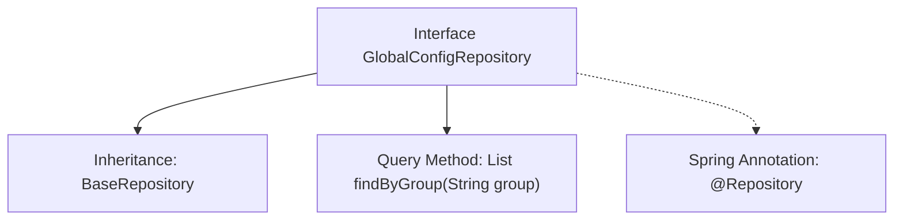

# Basic Information

|      |      |
|------|------|
| Name | GlobalConfigRepository |
| Language | .java |
| Code Path | WeFe/board/board-service/src/main/java/com/welab/wefe/board/service/database/repository/GlobalConfigRepository.java |
| Package Name | com.welab.wefe.board.service.database.repository |
| Dependencies | ['com.welab.wefe.board.service.database.entity.GlobalConfigMysqlModel', 'com.welab.wefe.board.service.database.repository.base.BaseRepository', 'org.springframework.stereotype.Repository', 'java.util.List'] |
| Brief Description | This is a Spring Repository interface that extends BaseRepository, designed for operating on GlobalConfigMysqlModel data and providing query functionality by the group field. |

# Description

This code snippet defines a Spring Data repository interface named `GlobalConfigRepository`, which extends the `BaseRepository` base class. The interface operates on entities of type `GlobalConfigMysqlModel` with a primary key of type `String`. It declares a query method `findByGroup` that searches by the `group` field and returns a list of matching entities. Annotated with `@Repository`, it is identified as a Spring-managed persistence layer component, automatically implementing query logic following Spring Data JPA's naming conventions.

# Class Summary

| Name   | Type  | Description |
|-------|------|-------------|
| GlobalConfigRepository | interface | This is a Spring Data JPA repository interface that extends the base repository for operating on the GlobalConfigMysqlModel entity, providing query functionality by group. |

## Class GlobalConfigRepository

|      |      |
|------|------|
| Access Modifier | @Repository;public |
| Type | interface |
| Name | GlobalConfigRepository |
| Description | This is a Spring Data JPA repository interface that extends the base repository for operating on the GlobalConfigMysqlModel entity, providing query functionality by group. |

### UML Class Diagram

This class diagram illustrates that the GlobalConfigRepository interface inherits from the generic BaseRepository interface and defines a findByGroup method. The GlobalConfigRepository operates on the GlobalConfigMysqlModel entity class, forming a clear hierarchical relationship. As a generic repository interface, BaseRepository provides basic CRUD capabilities, while GlobalConfigRepository extends these with specific query functionality through inheritance. The diagram accurately reflects the interface's generic parameters, inheritance relationships, and model dependencies.

### Internal Method Call Graph

This flowchart illustrates the structure of the GlobalConfigRepository interface in Spring Data JPA. The interface is marked as a data access component with the @Repository annotation and inherits from the generic BaseRepository interface (specifying the entity type as GlobalConfigMysqlModel and primary key type as String). Its core functionality provides a derived query method findByGroup that searches by the group field, returning a list of matching entities. This design follows Spring Data's Repository pattern, where query implementations are automatically generated based on method naming conventions.

### Field List

| Name  | Type  | Description |
|-------|-------|------|

### Method List

| Name  | Type  | Description |
|-------|-------|------|
| findByGroup | List<GlobalConfigMysqlModel> | Query the list of global configuration MySQL models by group name. |

