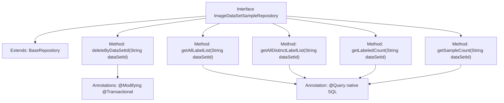

# Basic Information

|      |      |
|------|------|
| Name | ImageDataSetSampleRepository |
| Language | .java |
| Code Path | WeFe/board/board-service/src/main/java/com/welab/wefe/board/service/database/repository/ImageDataSetSampleRepository.java |
| Package Name | com.welab.wefe.board.service.database.repository |
| Dependencies | ['com.welab.wefe.board.service.database.entity.data_set.ImageDataSetSampleMysqlModel', 'com.welab.wefe.board.service.database.repository.base.BaseRepository', 'org.springframework.data.jpa.repository.Modifying', 'org.springframework.data.jpa.repository.Query', 'org.springframework.stereotype.Repository', 'org.springframework.transaction.annotation.Transactional', 'java.util.List'] |
| Brief Description | The ImageDataSetSampleRepository interface extends BaseRepository, providing methods for deletion, querying label lists, and counting sample quantities, with support for dataset ID operations. |

# Description

The code defines a Spring Data JPA repository interface named `ImageDataSetSampleRepository`, which extends `BaseRepository` and operates on the `ImageDataSetSampleMysqlModel` entity class with a primary key type of `String`. The interface includes five methods: `deleteByDataSetId` for deleting records by dataset ID; `getAllLabelList` to retrieve the label list of annotated samples for a specified dataset; `getAllDistinctLabelList` to obtain a deduplicated label list; `getLabeledCount` to count the number of annotated samples; and `getSampleCount` to count the total number of samples. All queries use native SQL and are defined via the `@Query` annotation.

# Class Summary

| Name   | Type  | Description |
|-------|------|-------------|
| ImageDataSetSampleRepository | interface | Image Dataset Sample Repository Interface, providing deletion, label list query, and statistical functions. Includes methods such as deleting samples by dataset ID, retrieving label lists, deduplicating label lists, and counting labeled samples and total samples. |


## Class ImageDataSetSampleRepository

|      |      |
|------|------|
| Access Modifier | @Repository;public |
| Type | interface |
| Name | ImageDataSetSampleRepository |
| Description | Image Dataset Sample Repository Interface, providing deletion, label list query, and statistical functions. Includes methods such as deleting samples by dataset ID, retrieving label lists, deduplicating label lists, and counting labeled samples and total samples. |


### UML Class Diagram

```mermaid
classDiagram
    class BaseRepository~T, ID~ {
        <<Interface>>
    }

    class ImageDataSetSampleRepository {
        <<Interface>>
        +deleteByDataSetId(String dataSetId) void
        +getAllLabelList(String dataSetId) List~String~
        +getAllDistinctLabelList(String dataSetId) List~String~
        +getLabeledCount(String dataSetId) long
        +getSampleCount(String dataSetId) long
    }

    BaseRepository <|-- ImageDataSetSampleRepository
    // ImageDataSetSampleRepository inherits from the generic BaseRepository interface
    // Provides CRUD operations for ImageDataSetSampleMysqlModel and specific query methods
```

This code defines a Spring Data JPA repository interface `ImageDataSetSampleRepository`, which extends the generic `BaseRepository` interface, specifically designed for operating on the `ImageDataSetSampleMysqlModel` entity class. The interface includes five custom query methods: deleting records by dataset ID, retrieving label lists, retrieving distinct label lists, counting labeled samples, and counting total samples. All methods utilize native SQL queries via `@Query` annotations, with data modification operations supported by `@Modifying` and `@Transactional` annotations.


### Internal Method Call Graph



This code demonstrates a Spring Data JPA repository interface defining 5 data operation methods. The interface extends BaseRepository and includes a deletion operation along with 4 query methods, 3 of which use native SQL queries. All query methods filter data based on the dataSetId parameter, covering functionalities like label list queries, distinct label statistics, labeled sample counting, and total sample counting. Each query method is configured with specific native SQL statements via @Query annotation, while the delete operation is configured with transaction and automatic cache clearance features.

### Field List

| Name  | Type  | Description |
|-------|-------|------|

### Method List

| Name  | Type  | Description |
|-------|-------|------|
| deleteByDataSetId | void | Using JPA to delete records with specified dataset IDs, automatically clearing the cache and supporting transactions. |
| getLabeledCount | long | Query the number of labeled data under the specified dataset ID. |
| getAllDistinctLabelList | List<String> | Query the unique list of labels for all annotated data under a specified dataset ID. |
| getAllLabelList | List<String> | Query the list of labels for annotated data under a specified dataset ID. |
| getSampleCount | long | Query the total number of records for a specified dataset ID. |


