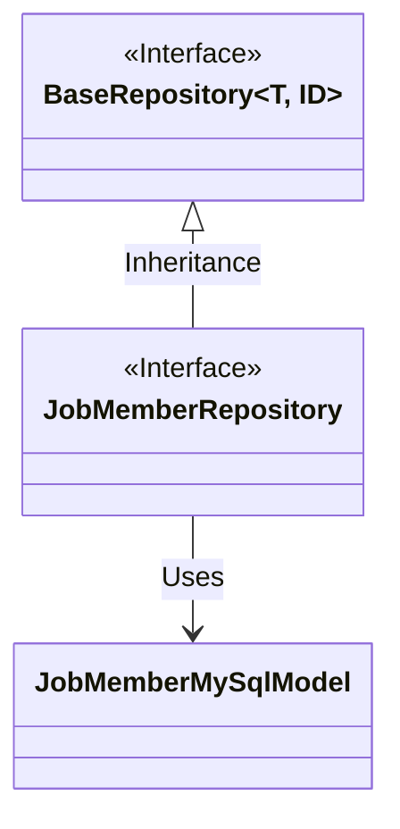
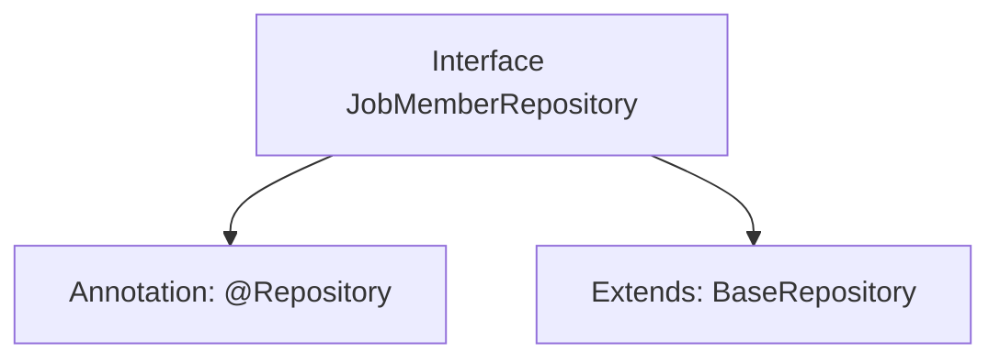

# Basic Information

|      |      |
|------|------|
| Name | JobMemberRepository |
| Language | .java |
| Code Path | WeFe/board/board-service/src/main/java/com/welab/wefe/board/service/database/repository/JobMemberRepository.java |
| Package Name | com.welab.wefe.board.service.database.repository |
| Dependencies | ['com.welab.wefe.board.service.database.entity.job.JobMemberMySqlModel', 'com.welab.wefe.board.service.database.repository.base.BaseRepository', 'org.springframework.stereotype.Repository'] |
| Brief Description | The JobMemberRepository interface extends BaseRepository, operates on the JobMemberMySqlModel entity, with the primary key type being String. |

# Description

The content defines a Spring Data repository interface named `JobMemberRepository`, identified by the `@Repository` annotation. This interface extends the generic base class `BaseRepository`, specifying the entity type as `JobMemberMySqlModel` and the primary key type as `String`. This indicates it is a data access layer component for the `JobMemberMySqlModel` entity, designed to handle database operations.

# Class Summary

| Name   | Type  | Description |
|-------|------|-------------|
| JobMemberRepository | interface | The JobMemberRepository interface extends BaseRepository and is used to manipulate JobMemberMySqlModel data, employing String as the primary key type. |

## Class JobMemberRepository

|      |      |
|------|------|
| Access Modifier | @Repository;public |
| Type | interface |
| Name | JobMemberRepository |
| Description | The JobMemberRepository interface extends BaseRepository and is used to manipulate JobMemberMySqlModel data, employing String as the primary key type. |

### UML Class Diagram

This class diagram illustrates that the `JobMemberRepository` interface inherits from the generic interface `BaseRepository`, with its generic parameters specified as `JobMemberMySqlModel` and `String`. `JobMemberRepository` is a Spring Data repository interface (annotated with `@Repository`) dedicated to operating on data entities of type `JobMemberMySqlModel`, where `String` represents the primary key type of the entity. As a base repository interface, `BaseRepository` provides generic CRUD operations, while `JobMemberRepository` inherits these capabilities while maintaining the lightweight nature of the interface.

### Internal Method Call Graph

This code defines a Spring Data JPA Repository interface named JobMemberRepository, marked as a data access component via the @Repository annotation. The interface extends the generic BaseRepository interface, specifying the entity type as JobMemberMySqlModel and the primary key type as String. This design adheres to Spring Data conventions, eliminating the need to implement basic CRUD operations as the framework automatically generates proxy implementation classes to handle database interactions.

### Field List

| Name  | Type  | Description |
|-------|-------|------|

### Method List

| Name  | Type  | Description |
|-------|-------|------|

