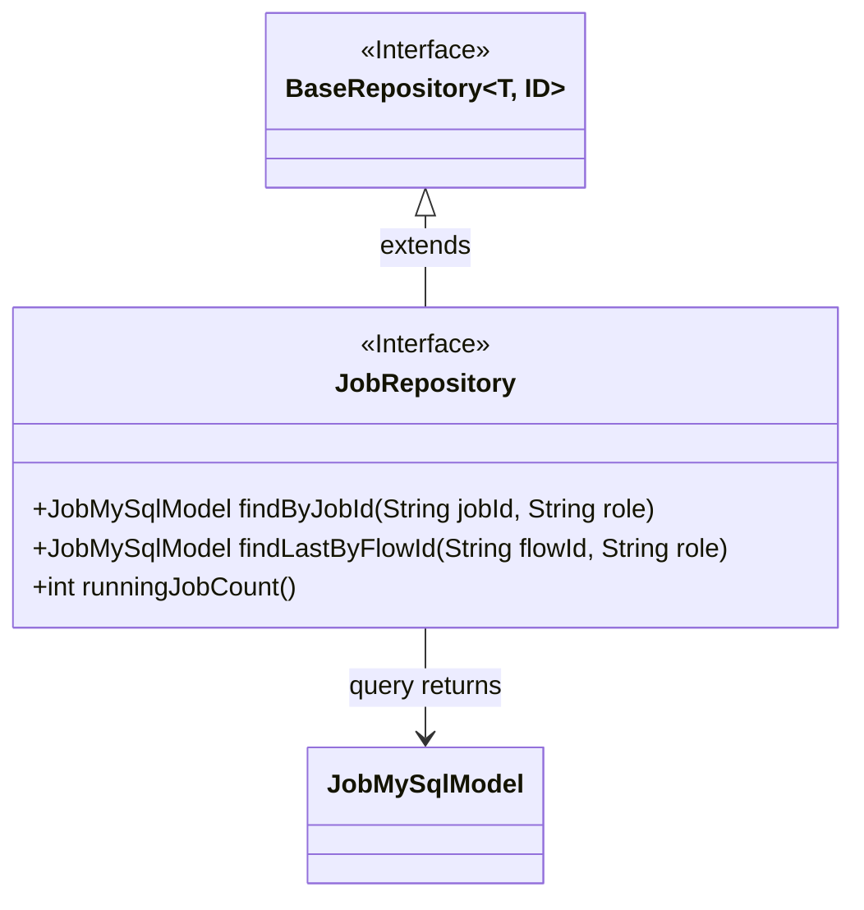
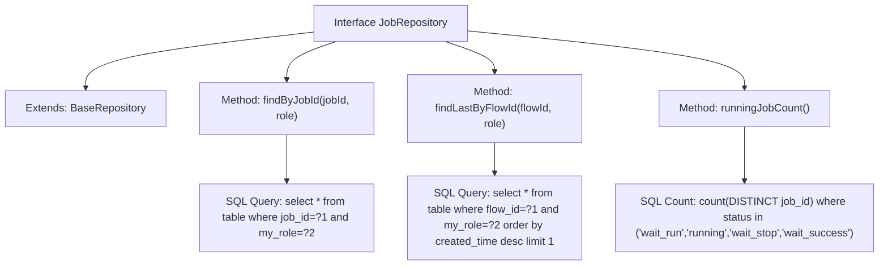

# Basic Information

|      |      |
|------|------|
| Name | JobRepository |
| Language | .java |
| Code Path | WeFe/board/board-service/src/main/java/com/welab/wefe/board/service/database/repository/JobRepository.java |
| Package Name | com.welab.wefe.board.service.database.repository |
| Dependencies | ['com.welab.wefe.board.service.database.entity.job.JobMySqlModel', 'com.welab.wefe.board.service.database.repository.base.BaseRepository', 'org.springframework.data.jpa.repository.Query', 'org.springframework.stereotype.Repository'] |
| Brief Description | The JobRepository interface extends BaseRepository and provides three native SQL query methods: finding tasks by jobId and role, finding the latest task by flowId and role, and counting the number of unfinished tasks. |

# Description

The JobRepository is an interface that extends BaseRepository, used for operating on JobMySqlModel data. It includes three methods: findByJobId queries records by jobId and role; findLastByFlowId retrieves the latest record by flowId and role; runningJobCount counts the number of jobs with unfinished statuses, which include wait_run, running, wait_stop, and wait_success. All queries are implemented using native SQL.

# Class Summary

| Name   | Type  | Description |
|-------|------|-------------|
| JobRepository | interface | The JobRepository interface extends BaseRepository and includes three methods: querying Jobs by jobId and role, querying the latest Job by flowId and role, and counting the number of unfinished Jobs. |

## Class JobRepository

|      |      |
|------|------|
| Access Modifier | @Repository;public |
| Type | interface |
| Name | JobRepository |
| Description | The JobRepository interface extends BaseRepository and includes three methods: querying Jobs by jobId and role, querying the latest Job by flowId and role, and counting the number of unfinished Jobs. |

### UML Class Diagram

This code demonstrates a Spring Data JPA Repository interface design. The JobRepository interface extends the generic BaseRepository interface, specifying the entity type JobMySqlModel and primary key type String. It defines three native SQL query methods: finding a single record by jobId and role, retrieving the latest record by flowId and role, and counting active jobs. The class diagram clearly reflects the interface inheritance and entity class dependency, conforming to standard JPA Repository design patterns.

### Internal Method Call Graph

This code defines a Spring Data JPA Repository interface containing three core query methods: precise task record lookup by jobId and role, fetching the latest task record by flowId and role, and counting tasks in unfinished states. Each method specifies native SQL query logic via @Query annotations to address different business scenarios, while inheriting basic CRUD functionality from BaseRepository.

### Field List

| Name  | Type  | Description |
|-------|-------|------|

### Method List

| Name  | Type  | Description |
|-------|-------|------|
| findByJobId | JobMySqlModel | Query the JobMySqlModel record with the specified jobId and role in the database. Use native SQL statements with parameters bound by position. |
| findLastByFlowId | JobMySqlModel | Query the latest record for a specified process ID and role, sorted in descending order by creation time, and return the first result. |
| runningJobCount | int | Query the count of unique tasks in the states of waiting to run, running, waiting to stop, or waiting for success. |

