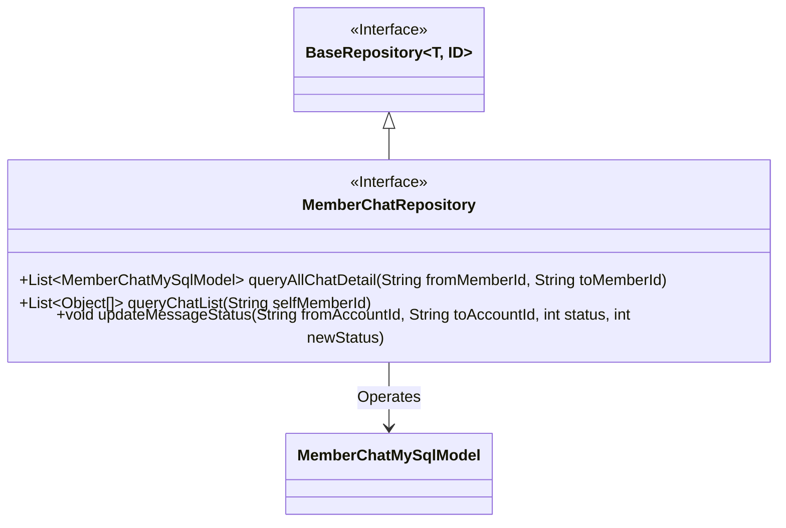
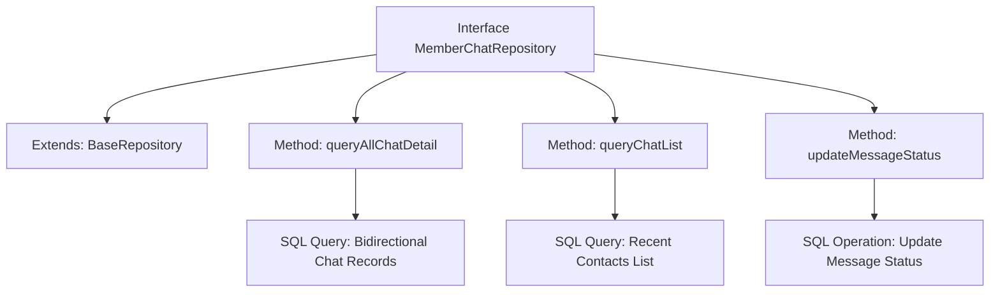

# Basic Information

|      |      |
|------|------|
| Name | MemberChatRepository |
| Language | .java |
| Code Path | WeFe/board/board-service/src/main/java/com/welab/wefe/board/service/database/repository/MemberChatRepository.java |
| Package Name | com.welab.wefe.board.service.database.repository |
| Dependencies | ['com.welab.wefe.board.service.database.entity.chat.MemberChatMySqlModel', 'com.welab.wefe.board.service.database.repository.base.BaseRepository', 'org.springframework.data.jpa.repository.Modifying', 'org.springframework.data.jpa.repository.Query', 'org.springframework.data.repository.query.Param', 'org.springframework.stereotype.Repository', 'java.util.List'] |
| Brief Description | Member Chat Repository Interface, including methods for querying chat history between both parties, retrieving chat lists, and updating message status. |

# Description

The code defines a Spring Data JPA repository interface named `MemberChatRepository`, which extends `BaseRepository`. The interface includes three methods: `queryAllChatDetail` for querying all chat records between two members; `queryChatList` to retrieve a list of other members who chatted with the specified member along with the last chat time; and `updateMessageStatus` to update the status of messages between a specified sender and receiver. All methods utilize native SQL queries implemented via the `@Query` annotation.

# Class Summary

| Name   | Type  | Description |
|-------|------|-------------|
| MemberChatRepository | interface | Member Chat Repository Interface, including methods for querying chat records between both parties, retrieving chat lists, and updating message statuses. |

## Class MemberChatRepository

|      |      |
|------|------|
| Access Modifier | @Repository;public |
| Type | interface |
| Name | MemberChatRepository |
| Description | Member Chat Repository Interface, including methods for querying chat records between both parties, retrieving chat lists, and updating message statuses. |

### UML Class Diagram

This class diagram illustrates a Spring Data JPA repository interface MemberChatRepository, which inherits from the generic interface BaseRepository and operates on the MemberChatMySqlModel entity class. The interface contains three main methods: queryAllChatDetail for retrieving chat records between two members, queryChatList for fetching a user's chat list, and updateMessageStatus for updating message statuses. It demonstrates the combination of JPA repository patterns with complex queries through native SQL implementations for data access.

### Internal Method Call Graph

This flowchart illustrates the structure of a Spring Data JPA repository interface, containing three core query methods. queryAllChatDetail retrieves bidirectional chat records through composite condition queries, queryChatList uses UNION queries to generate a recent contacts list sorted by time, and updateMessageStatus performs batch updates of message statuses. Each method directly defines native SQL operations via @Query annotations, demonstrating JPA's integration capability with complex SQL statements.

### Field List

| Name  | Type  | Description |
|-------|-------|------|

### Method List

| Name  | Type  | Description |
|-------|-------|------|
| queryChatList | List<Object[]> | Query the latest chat records of non-current users with other members, and return the member IDs and maximum timestamps in descending chronological order. |
| queryAllChatDetail | List<MemberChatMySqlModel> | Query all chat records between two members, using SQL to retrieve data by bidirectional matching of their IDs. |
| updateMessageStatus | void | Update the message status to a new status for specified sender, recipient, and status in the member_chat table. |

