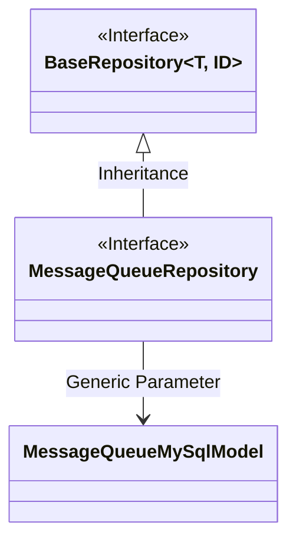
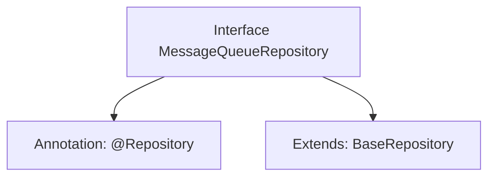

# Basic Information

|      |      |
|------|------|
| Name | MessageQueueRepository |
| Language | .java |
| Code Path | WeFe/board/board-service/src/main/java/com/welab/wefe/board/service/database/repository/MessageQueueRepository.java |
| Package Name | com.welab.wefe.board.service.database.repository |
| Dependencies | ['com.welab.wefe.board.service.database.entity.chat.MessageQueueMySqlModel', 'com.welab.wefe.board.service.database.repository.base.BaseRepository', 'org.springframework.stereotype.Repository'] |
| Brief Description | Message queue repository interface, inherits from the base repository, operates on the message queue MySQL model, with the primary key type as string. |

# Description

This is a Spring Data repository interface named MessageQueueRepository, annotated with @Repository. It extends the generic BaseRepository interface, specifying the entity type as MessageQueueMySqlModel and the primary key type as String. This interface is primarily used for database operations on the MessageQueueMySqlModel entity, inheriting the basic CRUD functionality provided by BaseRepository.

# Class Summary

| Name   | Type  | Description |
|-------|------|-------------|
| MessageQueueRepository | interface | Message queue storage interface, inherits the basic storage interface, operates the message queue MySQL model. |

## Class MessageQueueRepository

|      |      |
|------|------|
| Access Modifier | @Repository;public |
| Type | interface |
| Name | MessageQueueRepository |
| Description | Message queue storage interface, inherits the basic storage interface, operates the message queue MySQL model. |

### UML Class Diagram

This class diagram illustrates the relationship where the MessageQueueRepository interface inherits from the generic BaseRepository interface. BaseRepository defines two generic parameters T and ID, with T being specialized as the MessageQueueMySqlModel type and ID as String type. As a data access layer interface, MessageQueueRepository acquires generic CRUD operation capabilities by extending the base repository interface while specifying the entity type as MessageQueueMySqlModel. This design follows Spring Data JPA's repository pattern, enabling type-safe database operations.

### Internal Method Call Graph

This code defines a Spring Data repository interface named MessageQueueRepository, marked with the @Repository annotation to identify it as a persistence layer component. The interface extends the generic BaseRepository interface, specifying the entity type as MessageQueueMySqlModel and the primary key type as String. The flowchart clearly illustrates the annotation and inheritance relationships of the interface, demonstrating a typical design pattern in Spring Data JPA where basic CRUD operations are obtained by extending a base repository interface.

### Field List

| Name  | Type  | Description |
|-------|-------|------|

### Method List

| Name  | Type  | Description |
|-------|-------|------|

