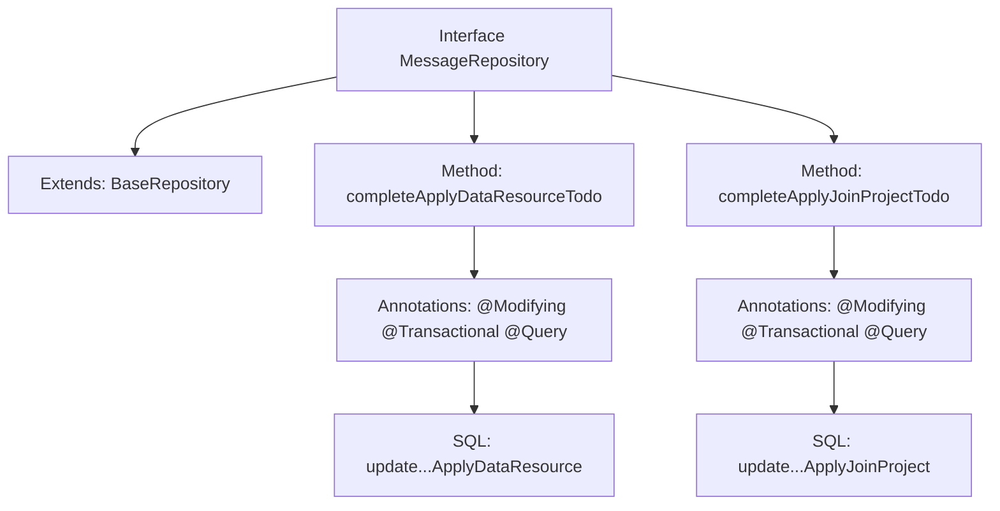

# Basic Information

|      |      |
|------|------|
| Name | MessageRepository |
| Language | .java |
| Code Path | WeFe/board/board-service/src/main/java/com/welab/wefe/board/service/database/repository/MessageRepository.java |
| Package Name | com.welab.wefe.board.service.database.repository |
| Dependencies | ['com.welab.wefe.board.service.database.entity.MessageMysqlModel', 'com.welab.wefe.board.service.database.repository.base.BaseRepository', 'org.springframework.data.jpa.repository.Modifying', 'org.springframework.data.jpa.repository.Query', 'org.springframework.stereotype.Repository', 'org.springframework.transaction.annotation.Transactional'] |
| Brief Description | The MessageRepository interface defines two methods: completeApplyDataResourceTodo updates the to-do status of a specified project and data resource to completed and read; completeApplyJoinProjectTodo updates the to-do status of a specified association ID for joining a project to completed and read. Both use native SQL and support transactions. |

# Description

The code defines a Spring Data JPA repository interface named `MessageRepository`, which extends `BaseRepository` and operates on the `MessageMysqlModel` entity class. The interface includes two custom update methods: The `completeApplyDataResourceTodo` method updates a specific event to "read" and "completed" status by project ID and data resource ID, while the `completeApplyJoinProjectTodo` method updates another type of event status by a related ID. Both methods use native SQL queries and are configured with automatic cache clearance and transaction support.

# Class Summary

| Name   | Type  | Description |
|-------|------|-------------|
| MessageRepository | interface | The MessageRepository interface defines two native SQL update methods: completeApplyDataResourceTodo updates the to-do status of a specified project and data resource to completed; completeApplyJoinProjectTodo updates the to-do status of joining a project for a specified association ID to completed. Both methods automatically clear the cache and support transactions. |


## Class MessageRepository

|      |      |
|------|------|
| Access Modifier | @Repository;public |
| Type | interface |
| Name | MessageRepository |
| Description | The MessageRepository interface defines two native SQL update methods: completeApplyDataResourceTodo updates the to-do status of a specified project and data resource to completed; completeApplyJoinProjectTodo updates the to-do status of joining a project for a specified association ID to completed. Both methods automatically clear the cache and support transactions. |


### UML Class Diagram

```mermaid
classDiagram
    class BaseRepository~T, ID~ {
        <<Interface>>
    }
    
    class MessageRepository {
        <<Interface>>
        +completeApplyDataResourceTodo(String projectId, String dataResourceId) void
        +completeApplyJoinProjectTodo(String relatedId1) void
    }
    
    BaseRepository <|-- MessageRepository : extends
    // MessageRepository extends the generic interface BaseRepository, providing two native SQL update methods
    // for handling completion operations of specific todo types, involving data resources and project joining scenarios
```

Class Diagram Description: This diagram illustrates a Spring Data JPA repository interface MessageRepository, which extends the generic base interface BaseRepository. MessageRepository defines two native SQL update methods for marking "Apply Data Resource" and "Apply Join Project" type todos as completed. Both methods utilize @Modifying and @Transactional annotations to ensure transactional operations and automatic persistence context clearance.


### Internal Method Call Graph



This flowchart illustrates the structure and functionality of the MessageRepository interface. The interface extends BaseRepository and contains two core methods: completeApplyDataResourceTodo and completeApplyJoinProjectTodo, which are used to update different types of todo item statuses. Each method is annotated with Spring Data JPA modification annotations (@Modifying, @Transactional) and includes native SQL queries (@Query) to update database records through parameterized operations. The arrows clearly indicate the interface inheritance relationship and method invocation hierarchy.

### Field List

| Name  | Type  | Description |
|-------|-------|------|

### Method List

| Name  | Type  | Description |
|-------|-------|------|
| completeApplyJoinProjectTodo | void | Update the database to mark unread as read and pending as completed, with the condition that the event type is a request to join a project and the associated ID matches. |
| completeApplyDataResourceTodo | void | Update the database to mark the to-dos for specific items and resource IDs as completed and read. |


