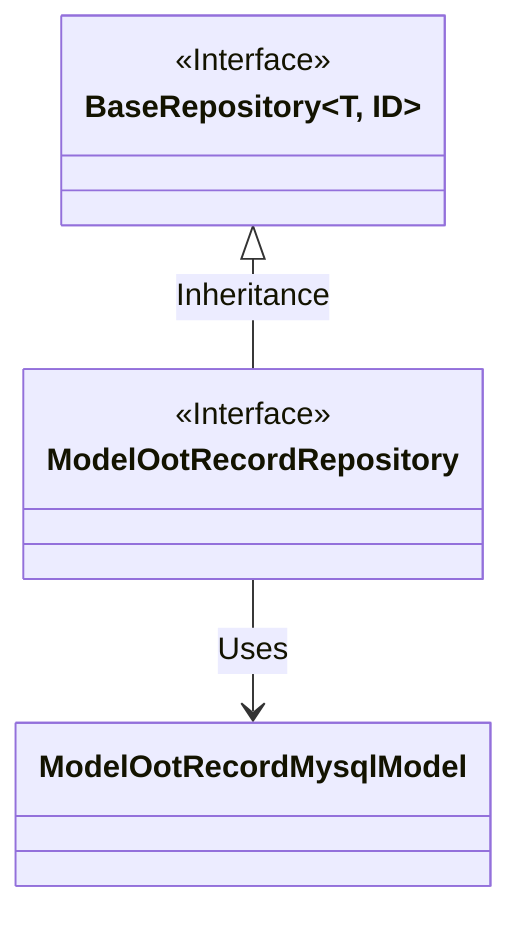
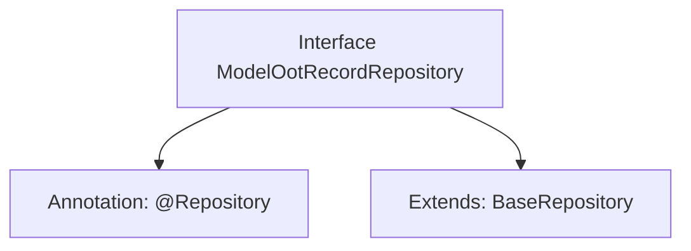

# Basic Information

|      |      |
|------|------|
| Name | ModelOotRecordRepository |
| Language | .java |
| Code Path | WeFe/board/board-service/src/main/java/com/welab/wefe/board/service/database/repository/ModelOotRecordRepository.java |
| Package Name | com.welab.wefe.board.service.database.repository |
| Dependencies | ['com.welab.wefe.board.service.database.entity.job.ModelOotRecordMysqlModel', 'com.welab.wefe.board.service.database.repository.base.BaseRepository', 'org.springframework.stereotype.Repository'] |
| Brief Description | This is a Spring Repository interface, extending from BaseRepository, used for operating the ModelOotRecordMysqlModel entity class with a primary key type of String. |

# Description

The content describes a Spring Data repository interface named ModelOotRecordRepository, annotated with @Repository. This interface extends the BaseRepository base class, with generic parameters specifying the entity type as ModelOotRecordMysqlModel and the primary key type as String. This indicates it is a persistence layer component for operating on ModelOotRecordMysqlModel entity data, designed following the Spring Data repository pattern.

# Class Summary

| Name   | Type  | Description |
|-------|------|-------------|
| ModelOotRecordRepository | interface | This is a Spring repository interface that extends the base repository class, used for operating on ModelOotRecordMysqlModel data with a primary key type of String. |

## Class ModelOotRecordRepository

|      |      |
|------|------|
| Access Modifier | @Repository;public |
| Type | interface |
| Name | ModelOotRecordRepository |
| Description | This is a Spring repository interface that extends the base repository class, used for operating on ModelOotRecordMysqlModel data with a primary key type of String. |

### UML Class Diagram

This class diagram illustrates that the `ModelOotRecordRepository` interface inherits from the generic interface `BaseRepository`, with the generic parameters specified as `ModelOotRecordMysqlModel` and `String`. `BaseRepository` is a generic interface, while `ModelOotRecordMysqlModel` is an entity class. As a Spring Repository interface, `ModelOotRecordRepository` acquires basic CRUD operation capabilities by extending `BaseRepository` and is specifically designed to handle data of type `ModelOotRecordMysqlModel`.

### Internal Method Call Graph

This flowchart illustrates the structure of the `ModelOotRecordRepository` interface, which is a Spring Data interface annotated with `@Repository`. It extends the generic `BaseRepository` interface, specifying the entity type as `ModelOotRecordMysqlModel` and the primary key type as `String`. This design is commonly used in Spring Data JPA to provide basic CRUD operation capabilities for databases without requiring manual implementation of interface methods.

### Field List

| Name  | Type  | Description |
|-------|-------|------|

### Method List

| Name  | Type  | Description |
|-------|-------|------|

