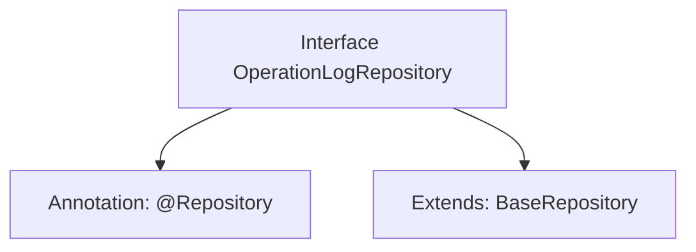

# Basic Information

|      |      |
|------|------|
| Name | OperationLogRepository |
| Language | .java |
| Code Path | WeFe/board/board-service/src/main/java/com/welab/wefe/board/service/database/repository/OperationLogRepository.java |
| Package Name | com.welab.wefe.board.service.database.repository |
| Dependencies | ['com.welab.wefe.board.service.database.entity.OperationLogMysqlModel', 'com.welab.wefe.board.service.database.repository.base.BaseRepository', 'org.springframework.stereotype.Repository'] |
| Brief Description | Operation log repository interface, inherits from the base repository class, with the operation log model being of MySQL type and the primary key as a string. |

# Description

This is a Spring Data repository interface named OperationLogRepository, annotated with @Repository. It extends the generic BaseRepository interface, specifying the entity type as OperationLogMysqlModel and the primary key type as String. This interface is primarily used for managing operation log records in the database, following Spring Data JPA specifications, which provide basic CRUD functionality without requiring concrete method implementations.

# Class Summary

| Name   | Type  | Description |
|-------|------|-------------|
| OperationLogRepository | interface | This is a MySQL storage interface for operation logs, inheriting from the base repository class, designed for operation log data access. |


## Class OperationLogRepository

|      |      |
|------|------|
| Access Modifier | @Repository;public |
| Type | interface |
| Name | OperationLogRepository |
| Description | This is a MySQL storage interface for operation logs, inheriting from the base repository class, designed for operation log data access. |


### UML Class Diagram

```mermaid
classDiagram
    class OperationLogRepository {
        <<Interface>>
    }
    class BaseRepository~T, ID~ {
        <<Interface>>
    }
    
    OperationLogRepository --|> BaseRepository : Inheritance
    // OperationLogRepository inherits from the generic interface BaseRepository, with generic parameters specified as OperationLogMysqlModel and String
```

This class diagram illustrates the hierarchical relationship where the OperationLogRepository interface extends the generic BaseRepository interface. OperationLogRepository is a Spring data access interface marked with @Repository, explicitly specifying the entity type OperationLogMysqlModel and primary key type String as its generic parameters. The design adheres to Spring Data JPA specifications, automatically acquiring standard CRUD operation methods by extending the base repository interface while maintaining type safety. The diagram clearly demonstrates the generic specialization between interfaces, representing a typical data access layer abstraction pattern.


### Internal Method Call Graph



This flowchart describes the structure of the OperationLogRepository interface. The interface is annotated with @Repository, indicating it is a Spring data access layer component. It also extends the BaseRepository generic interface, specifying the entity type as OperationLogMysqlModel and the primary key type as String. This design follows Spring Data JPA's Repository pattern, automatically acquiring CRUD operation capabilities by inheriting the base interface without requiring manual implementation of basic data access methods.

### Field List

| Name  | Type  | Description |
|-------|-------|------|

### Method List

| Name  | Type  | Description |
|-------|-------|------|


