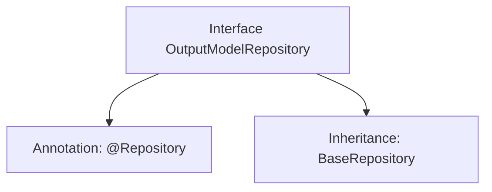

# Basic Information

|      |      |
|------|------|
| Name | OutputModelRepository |
| Language | .java |
| Code Path | WeFe/board/board-service/src/main/java/com/welab/wefe/board/service/database/repository/OutputModelRepository.java |
| Package Name | com.welab.wefe.board.service.database.repository |
| Dependencies | ['com.welab.wefe.board.service.database.entity.OutputModelMysqlModel', 'com.welab.wefe.board.service.database.repository.base.BaseRepository', 'org.springframework.stereotype.Repository'] |
| Brief Description | This is a Spring Data JPA repository interface that extends the base repository class, used for operating on the OutputModelMysqlModel entity with a primary key type of String. |

# Description

The content defines a Spring Data repository interface named `OutputModelRepository`, marked as a persistence layer component with the `@Repository` annotation. This interface extends the generic base class `BaseRepository`, specifying the entity type as `OutputModelMysqlModel` and the primary key type as `String`. This indicates that the repository is used to manipulate `OutputModel`-related data in a MySQL database, inheriting basic CRUD operation capabilities. The entire definition succinctly establishes a mapping relationship with the database table `OutputModelMysqlModel`.

# Class Summary

| Name   | Type  | Description |
|-------|------|-------------|
| OutputModelRepository | interface | This is a Spring Data JPA repository interface that extends the base repository class, used for operating on the OutputModelMysqlModel entity with a primary key type of String. |


## Class OutputModelRepository

|      |      |
|------|------|
| Access Modifier | @Repository;public |
| Type | interface |
| Name | OutputModelRepository |
| Description | This is a Spring Data JPA repository interface that extends the base repository class, used for operating on the OutputModelMysqlModel entity with a primary key type of String. |


### UML Class Diagram

```mermaid
classDiagram
    class OutputModelRepository {
        <<Interface>>
    }
    class BaseRepository~T, ID~ {
        <<Interface>>
    }
    OutputModelRepository --|> BaseRepository : extends
    // OutputModelRepository inherits from generic interface BaseRepository
    // Generic parameter T is bound to OutputModelMysqlModel, ID is bound to String
```

This class diagram illustrates the inheritance relationship where the OutputModelRepository interface extends the generic BaseRepository interface. BaseRepository defines two generic parameters T and ID, which are concretized as OutputModelMysqlModel and String types respectively during inheritance. The <<Interface>> annotation indicates both are interfaces, and the arrow direction correctly expresses the inheritance hierarchy, conforming to the Repository design pattern in Spring Data JPA.


### Internal Method Call Graph



This code defines a Spring Data JPA repository interface OutputModelRepository, marked as a persistence layer component via the @Repository annotation, and inherits the BaseRepository interface to obtain basic CRUD operations. The generic parameters specify the entity type as OutputModelMysqlModel and the primary key type as String, with the overall structure reflecting the standard implementation of the JPA repository pattern.

### Field List

| Name  | Type  | Description |
|-------|-------|------|

### Method List

| Name  | Type  | Description |
|-------|-------|------|


