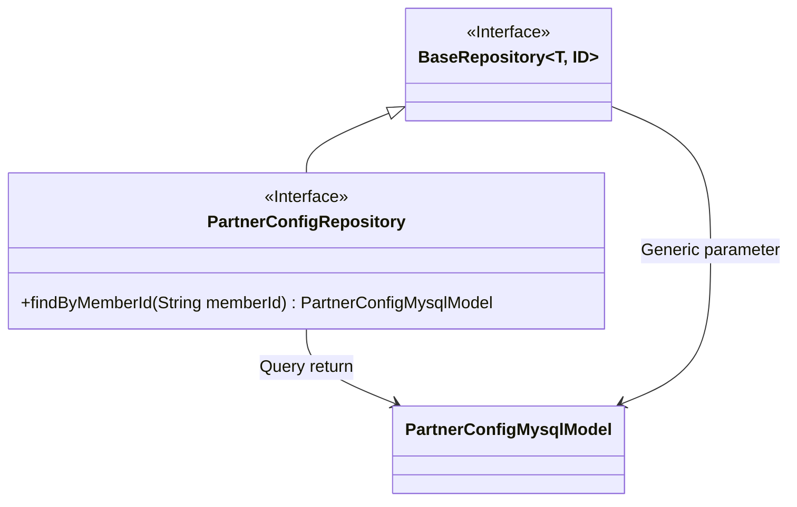
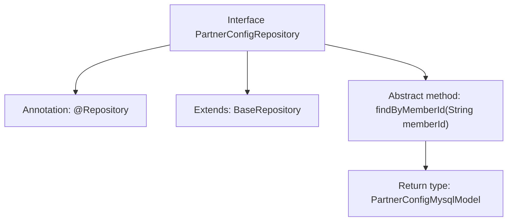

# Basic Information

|      |      |
|------|------|
| Name | PartnerConfigRepository |
| Language | .java |
| Code Path | WeFe/board/board-service/src/main/java/com/welab/wefe/board/service/database/repository/PartnerConfigRepository.java |
| Package Name | com.welab.wefe.board.service.database.repository |
| Dependencies | ['com.welab.wefe.board.service.database.entity.PartnerConfigMysqlModel', 'com.welab.wefe.board.service.database.repository.base.BaseRepository', 'org.springframework.stereotype.Repository'] |
| Brief Description | The PartnerConfigRepository interface extends BaseRepository and provides a method to query PartnerConfigMysqlModel by memberId. |

# Description

This is a Spring Data JPA repository interface, PartnerConfigRepository, which extends BaseRepository and operates on the PartnerConfigMysqlModel entity class with a primary key type of String. The interface defines a query method, findByMemberId, which queries by the memberId field and returns a PartnerConfigMysqlModel object. The @Repository annotation indicates that this is a Spring-managed persistence layer component.

# Class Summary

| Name   | Type  | Description |
|-------|------|-------------|
| PartnerConfigRepository | interface | The PartnerConfigRepository interface extends BaseRepository and provides a method to query PartnerConfigMysqlModel by memberId. |

## Class PartnerConfigRepository

|      |      |
|------|------|
| Access Modifier | @Repository;public |
| Type | interface |
| Name | PartnerConfigRepository |
| Description | The PartnerConfigRepository interface extends BaseRepository and provides a method to query PartnerConfigMysqlModel by memberId. |

### UML Class Diagram

This class diagram illustrates the inheritance relationship of repository interfaces in Spring Data JPA. The PartnerConfigRepository interface extends the generic BaseRepository interface and adds a method to query by memberId. BaseRepository serves as the foundational repository interface, specifying the entity type (PartnerConfigMysqlModel) and primary key type (String) through generic parameters T and ID. By extending the base interface, PartnerConfigRepository inherits CRUD capabilities while declaring custom query methods, forming a typical data access layer structure.

### Internal Method Call Graph

This flowchart illustrates the structure of the Spring Data JPA interface `PartnerConfigRepository`. As a data access layer component, it is marked with the `@Repository` annotation and extends the generic base repository `BaseRepository`, specifying the entity type `PartnerConfigMysqlModel` and primary key type `String`. Its core functionality is to query by member ID through the abstract method `findByMemberId`, which automatically generates query logic following JPA method naming conventions.

### Field List

| Name  | Type  | Description |
|-------|-------|------|

### Method List

| Name  | Type  | Description |
|-------|-------|------|
| findByMemberId | PartnerConfigMysqlModel | Query MySQL model methods for partner configurations based on member ID. |

