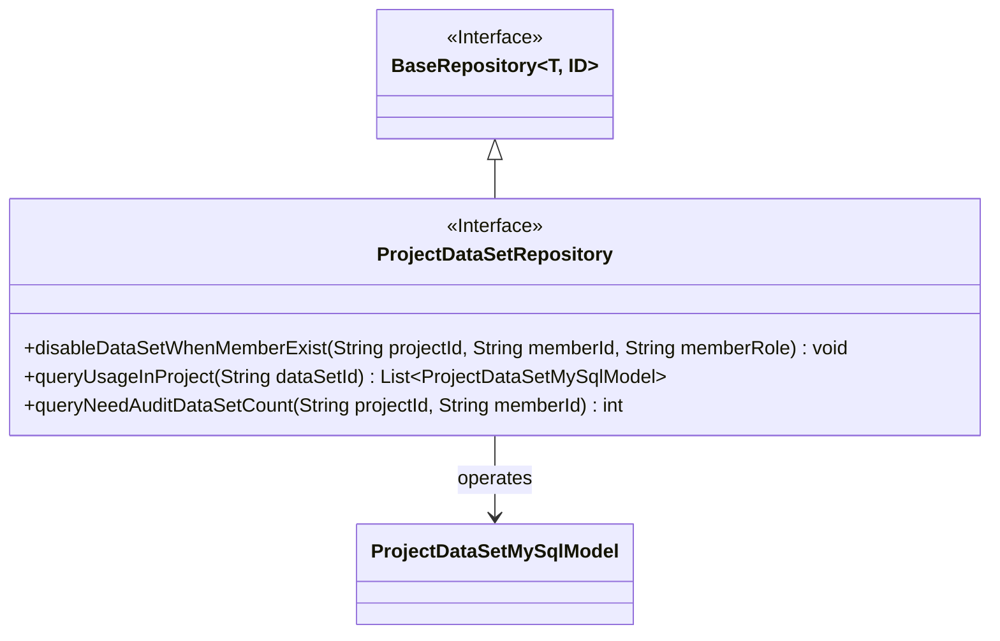
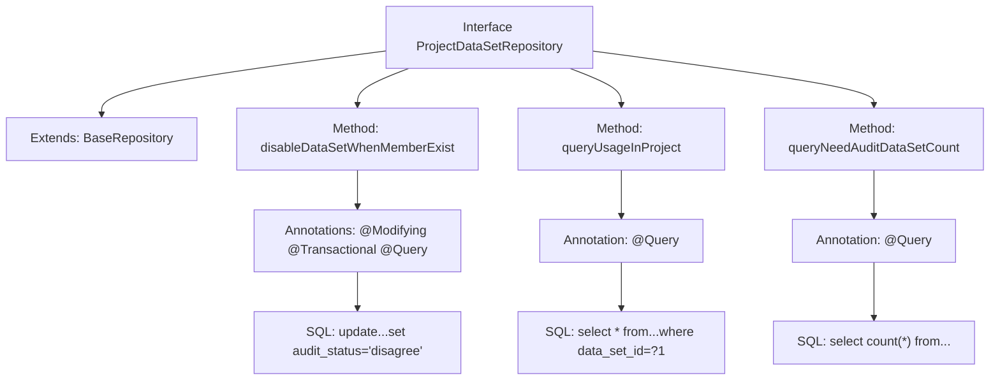

# Basic Information

|      |      |
|------|------|
| Name | ProjectDataSetRepository |
| Language | .java |
| Code Path | WeFe/board/board-service/src/main/java/com/welab/wefe/board/service/database/repository/ProjectDataSetRepository.java |
| Package Name | com.welab.wefe.board.service.database.repository |
| Dependencies | ['com.welab.wefe.board.service.database.entity.job.ProjectDataSetMySqlModel', 'com.welab.wefe.board.service.database.repository.base.BaseRepository', 'org.springframework.data.jpa.repository.Modifying', 'org.springframework.data.jpa.repository.Query', 'org.springframework.stereotype.Repository', 'org.springframework.transaction.annotation.Transactional', 'java.util.List'] |
| Brief Description | ProjectDataSetRepository interface definition: 1. Disable datasets when members exit; 2. Query available datasets in the project; 3. Count the number of datasets pending review. |

# Description

The code defines a Spring Data JPA repository interface named `ProjectDataSetRepository`, which extends `BaseRepository`. It includes three core methods: the `disableDataSetWhenMemberExist` method updates the dataset status to disabled when a member exits and adds a comment; the `queryUsageInProject` method queries records with a specified dataset ID and a status of "agreed"; the `queryNeedAuditDataSetCount` method counts the number of datasets pending review under a specified project and member. All methods use native SQL queries and include annotations for transactions and automatic cache clearance.

# Class Summary

| Name   | Type  | Description |
|-------|------|-------------|
| ProjectDataSetRepository | interface | The ProjectDataSetRepository interface extends BaseRepository and includes three methods: disabling datasets when members exit, querying available datasets in a project, and counting the number of datasets pending review. |

## Class ProjectDataSetRepository

|      |      |
|------|------|
| Access Modifier | @Repository;public |
| Type | interface |
| Name | ProjectDataSetRepository |
| Description | The ProjectDataSetRepository interface extends BaseRepository and includes three methods: disabling datasets when members exit, querying available datasets in a project, and counting the number of datasets pending review. |

### UML Class Diagram

This code demonstrates a Spring Data JPA repository interface `ProjectDataSetRepository`, which extends the generic interface `BaseRepository` and primarily handles database operations related to project datasets. The interface contains three core methods: 1) Disabling datasets when a member exits; 2) Querying datasets in use within a project; 3) Counting datasets pending audit. The class diagram clearly reflects the interface inheritance relationship and entity model dependency, where `ProjectDataSetRepository` implements specific SQL queries and update operations through JPA annotations, forming an operational relationship with the `ProjectDataSetMySqlModel` entity class.

### Internal Method Call Graph

This code demonstrates a Spring Data JPA repository interface with three core functionalities: 1) Disabling related datasets when members exit (via update operation); 2) Querying available records of specific datasets in projects; 3) Counting datasets pending review. Each method is configured with corresponding native SQL queries through specific annotations, where the disableDataSetWhenMemberExist method additionally features transaction management and automatic cache clearance. The interface inherits from a base repository template, providing standard CRUD operations for ProjectDataSetMySqlModel entities.

### Field List

| Name  | Type  | Description |
|-------|-------|------|

### Method List

| Name  | Type  | Description |
|-------|-------|------|
| queryUsageInProject | List<ProjectDataSetMySqlModel> | Query the approved datasets in the project: Filter records with the status "agree" based on the dataset ID, and return the corresponding model list. |
| disableDataSetWhenMemberExist | void | Update the dataset status to "Disagree", with the comment "Member exit unavailable", under the condition that the project ID, member ID, and role match. |
| queryNeedAuditDataSetCount | int | Query the number of pending review datasets for a specified project and member, with the condition that the review status is "auditing" and the source type is empty. |

