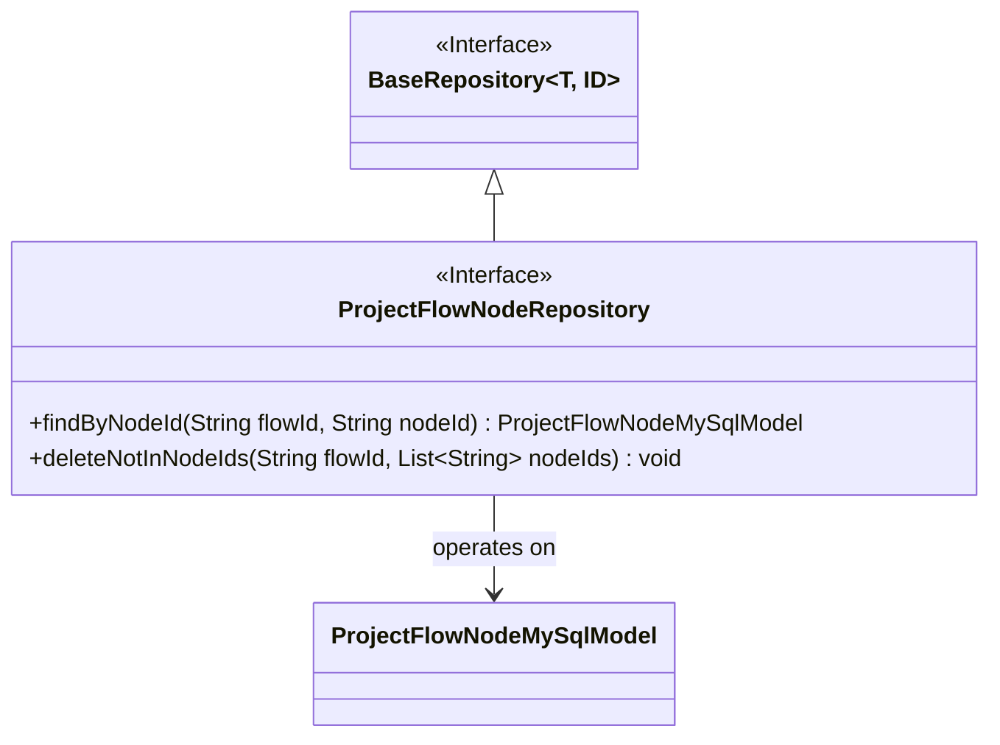
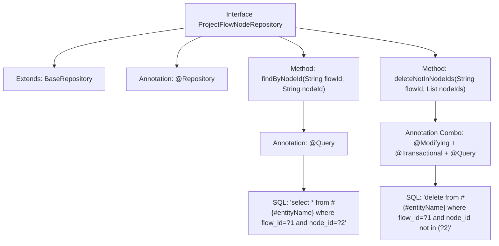

# Basic Information

|      |      |
|------|------|
| Name | ProjectFlowNodeRepository |
| Language | .java |
| Code Path | WeFe/board/board-service/src/main/java/com/welab/wefe/board/service/database/repository/ProjectFlowNodeRepository.java |
| Package Name | com.welab.wefe.board.service.database.repository |
| Dependencies | ['com.welab.wefe.board.service.database.entity.job.ProjectFlowNodeMySqlModel', 'com.welab.wefe.board.service.database.repository.base.BaseRepository', 'org.springframework.data.jpa.repository.Modifying', 'org.springframework.data.jpa.repository.Query', 'org.springframework.stereotype.Repository', 'org.springframework.transaction.annotation.Transactional', 'java.util.List'] |
| Brief Description | Project Process Node Repository Interface, providing methods to query nodes by process ID and node ID, as well as the functionality to delete nodes not in a given node ID list within a specified process. |

# Description

The code defines a Spring Data JPA repository interface named `ProjectFlowNodeRepository`, which extends `BaseRepository` and operates on the `ProjectFlowNodeMySqlModel` entity class with a primary key type of `String`. The interface includes two methods: `findByNodeId` queries a node by `flowId` and `nodeId` using native SQL, while `deleteNotInNodeIds` deletes nodes not in the specified `nodeIds` list based on `flowId`, featuring automatic cache clearance and transaction support.

# Class Summary

| Name   | Type  | Description |
|-------|------|-------------|
| ProjectFlowNodeRepository | interface | Project Process Node Repository Interface, provides methods for querying nodes by process ID and node ID, as well as the functionality to delete nodes not included in a specified node ID list. |

## Class ProjectFlowNodeRepository

|      |      |
|------|------|
| Access Modifier | @Repository;public |
| Type | interface |
| Name | ProjectFlowNodeRepository |
| Description | Project Process Node Repository Interface, provides methods for querying nodes by process ID and node ID, as well as the functionality to delete nodes not included in a specified node ID list. |

### UML Class Diagram

This class diagram illustrates the structure of a Spring Data JPA repository interface. The ProjectFlowNodeRepository interface extends the generic BaseRepository interface, specifying the entity type as ProjectFlowNodeMySqlModel and ID type as String. The interface defines two key methods: findByNodeId for querying nodes based on flow ID and node ID, and deleteNotInNodeIds for deleting all nodes in a specified flow that are not in the given node ID list. The annotations indicate this is a Spring Data repository interface containing native SQL queries and transactional operations.

### Internal Method Call Graph

This flowchart illustrates the structure of a Spring Data JPA repository interface, including inheritance relationships, class-level annotations, and two custom query methods. The findByNodeId method queries specific nodes through native SQL, while the deleteNotInNodeIds method performs transactional deletion to remove nodes not in the specified list. The annotation combinations clearly mark the persistence operation characteristics of each method, reflecting Spring Data's declarative data access style.

### Field List

| Name  | Type  | Description |
|-------|-------|------|

### Method List

| Name  | Type  | Description |
|-------|-------|------|
| deleteNotInNodeIds | void | Delete node data not in the given node ID list under the specified process ID, automatically clear the cache, and support transactions. |
| findByNodeId | ProjectFlowNodeMySqlModel | Query records in the database table with the specified process ID and node ID. |

