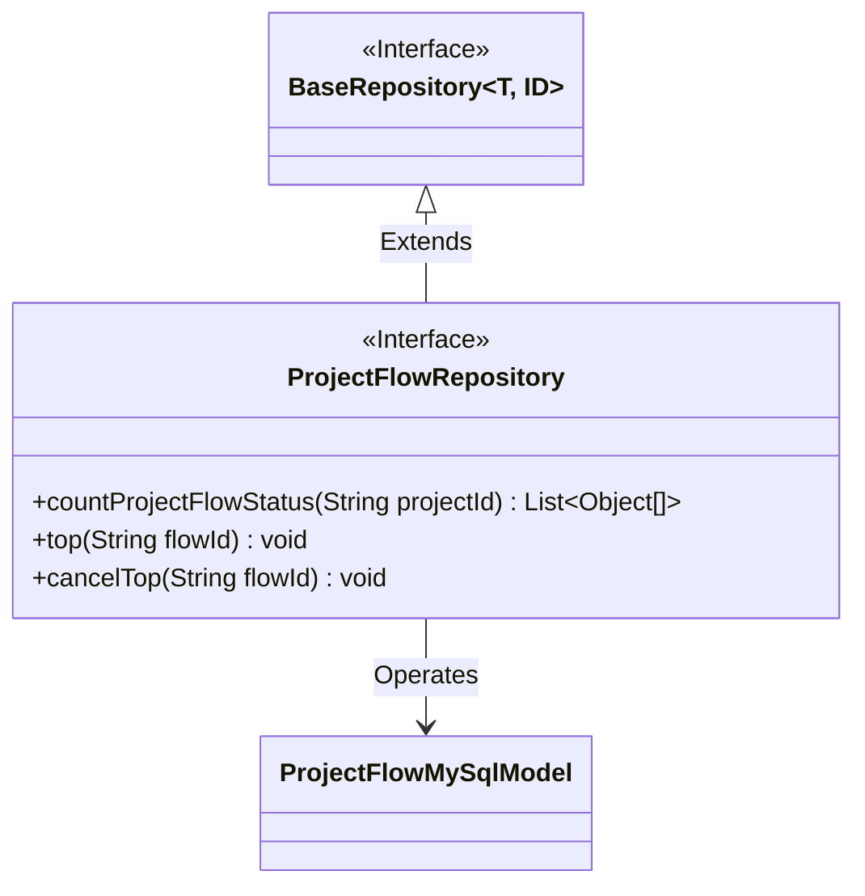
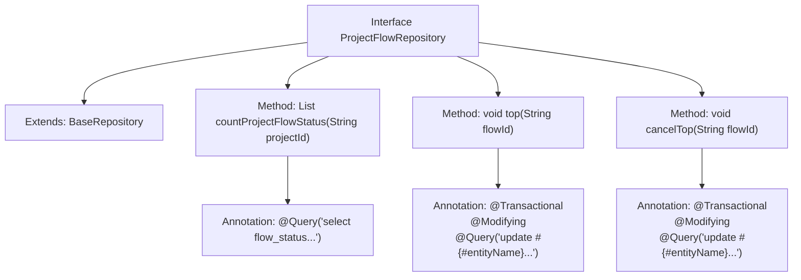

# Basic Information

|      |      |
|------|------|
| Name | ProjectFlowRepository |
| Language | .java |
| Code Path | WeFe/board/board-service/src/main/java/com/welab/wefe/board/service/database/repository/ProjectFlowRepository.java |
| Package Name | com.welab.wefe.board.service.database.repository |
| Dependencies | ['com.welab.wefe.board.service.database.entity.job.ProjectFlowMySqlModel', 'com.welab.wefe.board.service.database.repository.base.BaseRepository', 'org.springframework.data.jpa.repository.Modifying', 'org.springframework.data.jpa.repository.Query', 'org.springframework.stereotype.Repository', 'org.springframework.transaction.annotation.Transactional', 'java.util.List'] |
| Brief Description | The ProjectFlowRepository interface provides project flow status statistics, pinning, and unpinning functionalities, utilizing native SQL queries and update operations. |

# Description

The code defines a Spring Data JPA repository interface named `ProjectFlowRepository`, which extends `BaseRepository`. The interface includes three methods: `countProjectFlowStatus` for counting the number of workflows in different statuses within a project; the `top` method prioritizes a specified workflow and updates its sort order; and the `cancelTop` method cancels the prioritized status of a specified workflow and resets its sort order to 0. All methods use native SQL queries and are configured with annotations for transaction and modification behavior.

# Class Summary

| Name   | Type  | Description |
|-------|------|-------------|
| ProjectFlowRepository | interface | The ProjectFlowRepository interface provides project flow status statistics, pinning, and unpinning functionalities, utilizing native SQL queries and update operations. |

## Class ProjectFlowRepository

|      |      |
|------|------|
| Access Modifier | @Repository;public |
| Type | interface |
| Name | ProjectFlowRepository |
| Description | The ProjectFlowRepository interface provides project flow status statistics, pinning, and unpinning functionalities, utilizing native SQL queries and update operations. |

### UML Class Diagram

Class Diagram Description: This diagram illustrates a Spring Data JPA repository interface ProjectFlowRepository, which extends the generic interface BaseRepository and operates on the ProjectFlowMySqlModel entity class. The interface contains three main methods: counting project flow status quantities, pinning to top, and canceling top pinning, all implemented via native SQL. Marked as a persistence layer component through the @Repository annotation, it reflects the fundamental structure of the JPA repository pattern.

### Internal Method Call Graph

This code defines a Spring Data JPA repository interface ProjectFlowRepository, primarily used for managing project flow data. The interface provides three core functionalities: 1) Counting the number of flows with different statuses in a project (countProjectFlowStatus); 2) Pinning a specified flow to the top (top), achieved by updating the top field and setting the maximum sort value; 3) Unpinning a flow (cancelTop), resetting the top and sort_num fields. All database operations are implemented through native SQL queries, with @Modifying and @Transactional annotations ensuring data consistency. The interface extends BaseRepository, inheriting basic CRUD capabilities.

### Field List

| Name  | Type  | Description |
|-------|-------|------|

### Method List

| Name  | Type  | Description |
|-------|-------|------|
| countProjectFlowStatus | List<Object[]> | Query project flow status statistics: Group by project_id and undeleted conditions to count the quantity of each flow_status, then return the result list. |
| top | void | Update the record with the specified flowId using native SQL, set top to true and sort_num to the current maximum value plus 1, while automatically clearing the cache. |
| cancelTop | void | JPA method annotated with @Transactional and @Modifying, updating the top and sort_num fields of records with specified flowId using native SQL. |

