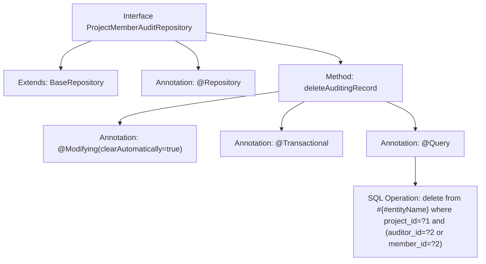

# Basic Information

|      |      |
|------|------|
| Name | ProjectMemberAuditRepository |
| Language | .java |
| Code Path | WeFe/board/board-service/src/main/java/com/welab/wefe/board/service/database/repository/ProjectMemberAuditRepository.java |
| Package Name | com.welab.wefe.board.service.database.repository |
| Dependencies | ['com.welab.wefe.board.service.database.entity.job.ProjectMemberAuditMySqlModel', 'com.welab.wefe.board.service.database.repository.base.BaseRepository', 'org.springframework.data.jpa.repository.Modifying', 'org.springframework.data.jpa.repository.Query', 'org.springframework.stereotype.Repository', 'org.springframework.transaction.annotation.Transactional'] |
| Brief Description | Project members review repository interface, inheriting the base repository, provides the functionality to delete specified member review records, including both their reviewed and being-reviewed records, implemented via native SQL. |

# Description

The code defines a Spring Data JPA repository interface named `ProjectMemberAuditRepository`, which extends `BaseRepository` and operates on data of type `ProjectMemberAuditMySqlModel` with a primary key of type `String`. The interface includes a method `deleteAuditingRecord` for removing audit records, which deletes all audit records related to a specific member in a given project, including records requiring the member's review and records reviewing the member. The method uses a native SQL query and is annotated with `@Modifying` and `@Transactional` to ensure transactional data modification operations and automatic cache clearance.

# Class Summary

| Name   | Type  | Description |
|-------|------|-------------|
| ProjectMemberAuditRepository | interface | The ProjectMemberAuditRepository interface defines a method for deleting project member audit records, using native SQL to remove records with specified project IDs and reviewer or member IDs. |


## Class ProjectMemberAuditRepository

|      |      |
|------|------|
| Access Modifier | @Repository;public |
| Type | interface |
| Name | ProjectMemberAuditRepository |
| Description | The ProjectMemberAuditRepository interface defines a method for deleting project member audit records, using native SQL to remove records with specified project IDs and reviewer or member IDs. |


### UML Class Diagram

```mermaid
classDiagram
    class BaseRepository~T, ID~ {
        <<Interface>>
    }

    class ProjectMemberAuditRepository {
        <<Interface>>
        +deleteAuditingRecord(String projectId, String auditorId) void
    }

    BaseRepository <|-- ProjectMemberAuditRepository
    // ProjectMemberAuditRepository inherits from the generic interface BaseRepository  
    // Provides a method to delete project member audit records, supporting native SQL operations  
```

Class diagram description: This diagram illustrates the ProjectMemberAuditRepository interface inheriting from the generic BaseRepository interface, where BaseRepository has two generic parameters T and ID. As a data access layer interface, ProjectMemberAuditRepository implements native SQL delete operations via @Query annotation to remove audit records of specified project members, including functionality to clear records related to both auditors and auditees.


### Internal Method Call Graph



This code defines a Spring Data JPA repository interface for managing database operations of project member audit records. The core functionality is to execute a native SQL delete operation through the deleteAuditingRecord method, which removes all audit records related to a specific member in a given project (including records where the member acts as either auditor or auditee). The method ensures transactional behavior via @Modifying and @Transactional annotations, and specifies the native SQL delete statement using @Query, where #{#entityName} will be replaced by the entity name. The interface inherits basic CRUD capabilities from BaseRepository and is marked as a Spring component with the @Repository annotation.

### Field List

| Name  | Type  | Description |
|-------|-------|------|

### Method List

| Name  | Type  | Description |
|-------|-------|------|
| deleteAuditingRecord | void | Delete the audit records for the specified project ID and reviewer or member ID, automatically clear the cache, and support transactions. |


