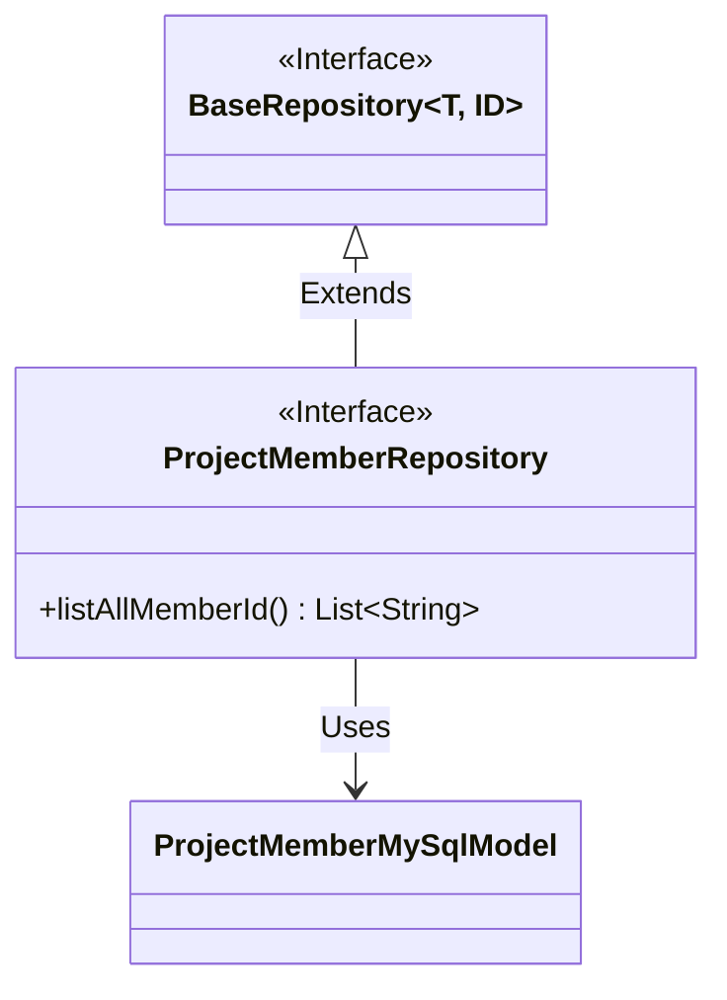
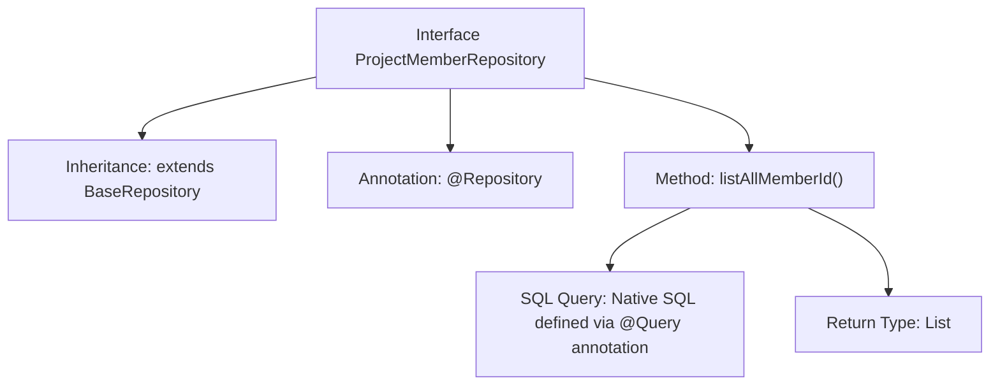

# Basic Information

|      |      |
|------|------|
| Name | ProjectMemberRepository |
| Language | .java |
| Code Path | WeFe/board/board-service/src/main/java/com/welab/wefe/board/service/database/repository/ProjectMemberRepository.java |
| Package Name | com.welab.wefe.board.service.database.repository |
| Dependencies | ['com.welab.wefe.board.service.database.entity.job.ProjectMemberMySqlModel', 'com.welab.wefe.board.service.database.repository.base.BaseRepository', 'org.springframework.data.jpa.repository.Query', 'org.springframework.stereotype.Repository', 'java.util.List'] |
| Brief Description | Project Member Repository Interface, inherits from the base repository, defines query methods to retrieve all collaborating member IDs. |

# Description

This is a Spring Data JPA repository interface named ProjectMemberRepository, which extends BaseRepository and operates on data entities of type ProjectMemberMySqlModel with a primary key type of String. The interface defines a native SQL query method called listAllMemberId, specified via the @Query annotation, which groups and queries all member IDs from the project member table and returns a list of strings. The interface is annotated with @Repository, indicating it is a Spring-managed persistence layer component.

# Class Summary

| Name   | Type  | Description |
|-------|------|-------------|
| ProjectMemberRepository | interface | Project Member Repository Interface, inherits from the base repository, provides the functionality to query all collaborating members grouped by member ID. |

## Class ProjectMemberRepository

|      |      |
|------|------|
| Access Modifier | @Repository;public |
| Type | interface |
| Name | ProjectMemberRepository |
| Description | Project Member Repository Interface, inherits from the base repository, provides the functionality to query all collaborating members grouped by member ID. |

### UML Class Diagram

This code demonstrates a Spring Data JPA repository interface design. The ProjectMemberRepository interface extends the generic BaseRepository interface, specifying the entity type as ProjectMemberMySqlModel and the primary key type as String. The interface defines a native SQL query method listAllMemberId() for grouping and querying all member IDs. The class diagram clearly reflects the interface inheritance relationship and entity dependency, conforming to the standard design pattern of JPA repositories, with the @Repository annotation indicating this as a data access component.

### Internal Method Call Graph

This flowchart illustrates the structure of the ProjectMemberRepository interface in Spring Data JPA. The interface is marked as a data access component with @Repository annotation, inheriting from the generic BaseRepository with specified entity type ProjectMemberMySqlModel and primary key type String. The core method listAllMemberId() uses @Query annotation to define a native SQL query that retrieves all distinct member_id through grouping operation, ultimately returning a string list. The entire design embodies Spring Data JPA's declarative Repository pattern, abstracting database operations into interface methods.

### Field List

| Name  | Type  | Description |
|-------|-------|------|

### Method List

| Name  | Type  | Description |
|-------|-------|------|
| listAllMemberId | List<String> | Query all member IDs and group them by member_id, returning a list of strings. |

