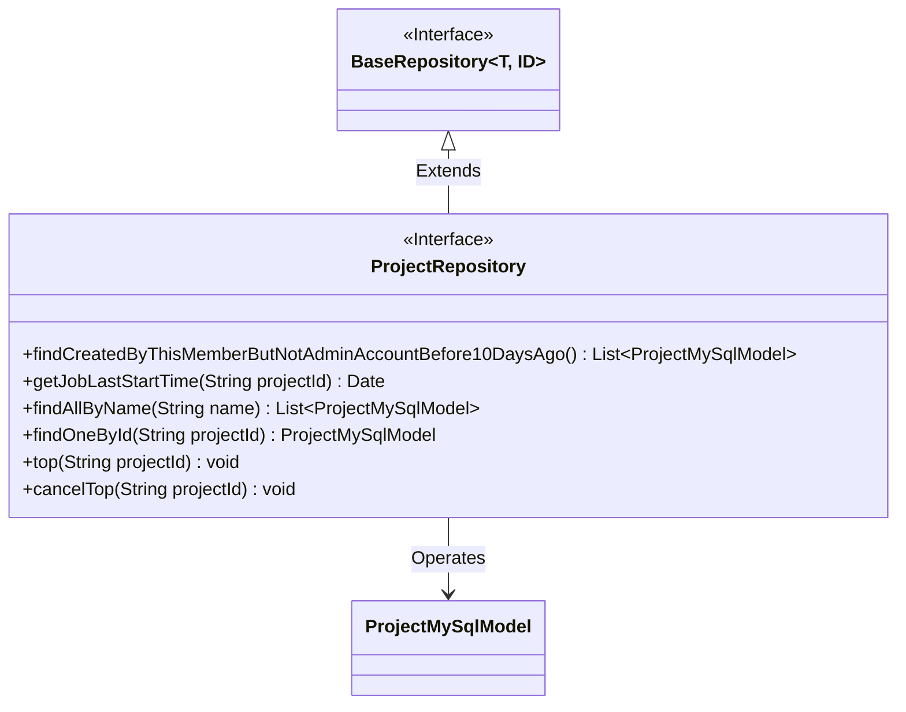
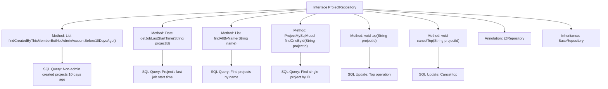

# Basic Information

|      |      |
|------|------|
| Name | ProjectRepository |
| Language | .java |
| Code Path | WeFe/board/board-service/src/main/java/com/welab/wefe/board/service/database/repository/ProjectRepository.java |
| Package Name | com.welab.wefe.board.service.database.repository |
| Dependencies | ['com.welab.wefe.board.service.database.entity.job.ProjectMySqlModel', 'com.welab.wefe.board.service.database.repository.base.BaseRepository', 'org.springframework.data.jpa.repository.Modifying', 'org.springframework.data.jpa.repository.Query', 'org.springframework.stereotype.Repository', 'org.springframework.transaction.annotation.Transactional', 'java.util.Date', 'java.util.List'] |
| Brief Description | The ProjectRepository interface includes functionalities for querying projects created by non-administrators 10 days ago, retrieving the last startup time of projects, searching projects by name or ID, as well as pinning and unpinning features. |

# Description

The ProjectRepository interface extends BaseRepository, providing various methods for querying and manipulating project data. It includes functionalities such as querying projects created by non-administrators more than 10 days ago, retrieving the last task start time for a specified project, and searching projects by name or ID. It also supports pinning and unpinning operations, implemented by updating the `top` and `sort_num` fields. All queries utilize native SQL statements, with some methods annotated for transactions and automatic cache clearance.

# Class Summary

| Name   | Type  | Description |
|-------|------|-------------|
| ProjectRepository | interface | The ProjectRepository interface includes methods for querying projects created by non-administrators more than 10 days ago, retrieving the last startup time of projects, querying projects by name or ID, as well as pinning and unpinning projects. |

## Class ProjectRepository

|      |      |
|------|------|
| Access Modifier | @Repository;public |
| Type | interface |
| Name | ProjectRepository |
| Description | The ProjectRepository interface includes methods for querying projects created by non-administrators more than 10 days ago, retrieving the last startup time of projects, querying projects by name or ID, as well as pinning and unpinning projects. |

### UML Class Diagram

This code demonstrates a Spring Data JPA `ProjectRepository` interface that extends `BaseRepository` and provides multiple custom query methods. The interface primarily operates on the `ProjectMySqlModel` entity class, including functionalities such as querying projects created by non-admin members 10 days ago, retrieving the last job start time of a project, querying projects by name, and pinning/unpinning projects. All methods are defined with native SQL queries via `@Query` annotations, with some modification operations additionally using `@Transactional` and `@Modifying` annotations to ensure transactional behavior and automatic persistence context clearance.

### Internal Method Call Graph

This flowchart illustrates the structure and functionality of the ProjectRepository interface. As a data access layer component, it inherits from BaseRepository and provides 6 core methods: including 4 query methods (complex conditional query, time-based query, name-based query, and ID-based query) and 2 update methods (top/cancel top operations). Each method is bound to specific native SQL statements through @Query annotations. The findCreatedByThisMemberButNotAdminAccountBefore10DaysAgo() method implements the most complex multi-condition joint query logic, while the top() and cancelTop() methods use @Modifying and @Transactional annotations to ensure transactional data modifications.

### Field List

| Name  | Type  | Description |
|-------|-------|------|

### Method List

| Name  | Type  | Description |
|-------|-------|------|
| findAllByName | List<ProjectMySqlModel> | Query all item records in the database that match the specified name and return the result list. Use native SQL statements. |
| getJobLastStartTime | Date | Query the latest start time of tasks in a project, and return the maximum start time based on the project ID. |
| top | void | Update the record with the specified project_id, pin it to the top, and set sort_num to the current maximum value plus 1. Use transactions and automatic cache clearing. |
| findCreatedByThisMemberButNotAdminAccountBefore10DaysAgo | List<ProjectMySqlModel> | Query records of projects that are not closed, created more than 10 days ago, created by specific members, and not associated with administrator accounts. |
| findOneById | ProjectMySqlModel | Query the first record with the specified project_id and return a ProjectMySqlModel object. |
| cancelTop | void | Using the @Transactional and @Modifying annotations, update the data with the specified projectId through native SQL, setting top to false and resetting sort_num to zero. |

