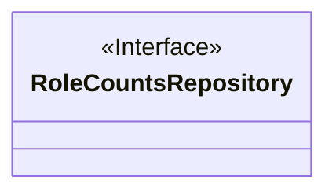

# Basic Information

|      |      |
|------|------|
| Name | RoleCountsRepository |
| Language | .java |
| Code Path | WeFe/board/board-service/src/main/java/com/welab/wefe/board/service/database/repository/RoleCountsRepository.java |
| Package Name | com.welab.wefe.board.service.database.repository |
| Dependencies | [] |
| Brief Description | Interface RoleCountsRepository definition, with no specific methods. |

# Description

This is a public interface definition named RoleCountsRepository, currently an empty interface without any declared methods. This interface may serve as an abstraction for the data access layer related to role counting, adhering to the design principle of interface-oriented programming to provide a normative foundation for subsequent implementation classes. The public modifier indicates that it can be accessed by any other class.

# Class Summary

| Name   | Type  | Description |
|-------|------|-------------|
| RoleCountsRepository | interface | Interface RoleCountsRepository definition, with no specific methods. |

## Class RoleCountsRepository

|      |      |
|------|------|
| Access Modifier | public |
| Type | interface |
| Name | RoleCountsRepository |
| Description | Interface RoleCountsRepository definition, with no specific methods. |

### UML Class Diagram

This class diagram depicts an interface named RoleCountsRepository, explicitly marked with <<Interface>> to indicate its type. Since no methods or attributes are defined within the interface, the diagram only presents its basic structure. In object-oriented design, such interfaces typically define behavioral contracts that can later be implemented by concrete classes to provide specific functionalities. The diagram clearly adheres to class diagram conventions, using correct markers and formatting to distinguish interfaces from regular classes.

### Internal Method Call Graph

This flowchart depicts a Java interface named RoleCountsRepository. Since it is an empty interface (containing no method or property declarations), the flowchart consists solely of a single node representing the interface itself. In object-oriented programming, such empty interfaces typically serve as marker interfaces, used to indicate that classes implementing them possess certain specific capabilities or characteristics. Although no methods are currently defined, functionality can be extended later by implementing this interface.

### Field List

| Name  | Type  | Description |
|-------|-------|------|

### Method List

| Name  | Type  | Description |
|-------|-------|------|

