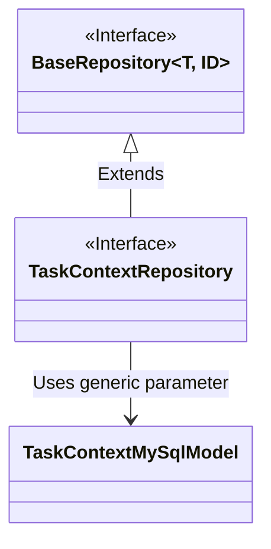
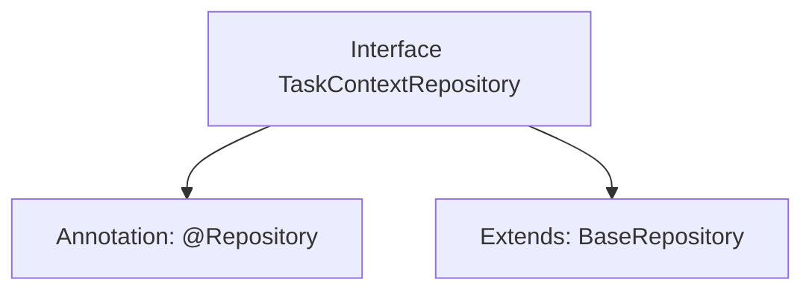

# Basic Information

|      |      |
|------|------|
| Name | TaskContextRepository |
| Language | .java |
| Code Path | WeFe/board/board-service/src/main/java/com/welab/wefe/board/service/database/repository/TaskContextRepository.java |
| Package Name | com.welab.wefe.board.service.database.repository |
| Dependencies | ['com.welab.wefe.board.service.database.entity.job.TaskContextMySqlModel', 'com.welab.wefe.board.service.database.repository.base.BaseRepository', 'org.springframework.stereotype.Repository'] |
| Brief Description | This is a Spring Repository interface that extends BaseRepository, designed for manipulating data of type TaskContextMySqlModel with a primary key of type String. |

# Description

This is a Spring Data repository interface named TaskContextRepository, annotated with @Repository. It extends the generic BaseRepository interface, specifying the entity type as TaskContextMySqlModel and the primary key type as String. This interface is primarily used for database operations on the TaskContextMySqlModel entity, inheriting basic CRUD functionalities from the base repository.

# Class Summary

| Name   | Type  | Description |
|-------|------|-------------|
| TaskContextRepository | interface | This is a Spring framework repository interface that extends the base repository class, designed for operating on TaskContextMySqlModel type data with a primary key of String type. |

## Class TaskContextRepository

|      |      |
|------|------|
| Access Modifier | @Repository;public |
| Type | interface |
| Name | TaskContextRepository |
| Description | This is a Spring framework repository interface that extends the base repository class, designed for operating on TaskContextMySqlModel type data with a primary key of String type. |

### UML Class Diagram

This code demonstrates a Spring Data JPA repository interface design. The TaskContextRepository interface extends from the generic BaseRepository interface, specifying the entity type as TaskContextMySqlModel and the primary key type as String. The class diagram clearly presents the interface inheritance relationship and generic parameter binding, where BaseRepository serves as the generic base interface, TaskContextRepository as the concrete domain repository interface, and TaskContextMySqlModel as the persistence entity model. This design follows Spring Data's repository pattern, implementing CRUD operations for specific entity types.

### Internal Method Call Graph

This code defines a Spring Data JPA repository interface TaskContextRepository, marked as a persistence layer component via the @Repository annotation. The interface extends the generic BaseRepository interface, specifying the entity type as TaskContextMySqlModel and the primary key type as String. The flowchart clearly illustrates the annotation and inheritance relationships of the interface, demonstrating the typical pattern in Spring Data JPA where CRUD operations are rapidly implemented by inheriting base repositories. This design eliminates the need for repetitive coding of basic data access logic.

### Field List

| Name  | Type  | Description |
|-------|-------|------|

### Method List

| Name  | Type  | Description |
|-------|-------|------|

