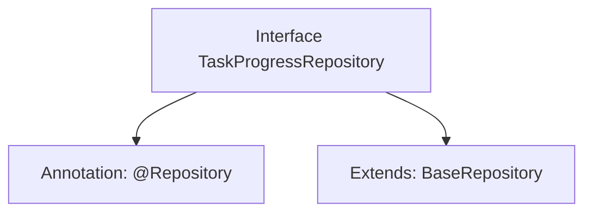

# Basic Information

|      |      |
|------|------|
| Name | TaskProgressRepository |
| Language | .java |
| Code Path | WeFe/board/board-service/src/main/java/com/welab/wefe/board/service/database/repository/TaskProgressRepository.java |
| Package Name | com.welab.wefe.board.service.database.repository |
| Dependencies | ['com.welab.wefe.board.service.database.entity.job.TaskProgressMysqlModel', 'com.welab.wefe.board.service.database.repository.base.BaseRepository', 'org.springframework.stereotype.Repository'] |
| Brief Description | Task progress repository interface, inherits from the base repository, operates on the task progress MySQL model, with the primary key type as string. |

# Description

The code snippet defines a Spring Data repository interface named `TaskProgressRepository`, marked with the `@Repository` annotation. This interface extends the generic base class `BaseRepository`, specifying the entity type as `TaskProgressMysqlModel` and the primary key type as `String`. This indicates that the repository is used for handling MySQL database operations related to task progress, inheriting the CRUD functionality from the base repository.

# Class Summary

| Name   | Type  | Description |
|-------|------|-------------|
| TaskProgressRepository | interface | Task Progress Repository Interface, inherits from the base repository, operates on the task progress MySQL model, with the primary key type as string. |


## Class TaskProgressRepository

|      |      |
|------|------|
| Access Modifier | @Repository;public |
| Type | interface |
| Name | TaskProgressRepository |
| Description | Task Progress Repository Interface, inherits from the base repository, operates on the task progress MySQL model, with the primary key type as string. |


### UML Class Diagram

```mermaid
classDiagram
    class TaskProgressRepository {
        <<Interface>>
    }
    class BaseRepository~T, ID~ {
        <<Interface>>
    }
    TaskProgressRepository --|> BaseRepository : Extends
    // The TaskProgressRepository interface inherits from the generic BaseRepository interface
    // Generic parameter T is bound to TaskProgressMysqlModel, and ID is bound to String
```

This class diagram illustrates a Spring Data repository interface TaskProgressRepository, which extends the generic base interface BaseRepository. The BaseRepository defines two generic parameters: T (entity type) specified as TaskProgressMysqlModel, and ID (primary key type) specified as String. The @Repository annotation indicates this is a data access layer component, following Spring Data's repository pattern design for handling persistence operations of TaskProgressMysqlModel entities. This design provides foundational support for standard CRUD operations while maintaining type safety.


### Internal Method Call Graph



This flowchart illustrates the structural relationships of the TaskProgressRepository interface. The interface is marked with the @Repository annotation, indicating it is a Spring data access layer component. It also extends the BaseRepository generic interface, specifying the entity type as TaskProgressMysqlModel and the primary key type as String. This design adheres to Spring Data JPA specifications, automatically acquiring CRUD operation capabilities by inheriting the base repository interface without requiring manual implementation of basic data access methods. The entire structure exemplifies the typical design pattern of JPA repository interfaces.

### Field List

| Name  | Type  | Description |
|-------|-------|------|

### Method List

| Name  | Type  | Description |
|-------|-------|------|


