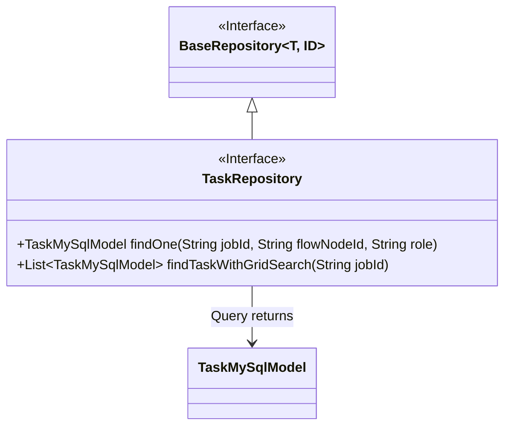
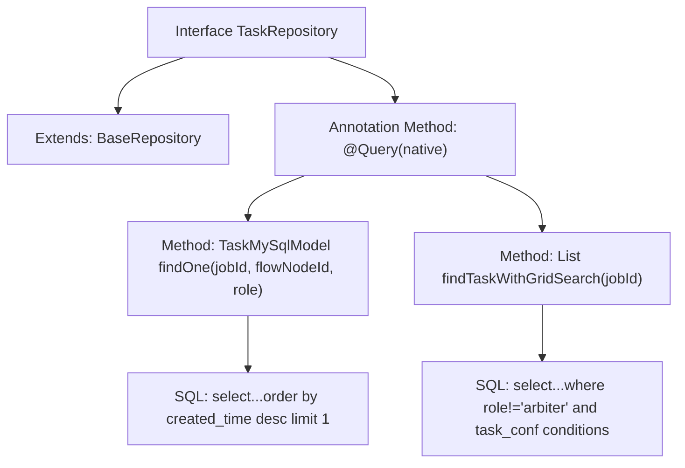

# Basic Information

|      |      |
|------|------|
| Name | TaskRepository |
| Language | .java |
| Code Path | WeFe/board/board-service/src/main/java/com/welab/wefe/board/service/database/repository/TaskRepository.java |
| Package Name | com.welab.wefe.board.service.database.repository |
| Dependencies | ['com.welab.wefe.board.service.database.entity.job.TaskMySqlModel', 'com.welab.wefe.board.service.database.repository.base.BaseRepository', 'org.springframework.data.jpa.repository.Query', 'org.springframework.stereotype.Repository', 'java.util.List'] |
| Brief Description | The TaskRepository interface extends BaseRepository and includes two native SQL query methods: findOne retrieves the latest task by jobId, flowNodeId, and role; findTaskWithGridSearch searches for task lists requiring grid search under non-arbiter roles. |

# Description

The code defines a Spring Data JPA repository interface named `TaskRepository`, which extends `BaseRepository` and operates on the `TaskMySqlModel` entity class. The interface includes two native SQL query methods: the `findOne` method retrieves the latest task record based on `jobId`, `flowNodeId`, and `role`; the `findTaskWithGridSearch` method queries a list of tasks under a specified `jobId` that are non-arbitrator roles and require grid search. Both methods use the `@Query` annotation to directly write SQL statements, implementing conditional queries through parameter binding.

# Class Summary

| Name   | Type  | Description |
|-------|------|-------------|
| TaskRepository | interface | The TaskRepository interface extends BaseRepository and includes two native SQL query methods: finding the latest task by jobId, flowNodeId, and role; and retrieving a list of non-arbitrator tasks requiring grid search under a specified jobId. |

## Class TaskRepository

|      |      |
|------|------|
| Access Modifier | @Repository;public |
| Type | interface |
| Name | TaskRepository |
| Description | The TaskRepository interface extends BaseRepository and includes two native SQL query methods: finding the latest task by jobId, flowNodeId, and role; and retrieving a list of non-arbitrator tasks requiring grid search under a specified jobId. |

### UML Class Diagram

This class diagram illustrates the structure and relationships of the TaskRepository interface in Spring Data JPA. TaskRepository extends the generic interface BaseRepository<TaskMySqlModel, String> and includes two custom query methods: findOne retrieves a single record by composite conditions of jobId, flowNodeId, and role; findTaskWithGridSearch queries non-arbitrator tasks requiring grid search. The interface is marked as a persistence layer component via the @Repository annotation and forms an association with the TaskMySqlModel entity class, reflecting the fundamental design of the JPA repository pattern.

### Internal Method Call Graph

This code demonstrates a Spring Data JPA Repository interface containing two custom SQL query methods. The first method findOne retrieves the latest single task record by jobId, flowNodeId and role, while the second method findTaskWithGridSearch searches for non-arbiter role tasks requiring grid search. The flowchart clearly illustrates the interface inheritance relationship and the invocation chain of two annotated methods with native SQL queries, each corresponding to specific database query logic.

### Field List

| Name  | Type  | Description |
|-------|-------|------|

### Method List

| Name  | Type  | Description |
|-------|-------|------|
| findTaskWithGridSearch | List<TaskMySqlModel> | Query the non-arbitrator role tasks requiring grid search under the specified jobId. |
| findOne | TaskMySqlModel | Query specified task: Filter by jobId, flowNodeId, and role conditions, returning the latest record. |

