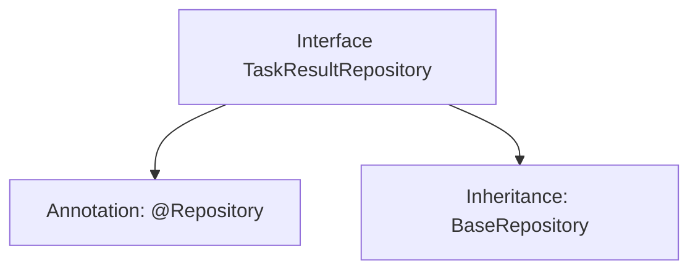

# Basic Information

|      |      |
|------|------|
| Name | TaskResultRepository |
| Language | .java |
| Code Path | WeFe/board/board-service/src/main/java/com/welab/wefe/board/service/database/repository/TaskResultRepository.java |
| Package Name | com.welab.wefe.board.service.database.repository |
| Dependencies | ['com.welab.wefe.board.service.database.entity.job.TaskResultMySqlModel', 'com.welab.wefe.board.service.database.repository.base.BaseRepository', 'org.springframework.stereotype.Repository'] |
| Brief Description | This is a Spring TaskResultRepository interface, which extends BaseRepository, used for operating TaskResultMySqlModel type data with a primary key of String type. |

# Description

The content describes a Java interface named TaskResultRepository, annotated with @Repository to mark it as a Spring data access layer component. This interface extends the generic base class BaseRepository, specifying the entity type as TaskResultMySqlModel and the primary key type as String. This indicates that the interface is used for database operations on the TaskResultMySqlModel entity, inheriting common CRUD methods provided by the base class. The entire definition is concise and does not include additional custom methods.

# Class Summary

| Name   | Type  | Description |
|-------|------|-------------|
| TaskResultRepository | interface | Task result repository interface, inherits from the base repository, operates on the task result MySQL model, with the primary key type as string. |


## Class TaskResultRepository

|      |      |
|------|------|
| Access Modifier | @Repository;public |
| Type | interface |
| Name | TaskResultRepository |
| Description | Task result repository interface, inherits from the base repository, operates on the task result MySQL model, with the primary key type as string. |


### UML Class Diagram

```mermaid
classDiagram
    class TaskResultRepository {
        <<Interface>>
    }
    class BaseRepository~T, ID~ {
        <<Interface>>
    }
    
    TaskResultRepository --|> BaseRepository : extends
    // TaskResultRepository extends the generic interface BaseRepository, specifying the generic parameters as TaskResultMySqlModel and String
```

This class diagram illustrates the inheritance relationship where the TaskResultRepository interface extends the generic BaseRepository interface. BaseRepository is an interface with two generic parameters, T and ID, while TaskResultRepository concretizes these parameters as TaskResultMySqlModel and String types during inheritance. The @Repository annotation indicates this is a data access layer component, typically used for database operations. This design follows Spring Data's repository pattern, acquiring basic CRUD operation capabilities by extending the base interface.


### Internal Method Call Graph



This code defines a Spring Data JPA repository interface TaskResultRepository, marked as a Spring-managed component via the @Repository annotation. The interface extends the generic BaseRepository interface, specifying the entity type as TaskResultMySqlModel and the primary key type as String. The flowchart illustrates the core structure and inheritance relationship of the interface, demonstrating the typical pattern in Spring Data JPA for rapidly implementing the data access layer by inheriting from a base repository.

### Field List

| Name  | Type  | Description |
|-------|-------|------|

### Method List

| Name  | Type  | Description |
|-------|-------|------|


