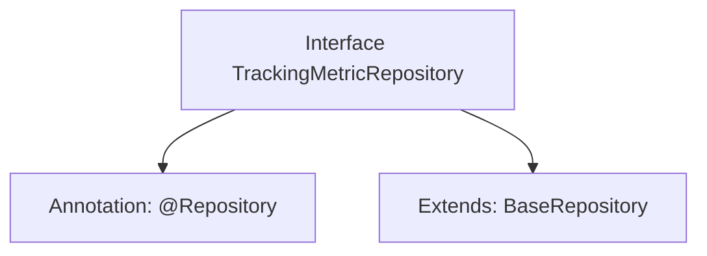

# Basic Information

|      |      |
|------|------|
| Name | TrackingMetricRepository |
| Language | .java |
| Code Path | WeFe/board/board-service/src/main/java/com/welab/wefe/board/service/database/repository/TrackingMetricRepository.java |
| Package Name | com.welab.wefe.board.service.database.repository |
| Dependencies | ['com.welab.wefe.board.service.database.entity.TrackingMetricMysqlModel', 'com.welab.wefe.board.service.database.repository.base.BaseRepository', 'org.springframework.stereotype.Repository'] |
| Brief Description | This is a Spring framework repository interface that extends a base repository class, designed for operating on the TrackingMetricMysqlModel data model with a primary key of type String. |

# Description

This is a Spring Data repository interface named TrackingMetricRepository, annotated with the @Repository annotation. It extends the generic BaseRepository interface, specifying the entity type as TrackingMetricMysqlModel and the primary key type as String. This interface is primarily used for database operations on the TrackingMetricMysqlModel entity, inheriting the generic CRUD methods provided by BaseRepository.

# Class Summary

| Name   | Type  | Description |
|-------|------|-------------|
| TrackingMetricRepository | interface | This is a Spring repository interface that extends the base repository class, designed for operating on TrackingMetricMysqlModel type data with String as the primary key. |


## Class TrackingMetricRepository

|      |      |
|------|------|
| Access Modifier | @Repository;public |
| Type | interface |
| Name | TrackingMetricRepository |
| Description | This is a Spring repository interface that extends the base repository class, designed for operating on TrackingMetricMysqlModel type data with String as the primary key. |


### UML Class Diagram

```mermaid
classDiagram
    class TrackingMetricMysqlModel {
        // Base model class for database mapping
    }

    <<Interface>> BaseRepository~T, ID~ {
        // Generic base repository interface
        +save(T entity) T
        +findById(ID id) Optional~T~
        +delete(T entity) void
    }

    <<Interface>> TrackingMetricRepository {
        // Tracking metric data repository interface
    }

    BaseRepository <|-- TrackingMetricRepository
    TrackingMetricRepository --> TrackingMetricMysqlModel : operates
```

Class diagram description: This structure shows that the `TrackingMetricRepository` interface inherits from the generic base repository interface `BaseRepository`, with generic parameters specified as `TrackingMetricMysqlModel` and `String`. The `BaseRepository` defines basic CRUD operations, while `TrackingMetricRepository` serves as its child interface specifically for operating on `TrackingMetricMysqlModel` type data entities, reflecting the repository pattern design of Spring Data JPA.


### Internal Method Call Graph



This flowchart illustrates the structure of the TrackingMetricRepository interface. The interface is marked with the @Repository annotation, indicating it is a Spring Data Access Layer component. It also extends the BaseRepository generic interface, specifying the entity type as TrackingMetricMysqlModel and the primary key type as String. This design follows Spring Data JPA conventions, automatically inheriting basic CRUD operation capabilities from the base repository interface without requiring manual implementation of these methods.

### Field List

| Name  | Type  | Description |
|-------|-------|------|

### Method List

| Name  | Type  | Description |
|-------|-------|------|


