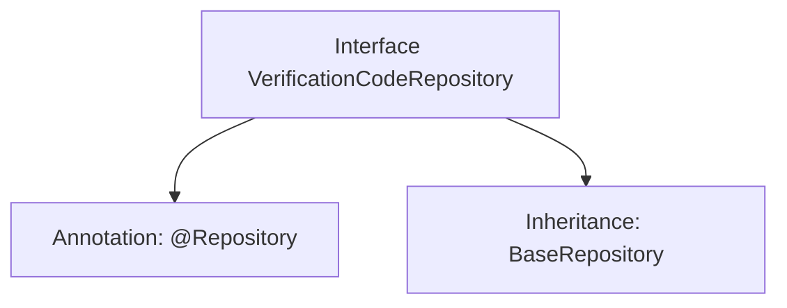

# Basic Information

|      |      |
|------|------|
| Name | VerificationCodeRepository |
| Language | .java |
| Code Path | WeFe/board/board-service/src/main/java/com/welab/wefe/board/service/database/repository/VerificationCodeRepository.java |
| Package Name | com.welab.wefe.board.service.database.repository |
| Dependencies | ['com.welab.wefe.board.service.database.entity.VerificationCodeMysqlModel', 'com.welab.wefe.board.service.database.repository.base.BaseRepository', 'org.springframework.stereotype.Repository'] |
| Brief Description | This is a Spring Repository interface, extending from BaseRepository, designed for operating on data of type VerificationCodeMysqlModel with a primary key type of String. |

# Description

The content defines a Spring Data repository interface named `VerificationCodeRepository`, annotated with `@Repository` to identify it as a data access component. This interface extends the generic base class `BaseRepository`, specifying the entity type as `VerificationCodeMysqlModel` and the primary key type as `String`. This indicates that the repository is used for handling persistence operations of verification code data, implemented based on a MySQL database. No additional custom methods are declared, relying solely on the generic CRUD functionality provided by the base class.

# Class Summary

| Name   | Type  | Description |
|-------|------|-------------|
| VerificationCodeRepository | interface | The interface VerificationCodeRepository extends BaseRepository and is used to operate VerificationCodeMysqlModel data, with the primary key type being String. |


## Class VerificationCodeRepository

|      |      |
|------|------|
| Access Modifier | @Repository;public |
| Type | interface |
| Name | VerificationCodeRepository |
| Description | The interface VerificationCodeRepository extends BaseRepository and is used to operate VerificationCodeMysqlModel data, with the primary key type being String. |


### UML Class Diagram

```mermaid
classDiagram
    class VerificationCodeRepository {
        <<Interface>>
    }
    class BaseRepository~T, ID~ {
        <<Interface>>
    }
    VerificationCodeRepository --|> BaseRepository : Extends
    // VerificationCodeRepository inherits from the generic interface BaseRepository, with generic parameters specified as VerificationCodeMysqlModel and String
```

This class diagram illustrates the inheritance relationship where the VerificationCodeRepository interface extends the generic BaseRepository interface. BaseRepository defines two generic parameters T and ID, which are concretized as VerificationCodeMysqlModel and String types during inheritance. As a data access layer interface, VerificationCodeRepository acquires generic CRUD operation capabilities by extending the base repository interface, while being identified as a Spring component through the @Repository annotation. This design achieves standardization and type safety in the data access layer.


### Internal Method Call Graph



This code defines a Spring Data JPA repository interface VerificationCodeRepository, marked as a persistence layer component via the @Repository annotation. The interface extends the BaseRepository interface, specifying the entity type as VerificationCodeMysqlModel and the primary key type as String. Inheriting from BaseRepository means this interface automatically acquires basic CRUD operation methods without manual implementation. This design adheres to Spring Data conventions, enabling rapid construction of the data access layer through interface inheritance.

### Field List

| Name  | Type  | Description |
|-------|-------|------|

### Method List

| Name  | Type  | Description |
|-------|-------|------|


