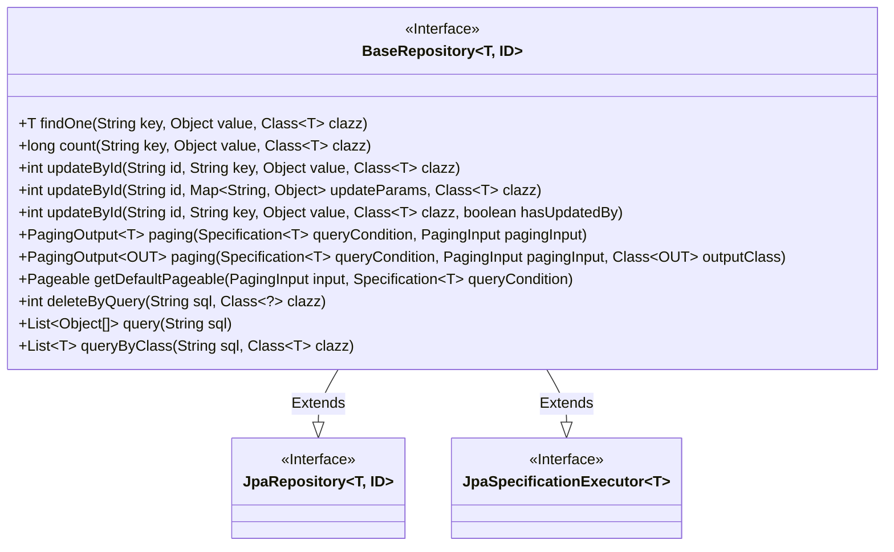

# Basic Information

|      |      |
|------|------|
| Name | BaseRepository |
| Language | .java |
| Code Path | WeFe/board/board-service/src/main/java/com/welab/wefe/board/service/database/repository/base/BaseRepository.java |
| Package Name | com.welab.wefe.board.service.database.repository.base |
| Dependencies | ['com.welab.wefe.board.service.dto.base.PagingInput', 'com.welab.wefe.board.service.dto.base.PagingOutput', 'com.welab.wefe.common.data.mysql.MySpecification', 'org.springframework.data.domain.PageRequest', 'org.springframework.data.domain.Pageable', 'org.springframework.data.domain.Sort', 'org.springframework.data.jpa.domain.Specification', 'org.springframework.data.jpa.repository.JpaRepository', 'org.springframework.data.jpa.repository.JpaSpecificationExecutor', 'org.springframework.data.repository.NoRepositoryBean', 'org.springframework.lang.Nullable', 'org.springframework.transaction.annotation.Transactional', 'java.io.Serializable', 'java.util.List', 'java.util.Map'] |
| Brief Description | The BaseRepository interface extends JpaRepository and JpaSpecificationExecutor, providing custom query, update, pagination, and native SQL operation capabilities. It supports field-based queries, statistics, updates, and DTO conversion for pagination. |

# Description

The interface defines a generic base repository that extends JpaRepository and JpaSpecificationExecutor. Its main functionalities include: querying single records or counting by specified fields; updating single or multiple fields by ID; supporting paginated queries and result conversion; providing default pagination logic; enabling native SQL queries and delete operations. All update operations are marked as transactional with rollback mechanisms. Pagination defaults to descending order by creation time while allowing custom sorting rules.

# Class Summary

| Name   | Type  | Description |
|-------|------|-------------|
| BaseRepository | interface | The BaseRepository interface extends JPA functionality, providing field-based querying, updating, pagination, and native SQL operations, with support for transaction handling and default sorting. |

## Class BaseRepository

|      |      |
|------|------|
| Access Modifier | @NoRepositoryBean;public |
| Type | interface |
| Name | BaseRepository |
| Description | The BaseRepository interface extends JPA functionality, providing field-based querying, updating, pagination, and native SQL operations, with support for transaction handling and default sorting. |

### UML Class Diagram

This code defines a generic interface BaseRepository<T, ID> that extends both JpaRepository and JpaSpecificationExecutor interfaces. It provides comprehensive database operation methods including single-record query, counting, updates (single-field and multi-field), paginated queries (with POJO-to-DTO conversion support), and native SQL queries. Notably, it incorporates transactional operations (@Transactional annotation) and default pagination implementation logic, demonstrating powerful data access layer abstraction capabilities suitable for generic operations across various JPA entity types.

### Internal Method Call Graph

```mermaid
graph TD
    A["Interface BaseRepository<T,ID>"]
    B["Extends: JpaRepository<T,ID>"]
    C["Extends: JpaSpecificationExecutor<T>"]
    D["Method: T findOne(key,value,clazz)"]
    E["Method: long count(key,value,clazz)"]
    F["Method: int updateById(id,key,value,clazz)"]
    G["Method: int updateById(id,updateParams,clazz)"]
    H["Method: int updateById(id,key,value,clazz,hasUpdatedBy)"]
    I["Method: PagingOutput<T> paging(queryCondition,pagingInput)"]
    J["Method: PagingOutput<OUT> paging(queryCondition,pagingInput,outputClass)"]
    K["Method: Pageable getDefaultPageable(input,queryCondition)"]
    L["Method: int deleteByQuery(sql,clazz)"]
    M["Method: List<Object[]> query(sql)"]
    N["Method: List<T> queryByClass(sql,clazz)"]

    A --> B
    A --> C
    A --> D
    A --> E
    A --> F
    A --> G
    A --> H
    A --> I
    A --> J
    A --> K
    A --> L
    A --> M
    A --> N
```

This flowchart illustrates the complete structure of the BaseRepository interface, a generic interface that extends two core JPA interfaces: JpaRepository and JpaSpecificationExecutor. The interface defines 12 primary methods, including basic CRUD operations (such as findOne and count), batch update methods (3 variants of updateById), paginated queries (2 paging methods), native SQL operations (query and queryByClass), and transactional deletion (deleteByQuery). Notably, the getDefaultPageable default method implements pagination sorting logic, defaulting to descending order by createdTime when no sort field is specified. All methods support generic types T and ID, reflecting a highly reusable design philosophy.

### Field List

| Name  | Type  | Description |
|-------|-------|------|

### Method List

| Name  | Type  | Description |
|-------|-------|------|
| updateById | int | Update data based on ID, specifying fields and values, with transaction support. |
| updateById | int | Update method using transaction annotation to update specified class instance based on ID and parameters. |
| getDefaultPageable | Pageable | This method generates a pagination request object based on the input parameters. If no sorting condition is specified, it defaults to sorting by createdTime in descending order. Custom sorting rules are supported. |
| deleteByQuery | int | Use the @Transactional annotation to ensure rollback on exceptions, defining deletion methods: delete data by SQL query and class type. |
| paging | PagingOutput<OUT> | Pagination query method, supports conditional queries and pagination parameters, returns output results of the specified type. |
| findOne | T | Find a single object of the specified type based on the key and value. |
| count | long | The method is used to count the number of matching items for a specified key and value type. |
| paging | PagingOutput<T> | Pagination query method, takes query conditions and pagination parameters as input, and returns paginated results. |
| updateById | int | This is a method with a transactional annotation, used to update specified field values based on ID. The parameters include ID, field name, new value, entity class, and a flag indicating whether to update the operator. |
| query | List<Object[]> | Execute SQL queries and return an array list of objects. |
| queryByClass | List<T> | This method returns a list of objects of the corresponding type based on the SQL query and class type. |

