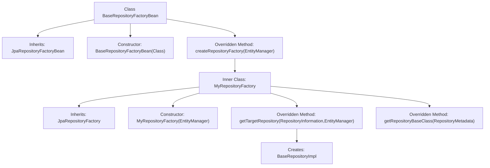

# Basic Information

|      |      |
|------|------|
| Name | BaseRepositoryFactoryBean |
| Language | .java |
| Code Path | WeFe/board/board-service/src/main/java/com/welab/wefe/board/service/database/repository/base/BaseRepositoryFactoryBean.java |
| Package Name | com.welab.wefe.board.service.database.repository.base |
| Dependencies | ['org.springframework.data.jpa.repository.JpaRepository', 'org.springframework.data.jpa.repository.support.JpaRepositoryFactory', 'org.springframework.data.jpa.repository.support.JpaRepositoryFactoryBean', 'org.springframework.data.jpa.repository.support.JpaRepositoryImplementation', 'org.springframework.data.repository.core.RepositoryInformation', 'org.springframework.data.repository.core.RepositoryMetadata', 'org.springframework.data.repository.core.support.RepositoryFactorySupport', 'javax.persistence.EntityManager', 'java.io.Serializable'] |
| Brief Description | BaseRepositoryFactoryBean extends JpaRepositoryFactoryBean to customize factory creation of BaseRepositoryImpl instances for specific JPA repository implementations. |

# Description

The code defines a generic factory bean class `BaseRepositoryFactoryBean`, which is used to create custom JPA repository instances. It extends `JpaRepositoryFactoryBean` and overrides the `createRepositoryFactory` method to return a custom `MyRepositoryFactory`. The inner class `MyRepositoryFactory` extends `JpaRepositoryFactory`, overrides the `getTargetRepository` method to return a `BaseRepositoryImpl` instance, and designates `BaseRepositoryImpl` as the repository base class. This entire structure implements a custom extension of the Spring Data JPA repository instance creation process.

# Class Summary

| Name   | Type  | Description |
|-------|------|-------------|
| BaseRepositoryFactoryBean | class | BaseRepositoryFactoryBean extends JpaRepositoryFactoryBean, customizing the factory to create BaseRepositoryImpl instances with support for generic entity and ID types. |


## Class BaseRepositoryFactoryBean

|      |      |
|------|------|
| Access Modifier | public |
| Type | class |
| Name | BaseRepositoryFactoryBean |
| Description | BaseRepositoryFactoryBean extends JpaRepositoryFactoryBean, customizing the factory to create BaseRepositoryImpl instances with support for generic entity and ID types. |


### UML Class Diagram

```mermaid
classDiagram
    class BaseRepositoryFactoryBean~R~T~ID~ {
        +BaseRepositoryFactoryBean(Class~? extends R~ repositoryInterface)
        +createRepositoryFactory(EntityManager em) RepositoryFactorySupport
    }

    class MyRepositoryFactory~T~I~ {
        -EntityManager em
        +MyRepositoryFactory(EntityManager em)
        +getTargetRepository(RepositoryInformation information, EntityManager entityManager) JpaRepositoryImplementation~?~?~
        +getRepositoryBaseClass(RepositoryMetadata metadata) Class~?~
    }

    class JpaRepositoryFactory {
        <<Interface>>
    }

    class RepositoryFactorySupport {
        <<Interface>>
    }

    class JpaRepositoryImplementation~?~?~ {
        <<Interface>>
    }

    class BaseRepositoryImpl~T~I~ {
        <<Interface>>
    }

    BaseRepositoryFactoryBean --> JpaRepositoryFactory : extends
    BaseRepositoryFactoryBean --> RepositoryFactorySupport : depends on
    MyRepositoryFactory --> JpaRepositoryFactory : extends
    MyRepositoryFactory --> BaseRepositoryImpl : creates instance
    MyRepositoryFactory --> JpaRepositoryImplementation : returns instance
```

This code demonstrates a Spring Data JPA-based repository factory bean implementation. BaseRepositoryFactoryBean is a generic class designed to create custom JPA repository instances. It overrides the repository creation logic through the inner class MyRepositoryFactory, using BaseRepositoryImpl as the base implementation class. The class diagram clearly illustrates the application of the factory pattern, along with the inheritance and dependency relationships between components, showcasing a typical implementation approach for Spring Data JPA extension points.


### Internal Method Call Graph



This code demonstrates a Spring Data JPA factory bean implementation for creating custom JPA repository instances. The flowchart depicts the structure of the BaseRepositoryFactoryBean class, which inherits from JpaRepositoryFactoryBean and overrides the method for creating repository factories. The inner class MyRepositoryFactory is responsible for actually creating BaseRepositoryImpl instances and specifying the base repository class. The entire process exemplifies a typical implementation of Spring Data JPA extension points, using the factory pattern to customize repository behavior.

### Field List

| Name  | Type  | Description |
|-------|-------|------|

### Method List

| Name  | Type  | Description |
|-------|-------|------|
| createRepositoryFactory | RepositoryFactorySupport | Override the method to create a repository factory, returning a custom factory instance with the entity manager passed in. |


