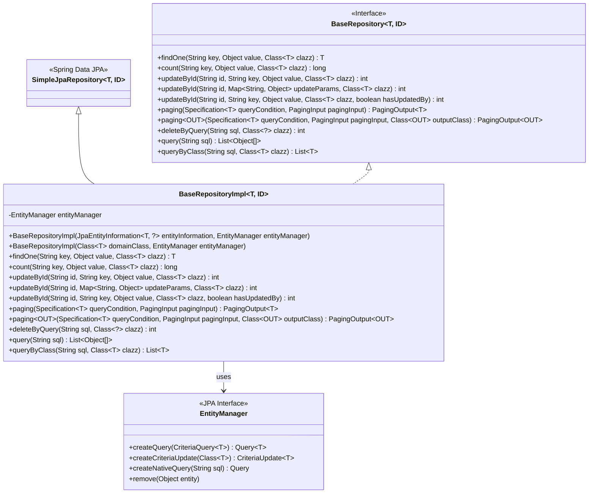

# Basic Information

|      |      |
|------|------|
| Name | BaseRepositoryImpl |
| Language | .java |
| Code Path | WeFe/board/board-service/src/main/java/com/welab/wefe/board/service/database/repository/base/BaseRepositoryImpl.java |
| Package Name | com.welab.wefe.board.service.database.repository.base |
| Dependencies | ['com.welab.wefe.board.service.dto.base.PagingInput', 'com.welab.wefe.board.service.dto.base.PagingOutput', 'com.welab.wefe.common.web.util.CurrentAccountUtil', 'org.apache.commons.collections4.CollectionUtils', 'org.springframework.data.domain.Page', 'org.springframework.data.jpa.domain.Specification', 'org.springframework.data.jpa.repository.support.JpaEntityInformation', 'org.springframework.data.jpa.repository.support.SimpleJpaRepository', 'org.springframework.lang.Nullable', 'javax.persistence.EntityManager', 'javax.persistence.Query', 'javax.persistence.criteria.CriteriaBuilder', 'javax.persistence.criteria.CriteriaQuery', 'javax.persistence.criteria.CriteriaUpdate', 'javax.persistence.criteria.Root', 'java.io.Serializable', 'java.util.Date', 'java.util.List', 'java.util.Map'] |
| Brief Description | BaseRepositoryImpl is the JPA repository implementation class, providing generic CRUD operations including querying, updating, pagination, and native SQL support. |

# Description

BaseRepositoryImpl is a generic JPA repository implementation class that extends SimpleJpaRepository and implements the BaseRepository interface. It provides various data operation functionalities through EntityManager: querying a single entity by key value, counting records matching conditions, updating single or multiple fields by ID, supporting paginated queries, executing native SQL queries, and performing delete operations. Update operations automatically set the modification timestamp and optionally record the updater. Paginated queries support direct entity returns or DTO conversion, while native SQL queries can return raw results or map to specified classes.

# Class Summary

| Name   | Type  | Description |
|-------|------|-------------|
| BaseRepositoryImpl | class | BaseRepositoryImpl is a JPA base repository implementation class that provides generic CRUD operations, including conditional queries, pagination, update and delete functionalities, with support for native SQL queries. |

## Class BaseRepositoryImpl

|      |      |
|------|------|
| Access Modifier | public |
| Type | class |
| Name | BaseRepositoryImpl |
| Description | BaseRepositoryImpl is a JPA base repository implementation class that provides generic CRUD operations, including conditional queries, pagination, update and delete functionalities, with support for native SQL queries. |

### UML Class Diagram

This code demonstrates a custom repository implementation class BaseRepositoryImpl based on Spring Data JPA, which extends SimpleJpaRepository and implements the BaseRepository interface. The class provides comprehensive CRUD operations including conditional queries, pagination queries, batch updates, and native SQL queries. It leverages EntityManager to perform JPA-standard operations and supports generic type parameters T (entity type) and ID (primary key type). The class diagram clearly illustrates the inheritance relationships, interface implementations, and key dependencies, highlighting the central role of this implementation class in the JPA persistence layer.

### Internal Method Call Graph

```mermaid
graph TD
    A["Class BaseRepositoryImpl<T, ID>"]
    B["Property: EntityManager entityManager"]
    C["Constructor 1: BaseRepositoryImpl(JpaEntityInformation<T,?>, EntityManager)"]
    D["Constructor 2: BaseRepositoryImpl(Class<T>, EntityManager)"]
    E["Method: T findOne(String key, Object value, Class<T> clazz)"]
    F["Method: long count(String key, Object value, Class<T> clazz)"]
    G["Method: int updateById(String id, String key, Object value, Class<T> clazz)"]
    H["Method: int updateById(String id, Map<String,Object> updateParams, Class<T> clazz)"]
    I["Method: int updateById(String id, String key, Object value, Class<T> clazz, boolean hasUpdatedBy)"]
    J["Method: PagingOutput<T> paging(Specification<T>, PagingInput)"]
    K["Method: PagingOutput<OUT> paging(Specification<T>, PagingInput, Class<OUT>)"]
    L["Method: int deleteByQuery(String sql, Class<?> clazz)"]
    M["Method: List<Object[]> query(String sql)"]
    N["Method: List<T> queryByClass(String sql, Class<T> clazz)"]

    A --> B
    A --> C
    A --> D
    A --> E
    A --> F
    A --> G
    A --> H
    A --> I
    A --> J
    A --> K
    A --> L
    A --> M
    A --> N
```

This code defines a generic JPA repository implementation class BaseRepositoryImpl, which extends SimpleJpaRepository and implements the BaseRepository interface. The class provides various database operation methods including conditional query (findOne), counting (count), updating by ID (updateById), paginated query (paging), native SQL queries (query/queryByClass), and delete operations (deleteByQuery). All methods interact with the database through EntityManager by constructing Criteria API or native SQL, supporting generic types T and ID with high flexibility and reusability.

### Field List

| Name  | Type  | Description |
|-------|-------|------|
| entityManager | EntityManager | Private immutable EntityManager instance variable. |

### Method List

| Name  | Type  | Description |
|-------|-------|------|
| count | long | This method uses the JPA Criteria API to count the number of records in the database where the value of a specified field equals a given value, and returns the statistical result. |
| updateById | int | This method updates specified field values of an entity by ID using the JPA Criteria API, while automatically setting the update time and operator ID, and returns the number of affected rows. |
| paging | PagingOutput<T> | This method implements pagination query functionality, accepting query conditions and pagination parameters, and returning paginated results. After retrieving the paginated data through the query, it extracts the content list and total record count, encapsulates them into a pagination output object, and returns it. |
| findOne | T | This method queries the database using the JPA Criteria API to find the first entity object matching the specified key-value pairs, returning null if no results are found. |
| updateById | int | This method updates the entity based on the ID, sets the update parameters, time, and operator, and finally executes the update operation. |
| paging | PagingOutput<OUT> | Pagination query method: Query paginated data based on conditions, returning the total count, current page data, and specified output type. |
| deleteByQuery | int | This method deletes data of the specified class through native SQL queries, first retrieving the result set and then deleting entries one by one, finally returning the count of deleted records. |
| updateById | int | This method updates entity fields by ID, supports setting the updater and timestamp, and returns the number of affected rows. |
| query | List<Object[]> | This method executes a native SQL query and returns a list of results. The parameter is an SQL statement string, and the return value is a list of Object arrays. |
| queryByClass | List<T> | This method queries the database using native SQL and returns a result list of the specified category. The parameters are the SQL statement and the target class, utilizing the entity manager to execute the query and retrieve the results. |

