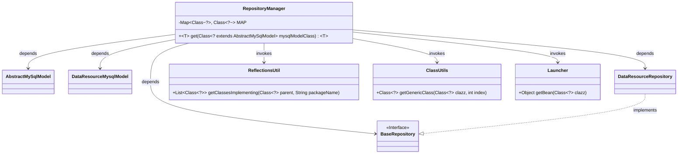
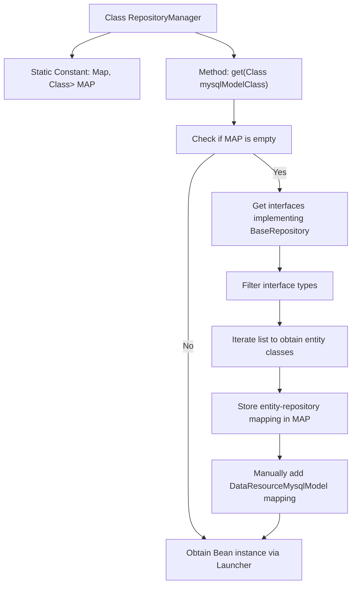

# Basic Information

|      |      |
|------|------|
| Name | RepositoryManager |
| Language | .java |
| Code Path | WeFe/board/board-service/src/main/java/com/welab/wefe/board/service/database/repository/base/RepositoryManager.java |
| Package Name | com.welab.wefe.board.service.database.repository.base |
| Dependencies | ['com.welab.wefe.board.service.database.entity.base.AbstractMySqlModel', 'com.welab.wefe.board.service.database.entity.data_resource.DataResourceMysqlModel', 'com.welab.wefe.board.service.database.repository.data_resource.DataResourceRepository', 'com.welab.wefe.common.util.ClassUtils', 'com.welab.wefe.common.util.ReflectionsUtil', 'com.welab.wefe.common.web.Launcher', 'java.util.HashMap', 'java.util.List', 'java.util.Map', 'java.util.stream.Collectors'] |
| Brief Description | The RepositoryManager class caches the mapping relationships between models and repository classes through a static Map, providing a get method to retrieve corresponding repository instances based on model classes. During initialization, it scans interfaces implementing BaseRepository and establishes mappings, while DataResourceRepository requires manual mapping. Finally, Bean instances are obtained through Launcher. |

# Description

The `RepositoryManager` class maintains a static MAP cache to store the mapping relationships between model classes and repository interfaces. During the first invocation of the `get` method, it scans all interfaces under the `com.welab.wefe` package that inherit from `BaseRepository`. The mapping is established by using reflection to obtain the model class corresponding to the interface's generic parameters. Since the generic type of `DataResourceRepository` cannot be automatically retrieved, the mapping for `DataResourceMysqlModel` must be manually added. Finally, the corresponding repository instance is obtained through the Spring container.

# Class Summary

| Name   | Type  | Description |
|-------|------|-------------|
| RepositoryManager | class | The `RepositoryManager` class associates models with repository classes through a static Map, providing a `get` method to dynamically retrieve corresponding repository instances. During initialization, it scans interfaces implementing `BaseRepository` and establishes mappings, while `DataResourceRepository` requires manual mapping. Finally, Bean instances are obtained via `Launcher`. |

## Class RepositoryManager

|      |      |
|------|------|
| Access Modifier | public |
| Type | class |
| Name | RepositoryManager |
| Description | The `RepositoryManager` class associates models with repository classes through a static Map, providing a `get` method to dynamically retrieve corresponding repository instances. During initialization, it scans interfaces implementing `BaseRepository` and establishes mappings, while `DataResourceRepository` requires manual mapping. Finally, Bean instances are obtained via `Launcher`. |

### UML Class Diagram

Class Diagram Description:  
RepositoryManager is a utility class for managing repository classes. It retrieves corresponding BaseRepository implementation classes based on subclasses of AbstractMySqlModel through the static method `get`. It depends on the BaseRepository interface and its implementation DataResourceRepository, as well as AbstractMySqlModel and its subclass DataResourceMysqlModel. RepositoryManager dynamically obtains generic type information via the utility classes ReflectionsUtil and ClassUtils, and ultimately acquires Bean instances through Launcher. This design enables automatic mapping between model classes and repository interfaces while supporting manual registration of special mapping relationships.

### Internal Method Call Graph

This flowchart illustrates the core logic of the RepositoryManager class. It first checks whether the static mapping MAP is empty. If empty, it retrieves all interfaces implementing BaseRepository via reflection, filters them, and establishes mappings between entity classes and repository classes, supplemented with special mappings. Finally, it obtains the corresponding Bean instance through Launcher. The entire process enables dynamic retrieval of repository instances based on model classes.

### Field List

| Name  | Type  | Description |
|-------|-------|------|
| MAP = new HashMap() | Map<Class<?>, Class<?>> | Define a static immutable hash map with key-value pairs of class object type, initialized as empty. |

### Method List

| Name  | Type  | Description |
|-------|-------|------|
| get | T | The static method `get` retrieves the corresponding repository instance based on the passed MySQL model class. During the first call, it scans interfaces implementing `BaseRepository` to establish a mapping between model classes and repository classes (including manual mappings like `DataResourceRepository`). Finally, it returns the corresponding repository instance via the Spring container. |

