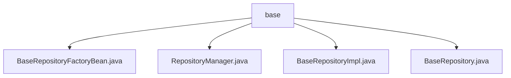

# Basic Information

|      |      |
|------|------|
| Name | base |
| Language | .java |
| Code Path | WeFe/board/board-service/src/main/java/com/welab/wefe/board/service/database/repository/base |
| Package Name | docs.board.board-service.src.main.java.com.welab.wefe.board.service.database.repository.base |
| Brief Description | BaseRepositoryFactoryBean defines a generic factory bean that extends the JPA repository creation process. RepositoryManager caches the model-repository mapping and supports both scanning and manual registration. BaseRepositoryImpl implements common JPA operations, including querying, updating, pagination, and SQL functionalities. The BaseRepository interface extends standard JPA capabilities, supporting field-based queries, updates, and transaction handling. |

# Description

## Overview  
This module implements a custom JPA repository framework, with its core responsibility being to extend Spring Data JPA through a generic factory pattern, providing enhanced data access capabilities. The interface specification uniformly adopts BaseRepository as the standard contract, supporting features such as dynamic field queries, batch updates, and pagination conversion. Key data structures include generic model class mapping caches (e.g., the MAP in RepositoryManager) and the encapsulation of EntityManager operations in BaseRepositoryImpl. External dependencies include Spring Data JPA, JPA Specification, and EntityManager. For example, BaseRepositoryFactoryBean overrides instance creation logic via MyRepositoryFactory.

## Key Business Scenarios  
The module is suitable for JPA scenarios requiring flexible database operations, similar to building a generic data access layer. The complete business process encompasses: repository interface scanning and registration (e.g., RepositoryManager initializing mappings), custom queries (e.g., pagination conversion in BaseRepositoryImpl), and transactional updates (e.g., automatically setting update times). The typical interaction pattern exposes APIs uniformly through BaseRepository, such as pagination queries supporting DTO conversion and native SQL supporting result mapping. Integration examples include special handling scenarios like DataResourceRepository, which require manual maintenance of model mapping relationships.

### Package Internal Structure View

This flowchart illustrates the foundational repository directory structure of the board-service module in the WeFe project. The base directory contains four core Java files: BaseRepositoryFactoryBean for factory pattern implementation, RepositoryManager for managing repository instances, BaseRepository defining the base interface, and BaseRepositoryImpl providing the interface implementation. Together, these files form the foundational architecture of the project's data access layer.

# File List

| Name   | Type  | Description |
|-------|------|-------------|
| [BaseRepositoryFactoryBean.java](BaseRepositoryFactoryBean.md) | file | BaseRepositoryFactoryBean extends JpaRepositoryFactoryBean, customizing factory creation of BaseRepositoryImpl instances for specific JPA repository implementations. |
| [RepositoryManager.java](RepositoryManager.md) | file | The `RepositoryManager` class caches the mapping relationships between models and repository classes through a static Map, providing a `get` method to retrieve the corresponding repository instance based on the model class. During initialization, it scans interfaces implementing `BaseRepository` and establishes mappings, while `DataResourceRepository` requires manual mapping. Finally, the Bean instance is obtained via `Launcher`. |
| [BaseRepositoryImpl.java](BaseRepositoryImpl.md) | file | BaseRepositoryImpl is the JPA repository implementation class, providing common CRUD operations including querying, updating, pagination, and native SQL support. |
| [BaseRepository.java](BaseRepository.md) | file | The BaseRepository interface extends JpaRepository and JpaSpecificationExecutor, providing custom query, update, pagination, and native SQL operation functionalities. It supports field-based queries, statistics, updates, and DTO conversion for pagination. |

