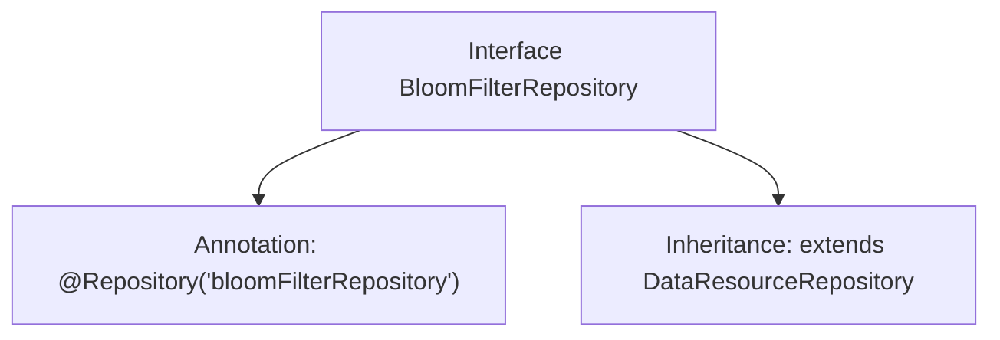

# Basic Information

|      |      |
|------|------|
| Name | BloomFilterRepository |
| Language | .java |
| Code Path | WeFe/board/board-service/src/main/java/com/welab/wefe/board/service/database/repository/data_resource/BloomFilterRepository.java |
| Package Name | com.welab.wefe.board.service.database.repository.data_resource |
| Dependencies | ['com.welab.wefe.board.service.database.entity.data_resource.BloomFilterMysqlModel', 'org.springframework.stereotype.Repository'] |
| Brief Description | The interface BloomFilterRepository extends DataResourceRepository and is used to operate the BloomFilterMysqlModel data model. |

# Description

The content defines a Spring repository interface named BloomFilterRepository, marked with the @Repository annotation and assigned the name "bloomFilterRepository". This interface extends the generic DataResourceRepository interface, with its generic type specified as BloomFilterMysqlModel, indicating that the repository is used to operate on MySQL data models related to Bloom filters.

# Class Summary

| Name   | Type  | Description |
|-------|------|-------------|
| BloomFilterRepository | interface | The interface BloomFilterRepository extends DataResourceRepository, annotated with @Repository to mark it as a data resource repository, operating on data of type BloomFilterMysqlModel. |


## Class BloomFilterRepository

|      |      |
|------|------|
| Access Modifier | @Repository("bloomFilterRepository");public |
| Type | interface |
| Name | BloomFilterRepository |
| Description | The interface BloomFilterRepository extends DataResourceRepository, annotated with @Repository to mark it as a data resource repository, operating on data of type BloomFilterMysqlModel. |


### UML Class Diagram

```mermaid
classDiagram
    class BloomFilterRepository {
        <<Interface>>
    }
    class DataResourceRepository~T~ {
        <<Interface>>
    }
    BloomFilterRepository --|> DataResourceRepository : Inheritance
    // The BloomFilterRepository interface inherits from the generic DataResourceRepository interface, with the generic parameter specified as BloomFilterMysqlModel
```

This class diagram illustrates the inheritance relationship where the BloomFilterRepository interface extends the generic DataResourceRepository interface, with the generic parameter set to BloomFilterMysqlModel. BloomFilterRepository is marked as a Spring Repository component, indicating its use in the data access layer. This design follows the generic interface extension pattern, allowing child interfaces to handle specific data model types while maintaining the generality of the base interface.


### Internal Method Call Graph



This flowchart illustrates the structure of the BloomFilterRepository interface, which is annotated with a specific Spring repository annotation (@Repository) and extends the generic DataResourceRepository base class with BloomFilterMysqlModel as the type parameter. This design indicates that the interface is specifically intended for persistence operations on BloomFilterMysqlModel type data, representing a typical implementation of the Spring Data JPA repository pattern.

### Field List

| Name  | Type  | Description |
|-------|-------|------|

### Method List

| Name  | Type  | Description |
|-------|-------|------|


