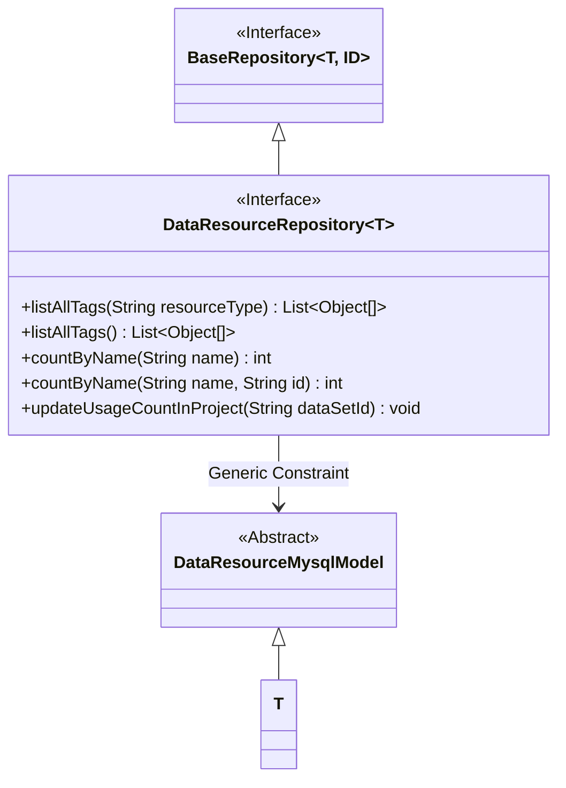
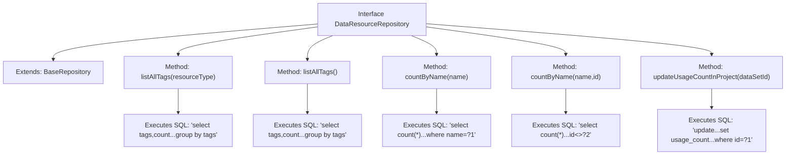

# Basic Information

|      |      |
|------|------|
| Name | DataResourceRepository |
| Language | .java |
| Code Path | WeFe/board/board-service/src/main/java/com/welab/wefe/board/service/database/repository/data_resource/DataResourceRepository.java |
| Package Name | com.welab.wefe.board.service.database.repository.data_resource |
| Dependencies | ['com.welab.wefe.board.service.database.entity.data_resource.DataResourceMysqlModel', 'com.welab.wefe.board.service.database.repository.base.BaseRepository', 'org.springframework.data.jpa.repository.Modifying', 'org.springframework.data.jpa.repository.Query', 'org.springframework.stereotype.Repository', 'org.springframework.transaction.annotation.Transactional', 'java.util.List'] |
| Brief Description | The DataResourceRepository interface extends BaseRepository, providing native SQL methods for querying statistics by resource type or global tags, counting names, and updating project usage frequencies. |

# Description

The code defines a Spring Data JPA repository interface named `DataResourceRepository`, which extends `BaseRepository`. The interface contains five methods: two `listAllTags` methods for querying tags and their occurrence counts (one with a resource type parameter, one without); two `countByName` methods for counting records with the same name (one with an ID parameter to exclude itself); and one `updateUsageCountInProject` method for updating the usage count of a dataset in projects. All methods use native SQL queries, with the update operation annotated for transactions and automatic cache clearance.

# Class Summary

| Name   | Type  | Description |
|-------|------|-------------|
| DataResourceRepository | interface | The DataResourceRepository interface extends BaseRepository, containing methods for querying tag statistics, name counting, and updating project usage counts, implemented using native SQL. |

## Class DataResourceRepository

|      |      |
|------|------|
| Access Modifier | @Repository("dataResourceRepository");public |
| Type | interface |
| Name | DataResourceRepository |
| Description | The DataResourceRepository interface extends BaseRepository, containing methods for querying tag statistics, name counting, and updating project usage counts, implemented using native SQL. |

### UML Class Diagram

This class diagram illustrates the inheritance relationships and functionalities of a Spring Data JPA repository interface `DataResourceRepository`. The interface extends the generic `BaseRepository` and constrains the generic parameter T to inherit from `DataResourceMysqlModel`. The interface includes five query methods: two for listing tags, two for counting by name, and one for updating project usage count. All methods utilize native SQL queries, with query behaviors configured via annotations.

### Internal Method Call Graph

This flowchart illustrates the structure and functionality of the Spring Data JPA interface `DataResourceRepository`. The interface extends `BaseRepository` and defines 5 query methods, encompassing 3 query types: two `listAllTags` methods for grouped tag statistics, two `countByName` methods for duplicate name validation, and one transactional modification method `updateUsageCountInProject`. Each method node precisely maps to its corresponding native SQL query, with arrows clearly presenting method invocation relationships.

### Field List

| Name  | Type  | Description |
|-------|-------|------|

### Method List

| Name  | Type  | Description |
|-------|-------|------|
| listAllTags | List<Object[]> | Query non-empty tags of the specified resource type and their occurrence counts, returning a result list grouped by tags. |
| listAllTags | List<Object[]> | Query non-empty tags and their occurrence counts, returning a grouped result list by tags. |
| countByName | int | Query the count of records with the same name but different IDs |
| updateUsageCountInProject | void | Update the usage count of datasets in projects: Automatically update the usage count of a specified dataset ID based on the consent review status count in the project dataset table. |
| countByName | int | Query the total number of records with the specified name in the database and return the integer result. |

