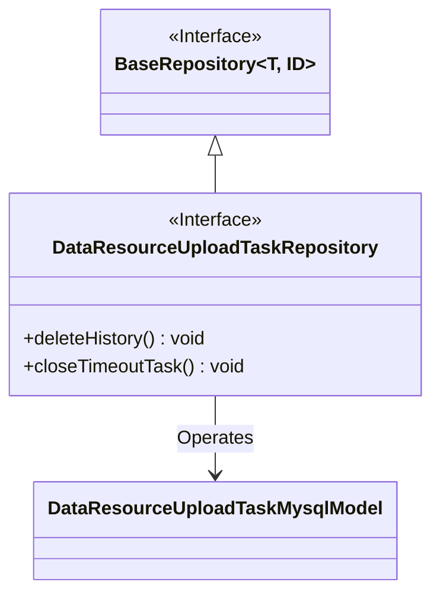
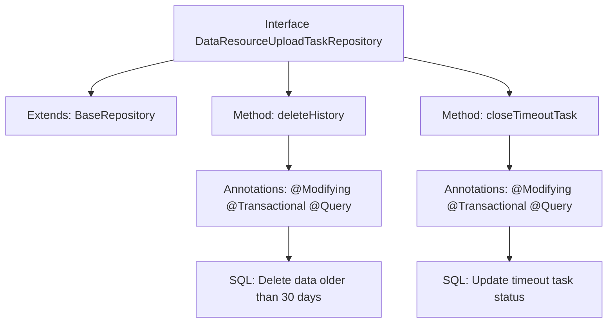

# Basic Information

|      |      |
|------|------|
| Name | DataResourceUploadTaskRepository |
| Language | .java |
| Code Path | WeFe/board/board-service/src/main/java/com/welab/wefe/board/service/database/repository/data_resource/DataResourceUploadTaskRepository.java |
| Package Name | com.welab.wefe.board.service.database.repository.data_resource |
| Dependencies | ['com.welab.wefe.board.service.database.entity.data_resource.DataResourceUploadTaskMysqlModel', 'com.welab.wefe.board.service.database.repository.base.BaseRepository', 'org.springframework.data.jpa.repository.Modifying', 'org.springframework.data.jpa.repository.Query', 'org.springframework.stereotype.Repository', 'org.springframework.transaction.annotation.Transactional'] |
| Brief Description | The DataResourceUploadTaskRepository interface defines two methods: deleteHistory deletes historical data older than 30 days, and closeTimeoutTask sets the status of upload tasks that have timed out for 5 minutes to failed and records error messages. |

# Description

This is a Spring Data JPA Repository interface designed for managing data resource upload tasks. The interface defines two database operations: 1. Deleting historical data older than 30 days, using a native SQL statement to determine the time difference via the created_time field; 2. Closing unresponsive upload tasks by changing the status of tasks with an uploading state that haven't been updated for over 5 minutes to failed, and setting the error message to indicate interruption due to system restart. Both methods are annotated with @Modifying and @Transactional to ensure transactional operations.

# Class Summary

| Name   | Type  | Description |
|-------|------|-------------|
| DataResourceUploadTaskRepository | interface | The DataResourceUploadTaskRepository interface defines two methods: deleteHistory removes historical data older than 30 days, and closeTimeoutTask sets the status of upload tasks that have not responded for more than 5 minutes to failed and records error messages. |

## Class DataResourceUploadTaskRepository

|      |      |
|------|------|
| Access Modifier | @Repository;public |
| Type | interface |
| Name | DataResourceUploadTaskRepository |
| Description | The DataResourceUploadTaskRepository interface defines two methods: deleteHistory removes historical data older than 30 days, and closeTimeoutTask sets the status of upload tasks that have not responded for more than 5 minutes to failed and records error messages. |

### UML Class Diagram

Class Diagram Description: This diagram illustrates the structure of a Spring Data JPA repository interface. The DataResourceUploadTaskRepository interface extends the generic BaseRepository interface and operates on the DataResourceUploadTaskMysqlModel entity class. The interface contains two core methods: deleteHistory() for removing historical data older than 30 days, and closeTimeoutTask() for marking tasks that have not been updated for 5 minutes as failed. Native SQL operations are implemented through JPA annotations, demonstrating functionalities for data cleanup and task status maintenance.

### Internal Method Call Graph

This flowchart illustrates the structure of a Spring Data JPA repository interface, featuring two core data cleanup methods. The deleteHistory method uses native SQL to remove historical data exceeding 30 days, employing @Modifying and @Transactional to ensure transactional integrity. The closeTimeoutTask method marks upload tasks that have timed out (no updates for 5 minutes) as failed, similarly using transactional annotations to guarantee atomic operations. Both methods directly define database operation logic through @Query annotations.

### Field List

| Name  | Type  | Description |
|-------|-------|------|

### Method List

| Name  | Type  | Description |
|-------|-------|------|
| closeTimeoutTask | void | Update tasks in the database with a status of "uploading" that have timed out for more than 5 minutes, changing their status to "failed" and recording the error message as "interrupted due to system reboot." |
| deleteHistory | void | This code snippet defines a method for deleting historical data older than 30 days, utilizing JPA annotations to achieve automatic cleanup and transaction management. |

