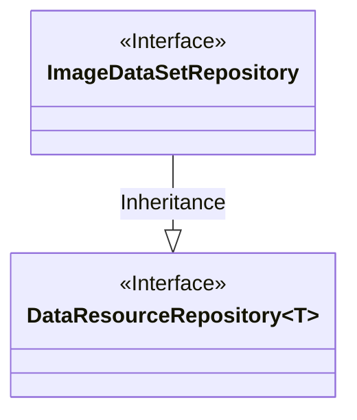
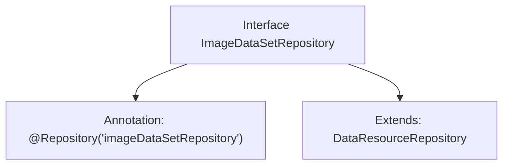

# Basic Information

|      |      |
|------|------|
| Name | ImageDataSetRepository |
| Language | .java |
| Code Path | WeFe/board/board-service/src/main/java/com/welab/wefe/board/service/database/repository/data_resource/ImageDataSetRepository.java |
| Package Name | com.welab.wefe.board.service.database.repository.data_resource |
| Dependencies | ['com.welab.wefe.board.service.database.entity.data_resource.ImageDataSetMysqlModel', 'org.springframework.stereotype.Repository'] |
| Brief Description | This is a Spring repository interface named imageDataSetRepository, which extends DataResourceRepository and is used for operating the ImageDataSetMysqlModel data model. |

# Description

The content defines a Spring Data repository interface named `ImageDataSetRepository`, marked with the `@Repository` annotation as "imageDataSetRepository". This interface extends `DataResourceRepository` and specifies the generic type as `ImageDataSetMysqlModel`, indicating it is a repository interface for operating on data of the `ImageDataSetMysqlModel` entity class.

# Class Summary

| Name   | Type  | Description |
|-------|------|-------------|
| ImageDataSetRepository | interface | This is a Spring repository interface named imageDataSetRepository, which extends DataResourceRepository and is used for operating the ImageDataSetMysqlModel data model. |

## Class ImageDataSetRepository

|      |      |
|------|------|
| Access Modifier | @Repository("imageDataSetRepository");public |
| Type | interface |
| Name | ImageDataSetRepository |
| Description | This is a Spring repository interface named imageDataSetRepository, which extends DataResourceRepository and is used for operating the ImageDataSetMysqlModel data model. |

### UML Class Diagram

This class diagram illustrates the relationship where the ImageDataSetRepository interface inherits from the generic DataResourceRepository interface. ImageDataSetRepository is a Spring Data repository interface (annotated with @Repository) specifically designed to handle data of type ImageDataSetMysqlModel. As an inheritance relationship between interfaces, the child interface inherits all abstract methods from the parent interface while specifying the concrete data model type as ImageDataSetMysqlModel through generic parameters. This design follows Spring Data JPA's repository pattern, providing a standardized data access interface for image datasets.

### Internal Method Call Graph

This code defines a Spring Data repository interface named ImageDataSetRepository, marked as a Spring component via the @Repository annotation with the bean name "imageDataSetRepository". The interface extends the generic DataResourceRepository interface with the type parameter ImageDataSetMysqlModel, indicating it is specifically designed for data access operations on the ImageDataSetMysqlModel entity class. This design follows Spring Data JPA conventions, automatically inheriting CRUD operation capabilities through the base repository interface.

### Field List

| Name  | Type  | Description |
|-------|-------|------|

### Method List

| Name  | Type  | Description |
|-------|-------|------|

