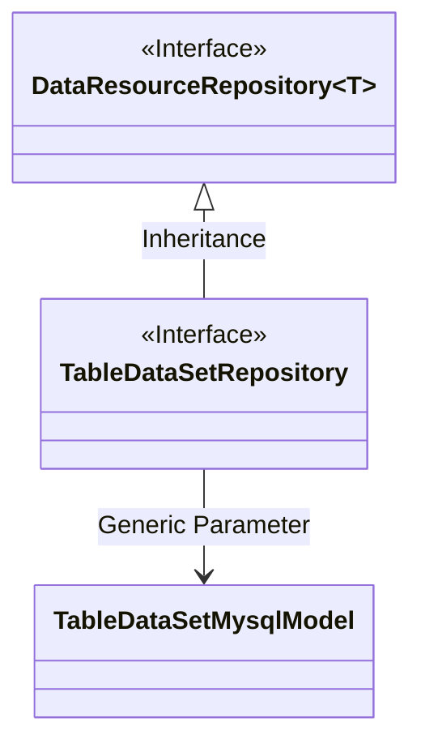
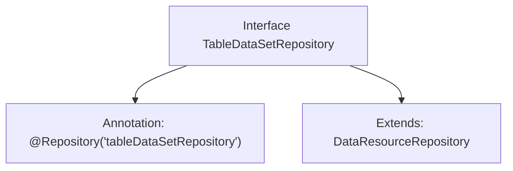

# Basic Information

|      |      |
|------|------|
| Name | TableDataSetRepository |
| Language | .java |
| Code Path | WeFe/board/board-service/src/main/java/com/welab/wefe/board/service/database/repository/data_resource/TableDataSetRepository.java |
| Package Name | com.welab.wefe.board.service.database.repository.data_resource |
| Dependencies | ['com.welab.wefe.board.service.database.entity.data_resource.TableDataSetMysqlModel', 'org.springframework.stereotype.Repository'] |
| Brief Description | This is a Spring Data repository interface that extends DataResourceRepository and is used for manipulating data of type TableDataSetMysqlModel. |

# Description

This code snippet defines a Spring repository interface named `TableDataSetRepository`, annotated with `@Repository` and assigned the bean name `"tableDataSetRepository"`. The interface extends the generic `DataResourceRepository` interface, with its generic type parameter specified as `TableDataSetMysqlModel`, indicating that this repository is designed to operate on data entities of type `TableDataSetMysqlModel`. This is a typical Spring Data JPA repository interface definition used for database access operations.

# Class Summary

| Name   | Type  | Description |
|-------|------|-------------|
| TableDataSetRepository | interface | This is a Spring repository interface named tableDataSetRepository, which extends DataResourceRepository and is used for operating the TableDataSetMysqlModel data model. |

## Class TableDataSetRepository

|      |      |
|------|------|
| Access Modifier | @Repository("tableDataSetRepository");public |
| Type | interface |
| Name | TableDataSetRepository |
| Description | This is a Spring repository interface named tableDataSetRepository, which extends DataResourceRepository and is used for operating the TableDataSetMysqlModel data model. |

### UML Class Diagram

This class diagram depicts a Spring-based repository interface structure. The TableDataSetRepository interface inherits from the generic DataResourceRepository interface, specifying TableDataSetMysqlModel as its generic parameter. DataResourceRepository is marked as an interface, while TableDataSetRepository is associated with it through inheritance and linked to the TableDataSetMysqlModel model class via a dependency relationship. The entire structure demonstrates a typical Spring Data JPA repository interface design pattern.

### Internal Method Call Graph

This code defines a Spring Data repository interface named TableDataSetRepository, which is marked as a Spring-managed component via the @Repository annotation with the component name "tableDataSetRepository". The interface extends the generic DataResourceRepository interface with TableDataSetMysqlModel as its type parameter, indicating it's a data access interface for the TableDataSetMysqlModel entity type. This structure is commonly used in Spring Data JPA or similar frameworks to automatically generate basic CRUD operations for database interactions.

### Field List

| Name  | Type  | Description |
|-------|-------|------|

### Method List

| Name  | Type  | Description |
|-------|-------|------|

