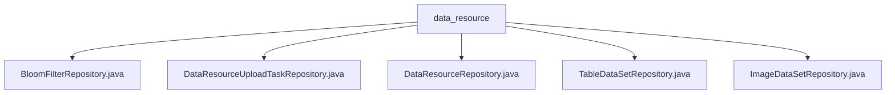

# Basic Information

|      |      |
|------|------|
| Name | data_resource |
| Language | .java |
| Code Path | WeFe/board/board-service/src/main/java/com/welab/wefe/board/service/database/repository/data_resource |
| Package Name | docs.board.board-service.src.main.java.com.welab.wefe.board.service.database.repository.data_resource |
| Brief Description | Spring repository interface definitions: BloomFilterRepository operates on the Bloom filter model; DataResourceUploadTaskRepository manages upload tasks, including cleanup and timeout handling; DataResourceRepository provides methods for tag queries, counting, and updates; TableDataSetRepository and ImageDataSetRepository operate on table data and image data models respectively. |

# Description

## Overview  
This module is a resource management repository layer implemented with Spring Data JPA, with its core responsibility being the unified management of database operations for various data resources (such as Bloom filters, table/image datasets). The interface specifications adhere to the JPA standard, providing extended basic CRUD capabilities. For example, the `DataResourceRepository` defines native SQL operations like tag queries and name-based statistics. Key data structures include entity classes such as `BloomFilterMysqlModel` and `TableDataSetMysqlModel`. It relies on the Spring Data JPA framework and ensures transaction integrity through annotations like `@Transactional`. For instance, `TableDataSetRepository` implements typed queries through generic inheritance.

## Primary Business Scenarios  
It primarily handles the full lifecycle management of data resources, resembling a resource management center model. This includes scenarios such as data cleanup (automatic deletion of 30-day-old records), status maintenance (marking timed-out tasks as `failed`), and usage statistics (updating project reference counts). The interaction model is uniformly exposed through JPA interfaces. For example, `ImageDataSetRepository` inherits generic operations while supporting specialized queries. Typical applications include dataset tag analysis (`listAllTags`) and conflict detection (`countByName`). API types cover queries, updates, and deletions, such as batch status changes implemented via `@Modifying`.

### Package Internal Structure View

This flowchart illustrates the structure of 5 Java repository class files under the data_resource directory. All files are directly subordinate to the data_resource node with no deeper nesting hierarchy. These repository classes include implementations for different functionalities such as BloomFilter, data resource upload tasks, data resources, table datasets, and image datasets.

# File List

| Name   | Type  | Description |
|-------|------|-------------|
| [BloomFilterRepository.java](BloomFilterRepository.md) | file | The interface BloomFilterRepository extends DataResourceRepository and is used to operate the BloomFilterMysqlModel data model. |
| [DataResourceUploadTaskRepository.java](DataResourceUploadTaskRepository.md) | file | The DataResourceUploadTaskRepository interface defines two methods: deleteHistory removes historical data older than 30 days, and closeTimeoutTask sets the status of upload tasks that have timed out for 5 minutes to failed and records error messages. |
| [DataResourceRepository.java](DataResourceRepository.md) | file | The DataResourceRepository interface extends BaseRepository, providing native SQL methods for querying statistics by resource type or globally, counting names, and updating project usage frequencies. |
| [TableDataSetRepository.java](TableDataSetRepository.md) | file | This is a Spring Data repository interface that extends DataResourceRepository, designed for operating on data of type TableDataSetMysqlModel. |
| [ImageDataSetRepository.java](ImageDataSetRepository.md) | file | This is a Spring repository interface named imageDataSetRepository, which extends DataResourceRepository and is used for operating the ImageDataSetMysqlModel data model. |

