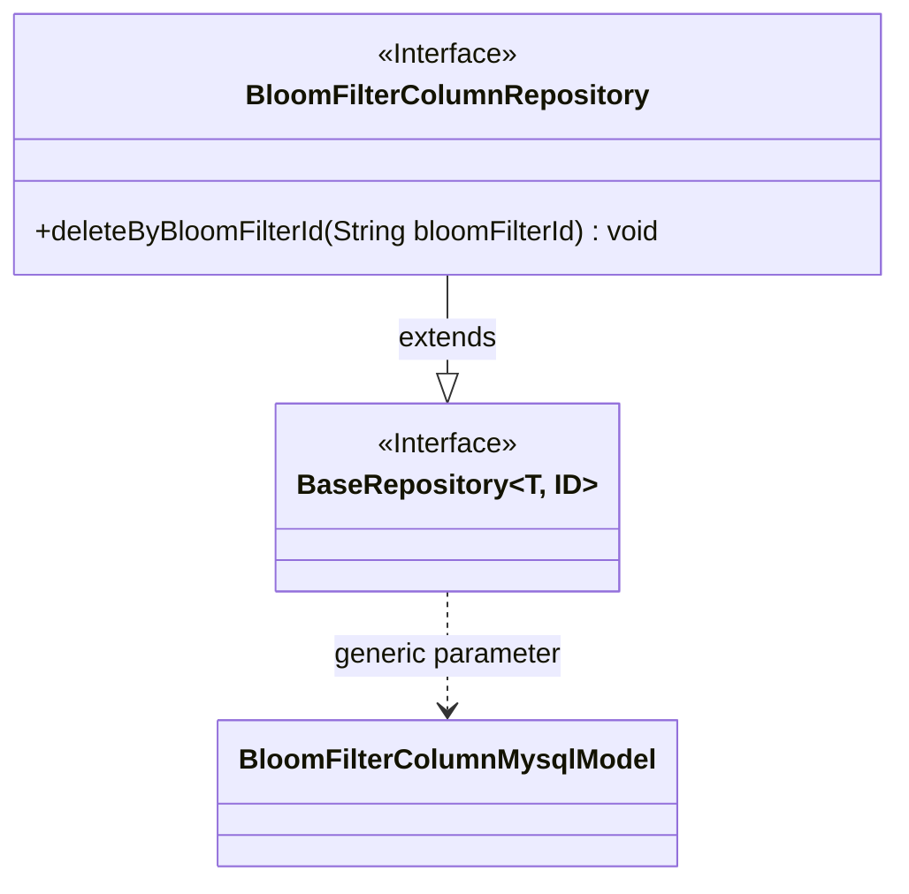
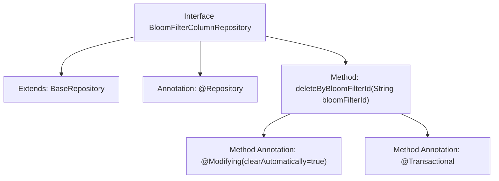

# Basic Information

|      |      |
|------|------|
| Name | BloomFilterColumnRepository |
| Language | .java |
| Code Path | WeFe/board/board-service/src/main/java/com/welab/wefe/board/service/database/repository/fusion/BloomFilterColumnRepository.java |
| Package Name | com.welab.wefe.board.service.database.repository.fusion |
| Dependencies | ['com.welab.wefe.board.service.database.entity.fusion.bloomfilter.BloomFilterColumnMysqlModel', 'com.welab.wefe.board.service.database.repository.base.BaseRepository', 'org.springframework.data.jpa.repository.Modifying', 'org.springframework.stereotype.Repository', 'org.springframework.transaction.annotation.Transactional'] |
| Brief Description | The interface BloomFilterColumnRepository extends BaseRepository, providing a method to delete data by bloomFilterId with support for automatic cleanup and transaction handling. |

# Description

This is a Spring Data JPA repository interface definition that extends the base repository interface for operating on Bloom filter column model data. The interface includes a delete method that removes related records by Bloom filter ID. The method is annotated with `@Modifying` and enables automatic cache clearance, while also being marked as `@Transactional` to ensure transactional behavior.

# Class Summary

| Name   | Type  | Description |
|-------|------|-------------|
| BloomFilterColumnRepository | interface | The interface BloomFilterColumnRepository extends BaseRepository, providing a method to delete data by bloomFilterId, with support for automatic cleanup and transactions. |

## Class BloomFilterColumnRepository

|      |      |
|------|------|
| Access Modifier | @Repository;public |
| Type | interface |
| Name | BloomFilterColumnRepository |
| Description | The interface BloomFilterColumnRepository extends BaseRepository, providing a method to delete data by bloomFilterId, with support for automatic cleanup and transactions. |

### UML Class Diagram

Class diagram description: This diagram illustrates a Spring Data JPA repository interface BloomFilterColumnRepository, which extends the generic interface BaseRepository<BloomFilterColumnMysqlModel, String>. Here, BaseRepository is an interface with generic parameters T and ID, where BloomFilterColumnMysqlModel serves as the entity type parameter. The BloomFilterColumnRepository interface defines a method for deleting data by bloomFilterId, annotated with JPA transactional and modification annotations.

### Internal Method Call Graph

This flowchart illustrates the structure of the Spring Data JPA interface BloomFilterColumnRepository. The interface extends BaseRepository and is annotated with @Repository, containing a delete method annotated with @Modifying and @Transactional. The method performs deletion operations via the bloomFilterId parameter, where clearAutomatically=true indicates automatic persistence context clearance after execution. The entire design reflects characteristics of the JPA repository pattern, implementing conditional deletion functionality through method naming conventions.

### Field List

| Name  | Type  | Description |
|-------|-------|------|

### Method List

| Name  | Type  | Description |
|-------|-------|------|
| deleteByBloomFilterId | void | Delete data with the specified Bloom filter ID using JPA, automatically clear the cache, and support transactions. |

