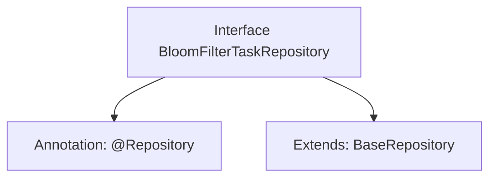

# Basic Information

|      |      |
|------|------|
| Name | BloomFilterTaskRepository |
| Language | .java |
| Code Path | WeFe/board/board-service/src/main/java/com/welab/wefe/board/service/database/repository/fusion/BloomFilterTaskRepository.java |
| Package Name | com.welab.wefe.board.service.database.repository.fusion |
| Dependencies | ['com.welab.wefe.board.service.database.entity.fusion.bloomfilter.BloomFilterTaskMysqlModel', 'com.welab.wefe.board.service.database.repository.base.BaseRepository', 'org.springframework.stereotype.Repository'] |
| Brief Description | This is a Spring Data JPA repository interface that extends the base repository interface, designed for operating the Bloom filter task data model. |

# Description

This code snippet defines a Spring Data repository interface named `BloomFilterTaskRepository`, identified by the `@Repository` annotation. The interface extends the generic base class `BaseRepository`, specifying the entity type as `BloomFilterTaskMysqlModel` and the primary key type as `String`. This design indicates that it is a persistence layer component for operating Bloom filter task-related data, implementing basic CRUD operations following the Spring Data JPA specifications.

# Class Summary

| Name   | Type  | Description |
|-------|------|-------------|
| BloomFilterTaskRepository | interface | The code defines a BloomFilterTaskRepository interface, which extends BaseRepository, for operating on data of type BloomFilterTaskMysqlModel with a primary key of String type. |


## Class BloomFilterTaskRepository

|      |      |
|------|------|
| Access Modifier | @Repository;public |
| Type | interface |
| Name | BloomFilterTaskRepository |
| Description | The code defines a BloomFilterTaskRepository interface, which extends BaseRepository, for operating on data of type BloomFilterTaskMysqlModel with a primary key of String type. |


### UML Class Diagram

```mermaid
classDiagram
    class BloomFilterTaskRepository {
        <<Interface>>
    }
    class BaseRepository~T, ID~ {
        <<Interface>>
    }
    BloomFilterTaskRepository --|> BaseRepository : extends
    // BloomFilterTaskRepository inherits from generic interface BaseRepository
    // Generic parameter T is bound to BloomFilterTaskMysqlModel, ID is bound to String
```

This class diagram illustrates a Spring Data repository interface BloomFilterTaskRepository, which extends the generic base interface BaseRepository. The BaseRepository defines two generic parameters T and ID, which are specified as BloomFilterTaskMysqlModel and String types respectively in this implementation. The @Repository annotation indicates this is a Spring Data access component for handling persistence operations of BloomFilterTaskMysqlModel entities.


### Internal Method Call Graph



This flowchart illustrates the structure of the BloomFilterTaskRepository interface, which is annotated with @Repository and extends the generic BaseRepository interface. The generic parameters of BaseRepository specify the entity type BloomFilterTaskMysqlModel and the primary key type String. This is a typical data access layer interface definition used for implementing database interaction operations.

### Field List

| Name  | Type  | Description |
|-------|-------|------|

### Method List

| Name  | Type  | Description |
|-------|-------|------|


