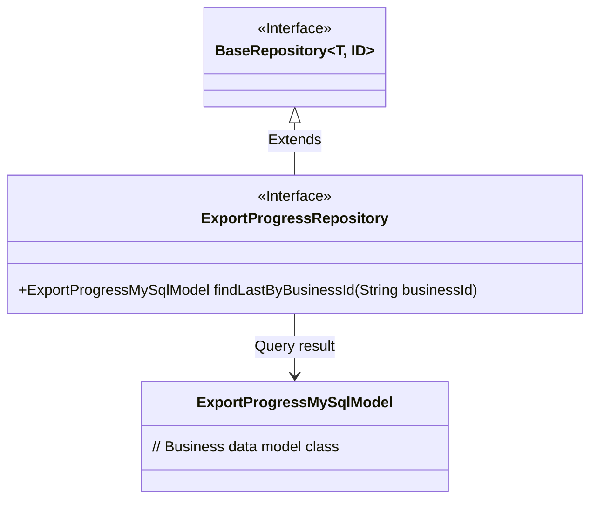
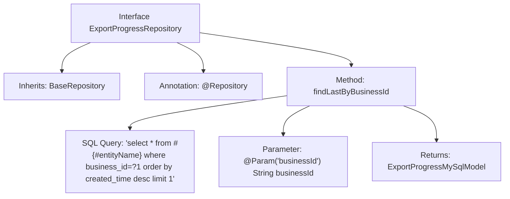

# Basic Information

|      |      |
|------|------|
| Name | ExportProgressRepository |
| Language | .java |
| Code Path | WeFe/board/board-service/src/main/java/com/welab/wefe/board/service/database/repository/fusion/ExportProgressRepository.java |
| Package Name | com.welab.wefe.board.service.database.repository.fusion |
| Dependencies | ['com.welab.wefe.board.service.database.entity.fusion.ExportProgressMySqlModel', 'com.welab.wefe.board.service.database.entity.fusion.FusionResultMySqlModel', 'com.welab.wefe.board.service.database.repository.base.BaseRepository', 'org.springframework.data.jpa.repository.Query', 'org.springframework.data.repository.query.Param', 'org.springframework.stereotype.Repository'] |
| Brief Description | This is a Spring Data JPA repository interface designed to query the latest export progress record for a specified business ID. It extends a base repository and includes a native SQL query method that returns a single result sorted by creation time in descending order. |

# Description

The code defines a Spring Data repository interface named `ExportProgressRepository`, which extends `BaseRepository` and operates on the `ExportProgressMySqlModel` entity class with a primary key type of `String`. The interface includes a native SQL query method `findLastByBusinessId`, which queries the latest record corresponding to the business ID via the `businessId` parameter, sorts the results in descending order by creation time, and returns the first result. The query uses `#{#entityName}` to reference the entity name and binds parameters via the `@Param` annotation.

# Class Summary

| Name   | Type  | Description |
|-------|------|-------------|
| ExportProgressRepository | interface | Export Progress Repository Interface, inherits from the base repository, provides a method to query the latest record by business ID. |

## Class ExportProgressRepository

|      |      |
|------|------|
| Access Modifier | @Repository;public |
| Type | interface |
| Name | ExportProgressRepository |
| Description | Export Progress Repository Interface, inherits from the base repository, provides a method to query the latest record by business ID. |

### UML Class Diagram

Class diagram description: This diagram illustrates that the ExportProgressRepository interface extends the generic BaseRepository interface and is associated with the ExportProgressMySqlModel data model. The ExportProgressRepository implements the functionality of retrieving the latest record by business ID through the native SQL query method findLastByBusinessId, reflecting the repository pattern design of Spring Data JPA. The interface is annotated with @Repository, indicating its role as a data access layer component.

### Internal Method Call Graph

This flowchart illustrates the structure of the Spring Data JPA interface `ExportProgressRepository`, highlighting its inheritance relationship, annotation markers, and core query method. The interface is marked as a persistence layer component with `@Repository`, inherits from a generic base repository, and defines a native SQL query method `findLastByBusinessId`, which retrieves the latest record by a business ID parameter. Arrows clearly depict the hierarchical relationship from interface definition to method details.

### Field List

| Name  | Type  | Description |
|-------|-------|------|

### Method List

| Name  | Type  | Description |
|-------|-------|------|
| findLastByBusinessId | ExportProgressMySqlModel | Query the latest export progress record for a specified business ID, sorted in descending order by creation time and return the first result. |

