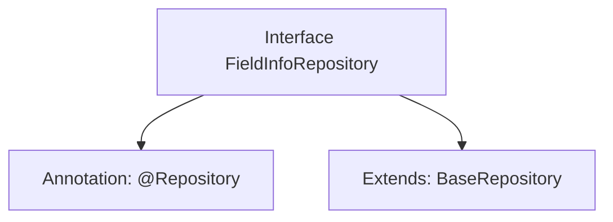

# Basic Information

|      |      |
|------|------|
| Name | FieldInfoRepository |
| Language | .java |
| Code Path | WeFe/board/board-service/src/main/java/com/welab/wefe/board/service/database/repository/fusion/FieldInfoRepository.java |
| Package Name | com.welab.wefe.board.service.database.repository.fusion |
| Dependencies | ['com.welab.wefe.board.service.database.entity.fusion.FieldInfoMySqlModel', 'com.welab.wefe.board.service.database.repository.base.BaseRepository', 'org.springframework.stereotype.Repository'] |
| Brief Description | This is a Spring Data JPA repository interface that extends the base repository interface, used for operating on the FieldInfoMySqlModel entity class with a primary key type of String. |

# Description

The content defines a Spring Data repository interface named `FieldInfoRepository`, identified by the `@Repository` annotation. This interface extends the generic base class `BaseRepository`, specifying the entity type as `FieldInfoMySqlModel` and the primary key type as `String`. This indicates that the repository is used to manipulate data entities of type `FieldInfoMySqlModel` and provides basic CRUD operation functionalities.

# Class Summary

| Name   | Type  | Description |
|-------|------|-------------|
| FieldInfoRepository | interface | This is a Spring Data JPA repository interface that extends the base repository class, designed to operate on FieldInfoMySqlModel type data with a primary key of String type. |


## Class FieldInfoRepository

|      |      |
|------|------|
| Access Modifier | @Repository;public |
| Type | interface |
| Name | FieldInfoRepository |
| Description | This is a Spring Data JPA repository interface that extends the base repository class, designed to operate on FieldInfoMySqlModel type data with a primary key of String type. |


### UML Class Diagram

```mermaid
classDiagram
    class FieldInfoRepository {
        <<Interface>>
    }
    class BaseRepository~T, ID~ {
        <<Interface>>
    }
    
    FieldInfoRepository --|> BaseRepository : Inheritance
    // The FieldInfoRepository interface inherits from the generic BaseRepository interface, with generic parameters specified as FieldInfoMySqlModel and String
```

This class diagram illustrates the inheritance relationship where the FieldInfoRepository interface extends the generic BaseRepository interface. FieldInfoRepository is a marker interface in the Spring data access layer, inheriting basic CRUD operations from BaseRepository. The generic parameter T is specified as FieldInfoMySqlModel representing the entity type, and ID as String representing the primary key type. This design follows Spring Data JPA's Repository pattern, providing a standardized data access interface for specific entities.


### Internal Method Call Graph



This flowchart depicts the structural relationships of the FieldInfoRepository interface. The interface is marked with Spring's @Repository annotation, indicating it is a data access layer component. Simultaneously, it extends the generic BaseRepository interface, specifying the entity type as FieldInfoMySqlModel and the primary key type as String. This design adheres to Spring Data JPA specifications, automatically inheriting basic CRUD operation capabilities from the base repository interface without requiring manual implementation of these methods.

### Field List

| Name  | Type  | Description |
|-------|-------|------|

### Method List

| Name  | Type  | Description |
|-------|-------|------|


