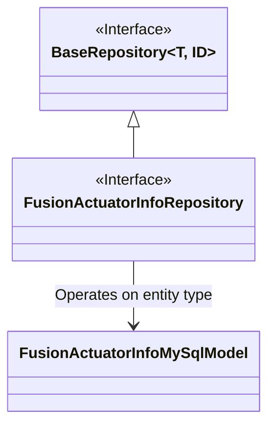
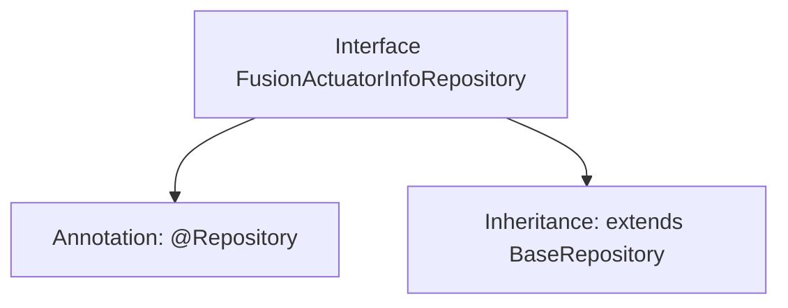

# Basic Information

|      |      |
|------|------|
| Name | FusionActuatorInfoRepository |
| Language | .java |
| Code Path | WeFe/board/board-service/src/main/java/com/welab/wefe/board/service/database/repository/fusion/FusionActuatorInfoRepository.java |
| Package Name | com.welab.wefe.board.service.database.repository.fusion |
| Dependencies | ['com.welab.wefe.board.service.database.entity.fusion.FusionActuatorInfoMySqlModel', 'com.welab.wefe.board.service.database.repository.base.BaseRepository', 'org.springframework.stereotype.Repository'] |
| Brief Description | The FusionActuatorInfoRepository interface extends BaseRepository and is used to manipulate FusionActuatorInfoMySqlModel data, with the primary key type being String. |

# Description

The content defines a Spring Data repository interface named `FusionActuatorInfoRepository`, marked with the `@Repository` annotation. This interface extends the `BaseRepository` base class, with generic parameters specifying the entity type as `FusionActuatorInfoMySqlModel` and the primary key type as `String`. This is a typical Spring Data JPA repository interface declaration, used for operating on the `FusionActuatorInfo` entity data in the database.

# Class Summary

| Name   | Type  | Description |
|-------|------|-------------|
| FusionActuatorInfoRepository | interface | The FusionActuatorInfoRepository interface extends BaseRepository and is used to operate on FusionActuatorInfoMySqlModel data, with the primary key type being String. |

## Class FusionActuatorInfoRepository

|      |      |
|------|------|
| Access Modifier | @Repository;public |
| Type | interface |
| Name | FusionActuatorInfoRepository |
| Description | The FusionActuatorInfoRepository interface extends BaseRepository and is used to operate on FusionActuatorInfoMySqlModel data, with the primary key type being String. |

### UML Class Diagram

This class diagram illustrates a Spring Data-based repository interface design. The FusionActuatorInfoRepository interface extends the generic BaseRepository interface, specifying FusionActuatorInfoMySqlModel as its entity type and String as the primary key type. Marked with the @Repository annotation, this interface will be automatically implemented by Spring, following JPA specification design patterns to provide basic CRUD operations for specific entity types. The diagram clearly demonstrates the interface inheritance relationship and the concretization process of generic parameters.

### Internal Method Call Graph

This flowchart illustrates the structure of the FusionActuatorInfoRepository interface, which is a Spring Data Access Layer interface annotated with @Repository. It extends the generic BaseRepository base class, specifying the entity type FusionActuatorInfoMySqlModel and primary key type String, indicating this interface is used to operate the actuator information table in a MySQL database. This design adheres to Spring Data JPA specifications, automatically acquiring basic data operation capabilities like CRUD by inheriting the base repository interface.

### Field List

| Name  | Type  | Description |
|-------|-------|------|

### Method List

| Name  | Type  | Description |
|-------|-------|------|

