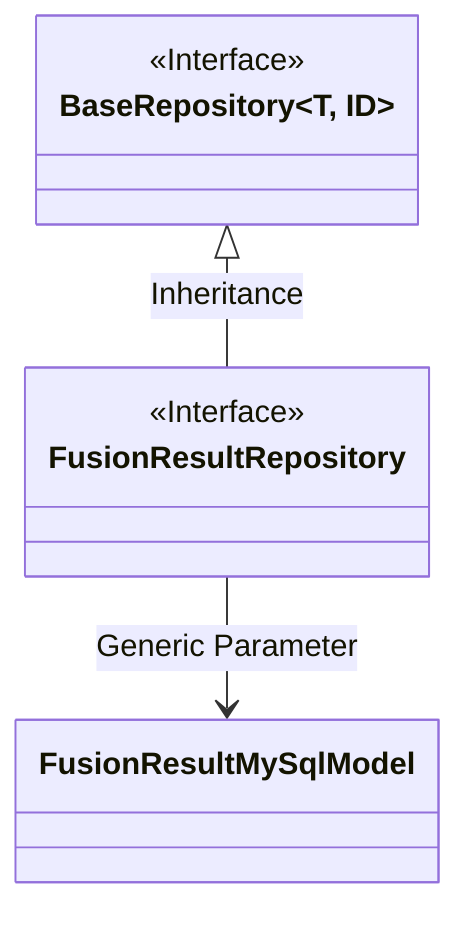
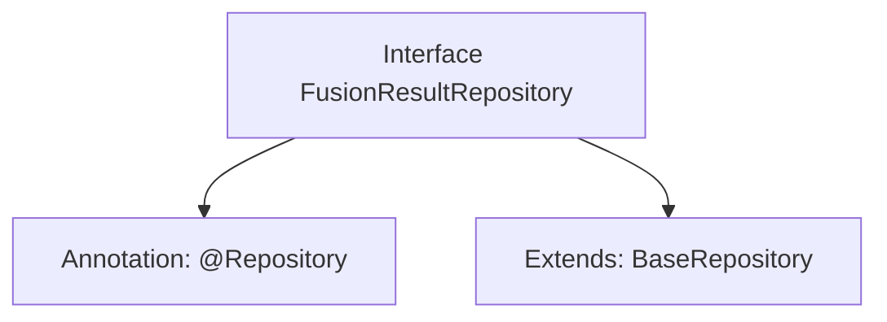

# Basic Information

|      |      |
|------|------|
| Name | FusionResultRepository |
| Language | .java |
| Code Path | WeFe/board/board-service/src/main/java/com/welab/wefe/board/service/database/repository/fusion/FusionResultRepository.java |
| Package Name | com.welab.wefe.board.service.database.repository.fusion |
| Dependencies | ['com.welab.wefe.board.service.database.entity.fusion.FusionResultMySqlModel', 'com.welab.wefe.board.service.database.repository.base.BaseRepository', 'org.springframework.stereotype.Repository'] |
| Brief Description | This is a Spring FusionResult repository interface, which extends the base repository and operates on the FusionResultMySqlModel entity, with the primary key type being String. |

# Description

The content defines a Spring Data repository interface named `FusionResultRepository`, marked as a persistence layer component with the `@Repository` annotation. This interface extends the generic base class `BaseRepository`, specifying the entity type as `FusionResultMySqlModel` and the primary key type as `String`. This indicates that the repository is used to manipulate data entities of type `FusionResultMySqlModel` and provides basic CRUD operation functionalities.

# Class Summary

| Name   | Type  | Description |
|-------|------|-------------|
| FusionResultRepository | interface | This is a Spring Data JPA repository interface that extends the base repository class, used for operating on the FusionResultMySqlModel entity with a primary key type of String. |

## Class FusionResultRepository

|      |      |
|------|------|
| Access Modifier | @Repository;public |
| Type | interface |
| Name | FusionResultRepository |
| Description | This is a Spring Data JPA repository interface that extends the base repository class, used for operating on the FusionResultMySqlModel entity with a primary key type of String. |

### UML Class Diagram

This class diagram illustrates the hierarchical relationship where the FusionResultRepository interface inherits from the generic BaseRepository interface. BaseRepository is an interface with two generic parameters (T and ID), while FusionResultRepository specializes it by inheriting to become a repository interface that operates on FusionResultMySqlModel type data with String as the primary key. The diagram clearly demonstrates the inheritance between interfaces and the process of generic parameter specialization, aligning with the repository interface design pattern of Spring Data JPA.

### Internal Method Call Graph

This code defines a Spring Data JPA repository interface FusionResultRepository, marked as a persistence layer component via the @Repository annotation, and inherits BaseRepository to obtain basic CRUD operations capability. The interface is specifically designed for manipulating entities of type FusionResultMySqlModel with a primary key type of String, embodying JPA's generic repository pattern that automatically generates database access logic without manual implementation.

### Field List

| Name  | Type  | Description |
|-------|-------|------|

### Method List

| Name  | Type  | Description |
|-------|-------|------|

