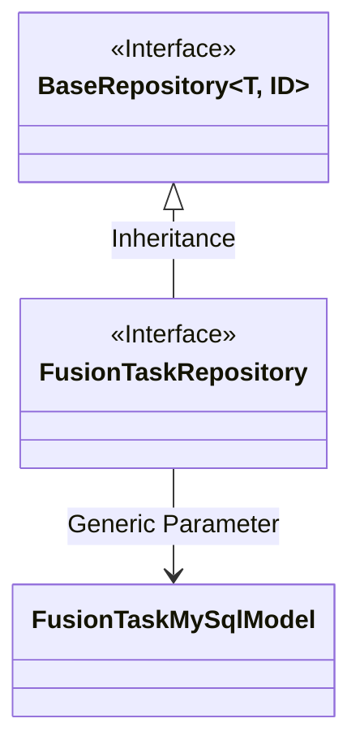
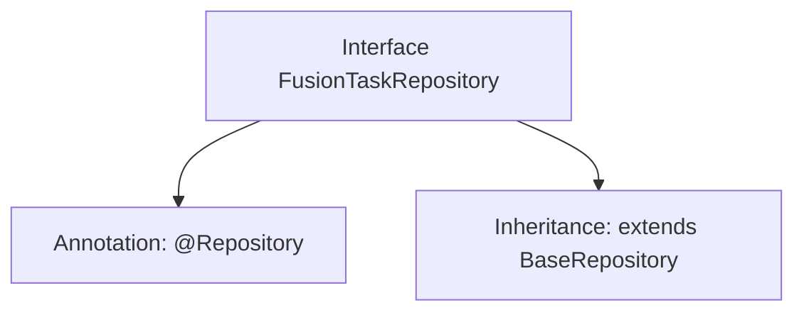

# Basic Information

|      |      |
|------|------|
| Name | FusionTaskRepository |
| Language | .java |
| Code Path | WeFe/board/board-service/src/main/java/com/welab/wefe/board/service/database/repository/fusion/FusionTaskRepository.java |
| Package Name | com.welab.wefe.board.service.database.repository.fusion |
| Dependencies | ['com.welab.wefe.board.service.database.entity.fusion.FusionTaskMySqlModel', 'com.welab.wefe.board.service.database.repository.base.BaseRepository', 'org.springframework.stereotype.Repository'] |
| Brief Description | This is a Spring Data repository interface that extends a base repository class, designed for operating on data of type FusionTaskMySqlModel with a primary key of String type. |

# Description

The content defines a Spring Data repository interface named `FusionTaskRepository`, identified by the `@Repository` annotation. This interface extends `BaseRepository`, specifying the entity type as `FusionTaskMySqlModel` and the primary key type as `String`. This indicates it is a data access layer component for operating on `FusionTaskMySqlModel` entities, following the repository pattern design of Spring Data.

# Class Summary

| Name   | Type  | Description |
|-------|------|-------------|
| FusionTaskRepository | interface | This is a Spring FusionTaskRepository interface, which extends BaseRepository, used for manipulating data of type FusionTaskMySqlModel with a primary key type of String. |

## Class FusionTaskRepository

|      |      |
|------|------|
| Access Modifier | @Repository;public |
| Type | interface |
| Name | FusionTaskRepository |
| Description | This is a Spring FusionTaskRepository interface, which extends BaseRepository, used for manipulating data of type FusionTaskMySqlModel with a primary key type of String. |

### UML Class Diagram

This class diagram illustrates the relationship where the FusionTaskRepository interface inherits from the generic BaseRepository interface. BaseRepository is an interface with two generic parameters, T and ID, where T is concretized as FusionTaskMySqlModel and ID as String type. As a data access layer interface, FusionTaskRepository acquires basic CRUD operation capabilities by inheriting from BaseRepository, while specifying the entity type as FusionTaskMySqlModel and the primary key type as String. This design adheres to the repository pattern of Spring Data JPA, achieving abstraction for operations on MySQL database tables.

### Internal Method Call Graph

This code defines a Spring Data repository interface named FusionTaskRepository, marked with the @Repository annotation as a persistence layer component. The interface extends the generic base class BaseRepository, specifying the entity type as FusionTaskMySqlModel and the primary key type as String. The flowchart clearly illustrates the interface's annotation and inheritance relationships, demonstrating the typical pattern in Spring Data JPA for rapidly implementing CRUD operations by inheriting from a base repository interface.

### Field List

| Name  | Type  | Description |
|-------|-------|------|

### Method List

| Name  | Type  | Description |
|-------|-------|------|

